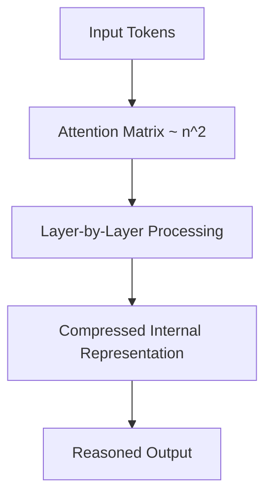
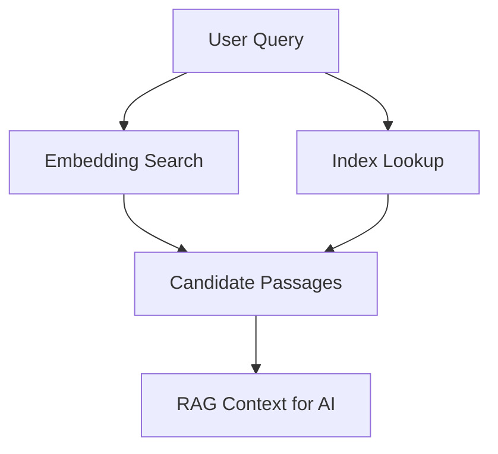

# 🧠 AI Context Limits, Document Compression, RAG Reinforcement, and Structured Knowledge Systems  

This article explains **why AI must work in limited chunks**, how to design **structured, compressible, indexable knowledge**, and how to build **tool‑aware, contextual systems** that allow AI to access your content efficiently.

---

# ⭐ 1. AI Works on Limited Chunks of Text

Large language models operate on a **finite context window**.  
This window is measured in **tokens**, not characters — roughly word‑pieces.

## 1.1 Context space is limited  
- A model can only “see” a certain number of tokens at once.  
- Even if the window is large, **reasoning capacity per token is not infinite**.  
- The model must compress meaning internally to reason effectively.

## 1.2 How many details can be reasoned at once  
Inside a single chunk, the model can:
- track relationships  
- maintain coherence  
- follow chains of reasoning  
- integrate multiple facts  

But only **within the window**.  
Outside it, the model forgets unless the information is re‑provided.

## 1.3 Holistic reasoning is expensive  
The model’s internal computation is roughly:
- **quadratic** with respect to sequence length (attention matrix)  
- multiplied by  
  - **atom size** (embedding dimension)  
  - **number of layers** (depth)  

This means:
- The more text you give it, the more expensive each “holistic decision” becomes.  
- The model must compress meaning internally to maintain coherence.  
- Large, unstructured documents overwhelm this mechanism.

### Mermaid: Context Window Pressure


---

# ⭐ 2. Why Compression and Structure Are Critical

Because AI cannot reason over huge documents directly, you must **prepare** your knowledge.

## 2.1 Compress documents  
Use:
- summaries  
- keyword lists  
- labels  
- embeddings  
- indexers  
- hierarchical outlines  

Compression allows:
- faster retrieval  
- better reasoning  
- smaller context windows  
- more accurate answers  

## 2.2 Structured documents  
Your knowledge base should include:
- folder summaries  
- document summaries  
- section summaries  
- standardized templates  
- metadata fields  

This creates a **multi‑layered map** of your information.

## 2.3 Embeddings vs. database indexing  
**Embeddings**  
- capture semantic meaning  
- allow similarity search  
- work well for fuzzy queries  

**Database indexing**  
- captures structure  
- supports exact lookup  
- works well for hierarchical or relational data  

Used together:
- embeddings find *what might matter*  
- indexing finds *where it lives*  

### Mermaid: Combined Retrieval Model


---

# ⭐ 3. RAG Reinforcement

RAG (Retrieval‑Augmented Generation) works best when:
- the question fits inside one context window  
- the retrieved documents also fit  
- the AI can produce a **simplified internal summary** for later steps  

## 3.1 Ask questions the AI can analyze in one chunk  
This means:
- break tasks into smaller steps  
- ask for summaries before asking for synthesis  
- avoid giving the model too much at once  

## 3.2 Provide references and links  
AI can:
- cite sources  
- track relationships  
- reuse earlier summaries  

But none of this is perfect without:
- manual curation  
- human‑designed structure  
- consistent templates  

## 3.3 Fine‑tuning with references and sources  
You can fine‑tune a model with:
- source text  
- metadata  
- examples  
- structured entries  

But fine‑tuning does not replace:
- RAG  
- manual structure  
- human oversight  

---

# ⭐ 4. Importance of Document Formats and Tools

## 4.1 PDF and Word documents  
These formats allow:
- highlights  
- comments  
- notes  
- bookmarks  

These must be **converted** because:
- AI cannot reliably parse layout  
- highlights contain meaning  
- comments contain context  
- structure is implicit  

## 4.2 Diagrams and backlink graphs  
Tools like:
- LogSeq  
- Obsidian  
- Roam Research  
- Athens  
- Foam  

generate:
- backlink graphs  
- block references  
- diagrams (Mermaid, Excalidraw)  

These structures:
- reveal relationships  
- help AI understand context  
- provide navigational metadata  

## 4.3 File browsers and automated tools  
Automated tools can:
- scan folders  
- extract metadata  
- generate summaries  
- build embeddings  

But AI must:
- use RAG documentation  
- or be fine‑tuned  
- and must not exceed memory limits  

Method descriptions must be:
- short  
- standardized  
- reusable  

---

# ⭐ 5. Advanced Markdown Techniques

Markdown is ideal for AI‑assisted knowledge systems.

## 5.1 Chapters, structure, formatting  
Use:
- headings  
- subheadings  
- lists  
- tables  
- tags  
- HTML blocks  
- XML references  

This creates predictable structure.

## 5.2 Named and structured markers  
Markers allow extraction of:
- summaries  
- definitions  
- Q&A cards  
- metadata  
- references  

Example:
```md
<!-- marker:summary -->
This section explains the core concept.
<!-- /marker -->
```

## 5.3 Separate entries for fine‑tuning  
Each marker can become:
- a fine‑tuning example  
- a RAG entry  
- a database record  

Include:
- session name  
- unique ID  
- URL  
- date  

## 5.4 Hidden preprocessing  
Markdown can be preprocessed to add:
- invisible markers  
- metadata blocks  
- machine‑readable tags  

This allows:
- automated extraction  
- consistent indexing  
- AI‑friendly structure  

---

# ⭐ 6. How Much Work Is Done vs. How Much Remains

## What is already possible
- automated summarization  
- embedding generation  
- RAG pipelines  
- structured Markdown systems  
- AI‑assisted editors  
- automated card generation  
- folder‑level summaries  

## What still requires human work
- designing structure  
- maintaining consistency  
- validating connections  
- curating metadata  
- reviewing AI output  
- building templates  

## What can be automated further
- preprocessing pipelines  
- hidden markers  
- fine‑tuning datasets  
- index generation  
- diagram extraction  
- highlight conversion  

## What users can optimize
- document structure  
- naming conventions  
- metadata schemas  
- folder hierarchies  
- summary layers  
- RAG prompts  
- toolflow automation  

---

# 🧩 Final Perspective

To build an **aware, contextual system** that can rapidly access your content, you must combine:

1. **AI chunk‑based reasoning**  
2. **Document compression and structure**  
3. **RAG reinforcement**  
4. **Tool‑integrated knowledge systems**  
5. **Markdown‑based metadata and markers**  
6. **Human oversight and curation**  

This creates a system where:
- AI can reason effectively  
- documents are easy to retrieve  
- structure is predictable  
- automation is possible  
- context is preserved  

A well‑designed knowledge system becomes a **living environment** where AI, automation, and human judgment work together to produce clarity, speed, and insight.
