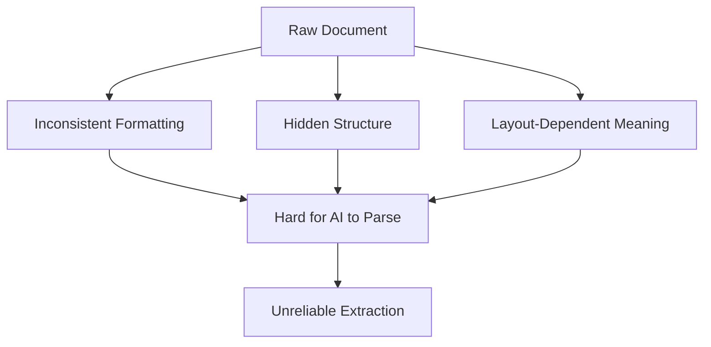
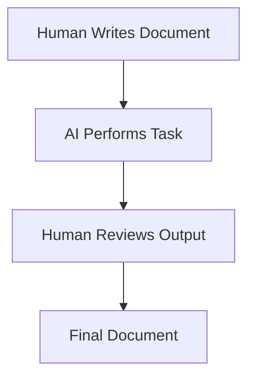
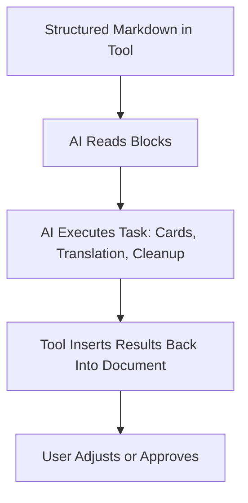
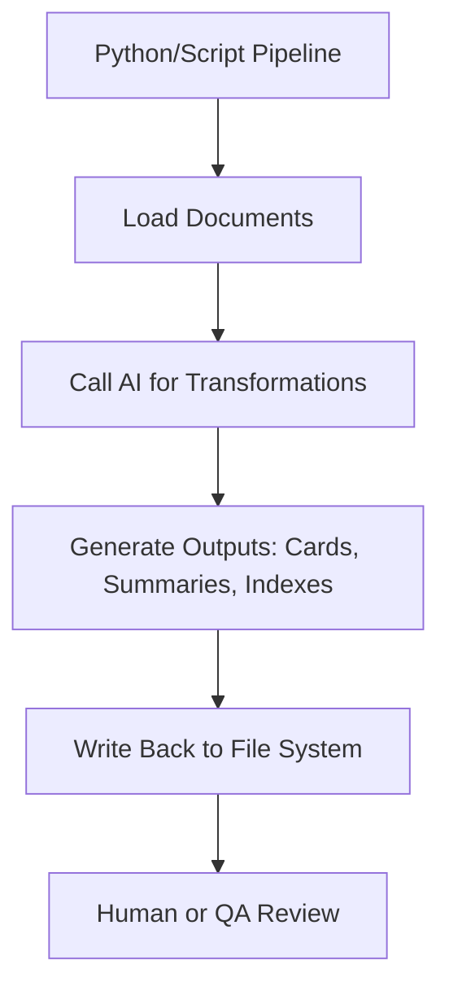
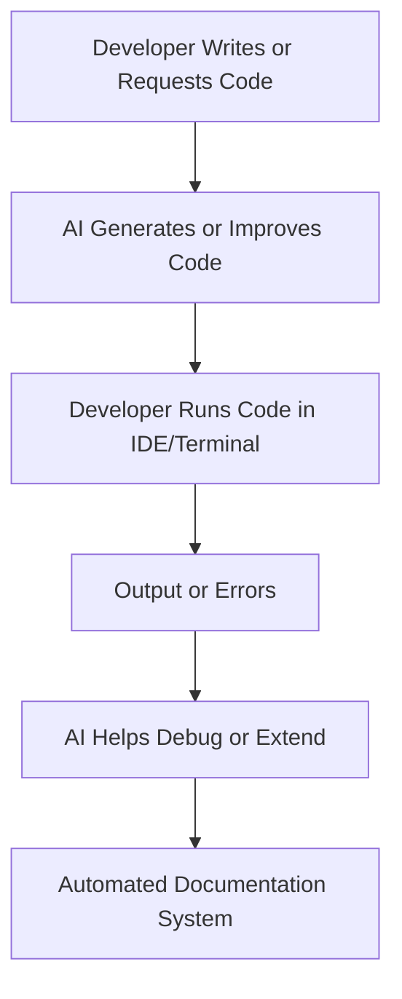
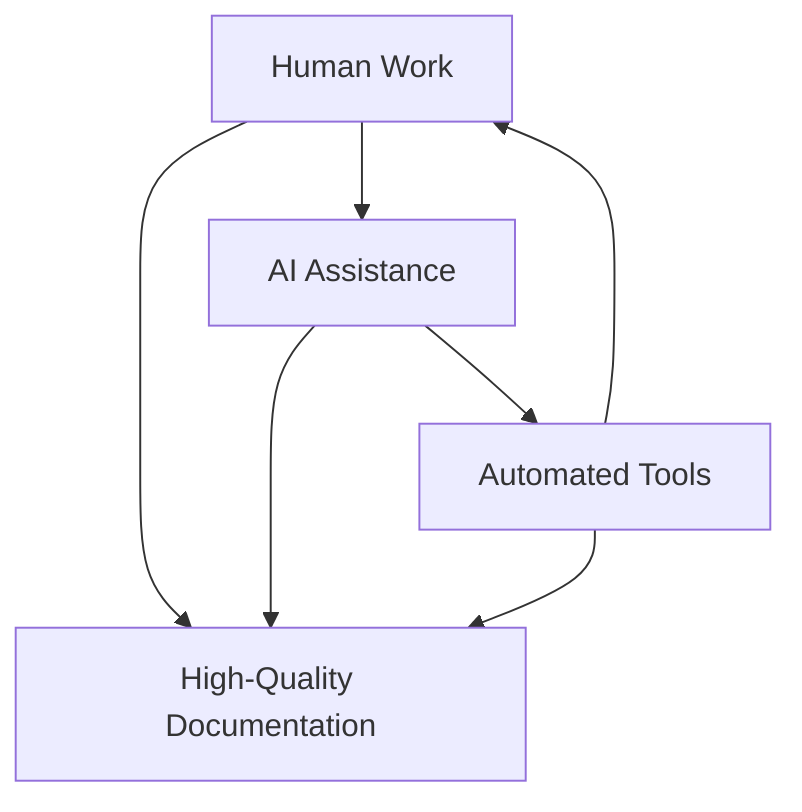
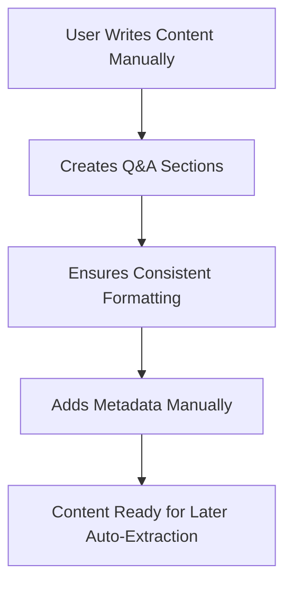
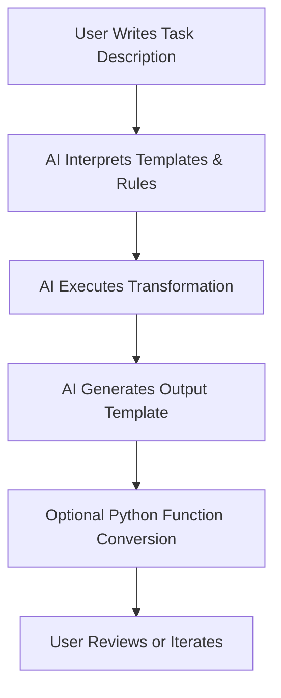
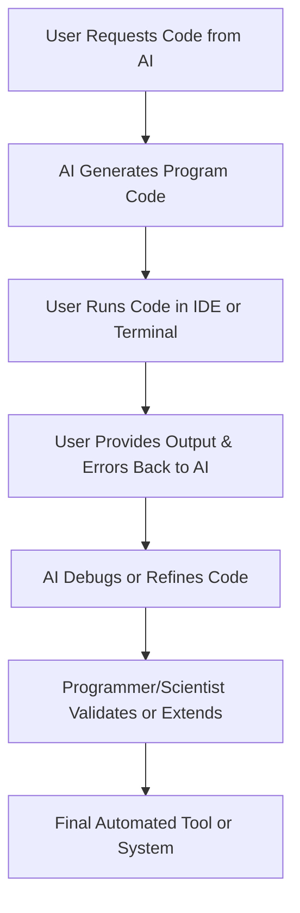

# 🧭 Code Execution Platforms: How Humans and AI Share the Workflow

A code‑execution platform is the environment where **documents, AI tasks, scripts, and human judgment** interact. It spans everything from manual editing to fully automated pipelines. Below is a structured explanation of how these layers work together.

---

# ⭐ 1. Manual Work With Documents

Manual work is both the **simplest** and the **most complex** part of the workflow.

## Why it’s simple
Some tasks are easiest to do by hand, especially early in a project:
- Drafting ideas  
- Writing initial chapters  
- Creating early Q&A cards  
- Sketching structure or metadata  

Humans excel at:
- Intuition  
- Context  
- Emotional nuance  
- Understanding real‑world situations  

## Why it’s complex
Manual work is also where **quality control** happens:
- Editors refine clarity  
- Proofreaders fix errors  
- Administrators ensure consistency  
- Users validate meaning in their own documents  

AI cannot replace this.  
A healthy workflow always includes **human assessment** of AI output to prevent:
- Reinforcing old patterns  
- Missing subtle meaning  
- Losing connection to lived experience  
- Misinterpreting user intent  

---

# ⭐ 2. Using Common AI Interfaces

This is the most familiar pattern:

1. You give the AI a task  
2. You paste your document  
3. You hit Enter  

Works well for:
- Summaries  
- Translations  
- Card generation  
- Rewriting  
- Structural cleanup  

Limitations:
- No persistent state  
- No automation  
- No integration with your file system  
- No repeatable pipelines  

Still, it’s the fastest way to get started.

---

# ⭐ 3. LogSeq, Obsidian, and Similar Tools

Tools like **LogSeq**, **Obsidian**, **Joplin**, and **Notion** make AI feel *native* inside a Markdown‑based knowledge system.

## How they make AI friendly
- AI can read your Markdown directly  
- AI can generate cards from headings or blocks  
- AI can translate or rewrite selected text  
- AI can follow your folder structure  
- AI can respect your metadata (tags, properties, frontmatter)  

Ideal for:
- Knowledge bases  
- Personal wikis  
- Zettelkasten systems  
- Research notes  
- Documentation  

These tools give you:
- A consistent environment  
- A predictable document structure  
- A place where AI can operate safely  

---

# ⭐ 4. Tools With Built‑In AI Assistance

Many modern tools embed AI directly into their UI.

## How AI assistants execute tasks
- They read the current document or selection  
- They apply a transformation (summarize, rewrite, extract, translate)  
- They insert the result back into the document  
- They maintain context across multiple operations  

Examples:
- Notion AI  
- Obsidian AI plugins  
- GitHub Copilot Chat  
- Google Docs AI features  
- Office 365 Copilot  

These assistants act like:
- Editors  
- Translators  
- Card generators  
- Structure analyzers  
- Metadata helpers  

---

# ⭐ 5. IDEs With Script Execution + AI

This is where things become powerful.

## What IDEs provide
- Built‑in terminals  
- Script execution (Python, JS, etc.)  
- File system access  
- Project structure  
- Extensions and plugins  
- Integrated AI assistants  

## Why this matters
You can:
- Generate cards automatically  
- Run transformations on entire folders  
- Build pipelines for document processing  
- Extend your framework with custom scripts  
- Automate repetitive tasks  
- Validate or lint your Markdown  

### Where scripts run
- Locally  
- On a server  
- In a cloud workspace  
- Inside containers  

This bridges:
- AI‑assisted workflows  
- Fully automated pipelines  

---

# ⭐ 6. VS Code and Similar IDEs

VS Code is the most flexible environment for combining:
- AI  
- Code  
- Terminal  
- Extensions  
- Custom tools  

## What VS Code enables
- Running Python scripts directly  
- Using AI to generate or debug code  
- Running shell commands  
- Integrating with Git  
- Using Markdown preview  
- Running custom document processors  
- Building your own extensions  

This is where:
- AI helps you write code  
- Code helps you process documents  
- Documents feed back into AI  
- Everything stays in one place  

---

# 🧩 Final Perspective

A code‑execution platform is a **continuum**:

| Layer | Who Works Here | Strength |
|-------|----------------|----------|
| Manual | Writers, editors, users | Quality, intuition |
| AI Interface | Everyday users | Speed, convenience |
| AI‑Integrated Tools | Knowledge workers | Structure, consistency |
| IDE + Scripts | Technical users | Automation, pipelines |
| Full Programming | Developers, scientists | Maximum control |

Each layer supports the others.  
A healthy workflow uses **all of them**, not just one.

If you want, I can turn this into a diagram, a workflow guide, or a multi‑level framework combining documentation + tool execution + AI workflows.

# 🧭 Tooling, AI, and Human Workflows: A Unified Model

This article explains how **tooling**, **AI**, and **human effort** interact in different workflows. It also shows why **raw documents are hard to parse**, and how structured tooling improves documentation quality. Mermaid diagrams illustrate the processes.

---

# ⭐ 1. Why Raw Documents Are Hard to Parse

Raw documents (Word, PDF, unstructured text) often contain:
- inconsistent formatting  
- ambiguous headings  
- mixed styles  
- hidden metadata  
- layout‑dependent meaning  
- tables or lists that don’t convert cleanly  
- images embedded without context  

AI struggles because:
- structure must be inferred  
- meaning is distributed across layout  
- extraction requires heuristics  
- formatting errors propagate into downstream tasks  

### Mermaid: Raw Document Parsing Difficulty

---

# ⭐ 2. Workflow Case 1 — Manual + AI Review

Humans create content manually, and AI assists with:
- summarization  
- card generation  
- translation  
- structural cleanup  

Human judgment ensures:
- correctness  
- nuance  
- context  
- emotional meaning  

### Mermaid: Manual + AI Review Workflow

---

# ⭐ 3. Workflow Case 2 — AI‑Integrated Tooling (LogSeq, Obsidian, etc.)

Tools like LogSeq or Obsidian provide:
- structured Markdown  
- block‑level editing  
- metadata fields  
- backlinks and graph structure  

AI becomes more effective because:
- structure is predictable  
- metadata is explicit  
- documents are modular  
- transformations are easier  

### Mermaid: AI‑Integrated Tool Workflow

---

# ⭐ 4. Workflow Case 3 — Automated Scripts + AI

In IDEs or server environments:
- Python scripts run transformations  
- AI models are called programmatically  
- entire folders can be processed  
- pipelines ensure repeatability  

This is ideal for:
- large documentation sets  
- batch card generation  
- automated indexing  
- nightly builds  

### Mermaid: Automated Script Workflow

---

# ⭐ 5. Workflow Case 4 — Full Programming + AI Assistance

Developers combine:
- AI‑generated code  
- manual debugging  
- terminal execution  
- custom tools  
- automation frameworks  

This enables:
- custom parsers  
- advanced document transformations  
- integration with CI/CD  
- scalable documentation systems  

### Mermaid: Full Programming Workflow

---

# ⭐ 6. General Concept: Coherence Between Human Work and Tooling

A healthy documentation ecosystem balances:
- **Human intuition** (meaning, nuance, correctness)  
- **AI assistance** (speed, structure, transformation)  
- **Automated tooling** (repeatability, scale, consistency)  

Each layer supports the others:

| Layer | Strength | Weakness |
|-------|----------|----------|
| Human | Context, nuance, meaning | Slow, inconsistent |
| AI | Fast, structured, adaptive | Needs guidance, may hallucinate |
| Automation | Scalable, repeatable | Requires setup and maintenance |

### Mermaid: Coherent Tooling Model

---

# ⭐ 7. How Tooling Enhances Documentation

Tooling improves documentation by:
- enforcing structure  
- enabling consistent formatting  
- supporting metadata  
- enabling automated transformations  
- reducing manual labor  
- improving AI accuracy  

Without tooling, documentation becomes:
- harder to parse  
- harder to maintain  
- harder to automate  
- harder for AI to understand  

With tooling, documentation becomes:
- modular  
- predictable  
- machine‑readable  
- easier to transform  

---

# 🧩 Final Summary

Tooling, AI, and human effort form a **three‑layer system**:

1. **Humans** provide meaning and judgment  
2. **AI** provides speed and structure  
3. **Automation** provides scale and consistency  

Raw documents are difficult for AI because they lack structure.  
Tooling introduces structure, which unlocks the full power of AI and automation.

If you want, I can also produce:
- a combined mega‑diagram  
- a multi‑level workflow model  
- a version aligned with your earlier Levels 1–3 editing model  
- or a full documentation‑tooling architecture  

# 🧭 Levels of Executive Tool Use  
This article extends the earlier framework by describing **three major levels of tool execution**—manual, AI‑based, and programming‑based—along with **Mermaid diagrams** illustrating the workflows.

---

# ⭐ Level 1 — Manual Execution of Tool Programs

Common‑sense users operate tools manually, without automation or code.

## What users do manually
- Create **Q&A cards** by hand.  
- Write chapters with **Q&A subchapters** or other predictable structures.  
- Maintain **consistent formatting** so later extraction is possible.  
- Ensure metadata (tags, categories, difficulty, references) is **present and extractable**.  
- Perform other operations manually (sorting, linking, indexing).

## Why this matters
Manual users rely on:
- Predictable structure  
- Human consistency  
- Later automated extraction  

They do not need programming skills, but they must maintain **discipline in formatting**.

### Mermaid: Manual Workflow

---

# ⭐ Level 2 — AI‑Based Execution of Tool Programs

Users describe tasks to an AI, which executes or transforms content using templates, rules, or structured instructions.

## What the user provides
- **Document template** with terms and placeholders  
- **Transformation description** (e.g., “convert chapter to Q&A cards”)  
- **Output template** with placeholders  
- **Standard use cases** and **exceptions**  

## How AI executes the task
Different UIs provide different experiences:
- Chat-based step-by-step guidance  
- Form-based task execution  
- Editor-integrated transformations  
- Automated pipelines  

## Converting tasks into Python functions
### Simple function form
- A Python function:
  - documents the tool  
  - calls a small AI model  
  - optionally receives context  

### Advanced function form
- User’s custom syntax is mapped to Python  
- Python functions call AI models for:
  - special cases  
  - structured transformations  
  - validation  
  - suggestions  

## Intelligent AI interaction
AI can:
- Ask clarifying questions  
- Guide the user through steps  
- Modify the task internally  
- Display the final task in a **standardized form**  
- Provide a **debugger-like view** of transformations  

### Mermaid: AI‑Based Workflow

---

# ⭐ Level 3 — Programming‑Based Execution

Users generate or write program code—often with AI assistance—to automate tasks fully.

## How users interact with AI
- AI generates code (Python, JS, etc.)  
- User tests code, feeds back terminal output  
- AI provides debugging guidance  
- User edits code in an IDE or editor  

Programming skills reduce friction and risk.

## Roles and capabilities

### 🧩 Common users with minimal programming
- Paste code into files  
- Run Python scripts  
- Provide terminal output to AI  
- Must manage files carefully  
- Must avoid accidental edits or missing content  

### 🧪 General computer scientists
- Verify correctness using scientific method  
- Understand testing and validation  
- May not write code fluently  
- Provide conceptual oversight  

### 🛠️ Computer programmers
- Debug and optimize code  
- Build toolsets and automation  
- Manage memory and performance  
- Create custom functions for AI workflows  
- Ensure linear, stable execution  

### 📐 Advanced computer scientists
- Formally prove code correctness  
- Use theorem provers  
- Study algorithmic patterns  
- Understand deep AI internals  
- Not always suited for large messy codebases  

### 🧬 Advanced AI architects
- Design new AI architectures  
- Research model behavior  
- Build foundational systems  

### Mermaid: Programming‑Based Workflow

---

# 🧭 Summary Table

| Level | Who Uses It | Skills Needed | AI Role | Output Quality |
|------|--------------|----------------|---------|----------------|
| **1. Manual** | Common-sense users | Formatting discipline | None or minimal | Depends on user consistency |
| **2. AI-Based** | Semi-technical users | Template thinking | Executes transformations | High, structured |
| **3. Programming-Based** | Programmers & scientists | Coding & debugging | Code generation & guidance | Very high, fully automated |
