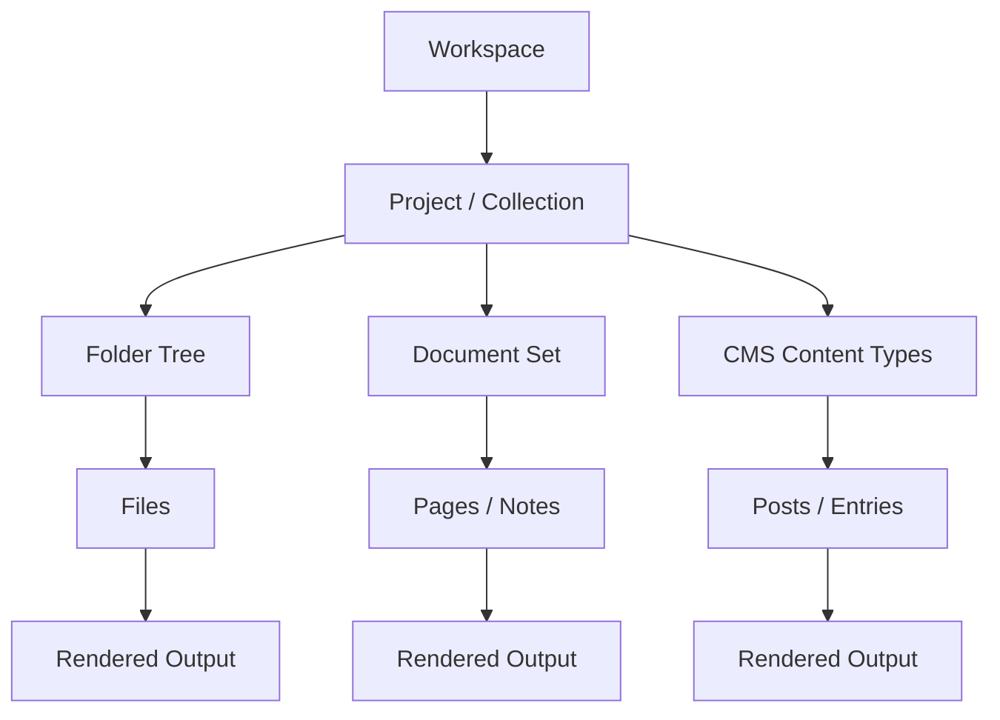
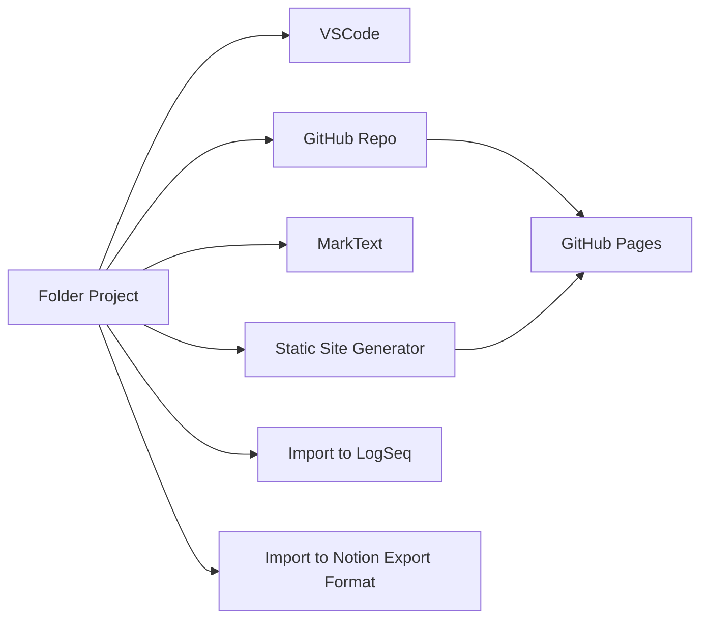
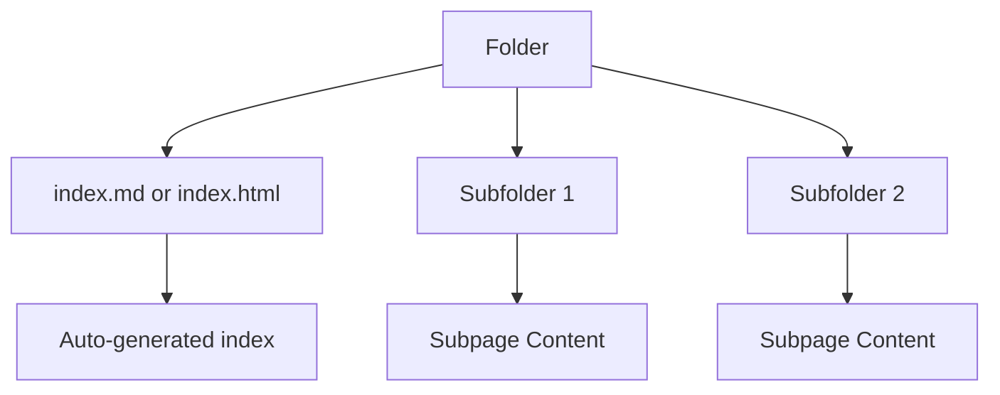
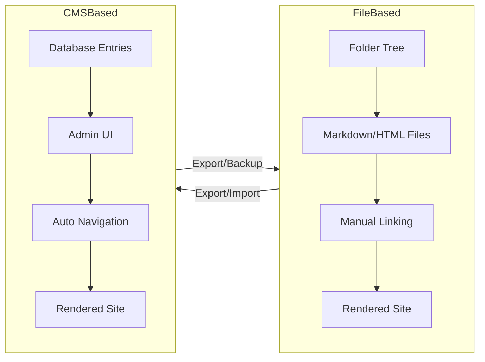

# 🌿 Unified View of Workspaces, Projects, and Document Collections

This document presents a tool‑agnostic explanation of how **projects**, **document collections**, and **folder structures** relate across editors, CMS systems, and knowledge tools.  
It also includes **Mermaid diagrams** to visualize workflows and structural abstractions.

---

# 🧭 1. Core Concepts

## 📁 Workspaces and Projects (Tool‑Agnostic)

Across tools, the same pattern repeats:

- A **workspace** is the *context* in which you view or manage content.
- A **project** is a *collection of related items*—often a folder, but not always.
- A **document collection** is simply a project where the items are documents.
- A **CMS** (Content Management System) is a project where the items are stored in a database or structured interface instead of a visible folder tree.

### Why tools ask “Do you trust the author?”

Tools like VSCode ask this because:

- Opening a folder may load scripts, tasks, or extensions.
- These can run code on your machine.
- Trust = “Is this folder safe to execute code from?”

This is a **security question**, not a philosophical one.

---

# 🧭 2. How Different Tools Map to the Same Abstraction

Below is a conceptual mapping:

| Tool | What a “Project” Really Is | How Structure Is Shown |
|------|-----------------------------|--------------------------|
| VSCode | A folder or multi-folder workspace | File Explorer |
| GitHub | A repository (folder with version control) | Repo tree + README |
| Notion | A page with nested subpages | Page sidebar |
| LogSeq | A folder of Markdown pages + graph | Page tree + backlinks |
| RemNote / RemNina | Nested “rems” (hierarchical notes) | Document tree |
| MarkText | A folder of Markdown files | File tree |
| CMS (WordPress, Drupal, Ghost) | Database-backed content types | Admin UI, menus, categories |

All of these are **project inspectors**—just with different skins.

---

# 🧭 3. Mermaid Diagram: General Abstraction of a Project



This diagram shows that **all systems ultimately produce content from structured items**, regardless of how they store them.

---

# 🧭 4. Mermaid Diagram: How Projects Flow Between Tools



This shows how a simple folder can travel across tools.

---

# 🧭 5. Notion‑Style Nodes and HTML Index Folders

Notion exports a page as:

```
MyPage/
  MyPage.md
  Subpage1/
  Subpage2/
```

This mirrors a website:

```
docs/
  index.html
  chapter1.html
  chapter2.html
```

Both treat **folders as documents**.

You can replicate this in VSCode by:

- using `README.md` as a root document  
- generating an index in `index.html`  
- using scripts to auto-list folder contents  

---

# 🧭 6. Mermaid Diagram: Folder-as-Document Pattern



This is the same pattern used by:

- Notion exports  
- Static site generators  
- GitHub README navigation  
- CMS category pages  

---

# 🧭 7. Project Inspector Sidebars Across Tools

## VSCode  
Shows the **actual filesystem**.

## Notion  
Shows **pages and subpages**, but conceptually identical to folders.

## LogSeq  
Shows **pages**, but also backlinks—like a dynamic index.

## RemNote / RemNina  
Shows **nested rems**, which behave like nested folders.

## MarkText  
Shows **folders and Markdown files** directly.

---

# 🧭 8. How CMS Systems Fit In

A CMS (WordPress, Drupal, Ghost, etc.) provides:

- A **simplified interface** for managing content  
- A **menu or category system** instead of a folder tree  
- A **database** instead of files  
- A **visual inspector** instead of a file explorer  

### Why CMS feels simpler

- Users don’t see the filesystem.
- Content is organized by:
  - categories  
  - tags  
  - menus  
  - content types  
- The system handles indexing automatically.

### CMS as an alternative to a project inspector

A CMS replaces:

- manual folder navigation  
- manual index creation  
- manual linking  

with:

- dashboards  
- content lists  
- auto-generated navigation  

This is why non-technical users often prefer CMS tools.

---

# 🧭 9. Mermaid Diagram: CMS vs File-Based Workflow



Both workflows lead to the same outcome: **structured content**.

---

# 🧭 10. How Normal Folders Become Projects for Beginners

Tools like MarkText or VSCode allow beginners to:

1. Create a folder  
2. Add Markdown files  
3. Use the sidebar to navigate  
4. Treat the folder as:
   - a book  
   - a wiki  
   - a project  
   - a documentation set  

This is the simplest possible project system.

---

# 🌟 Final Thoughts

All tools—VSCode, Notion, LogSeq, RemNote, MarkText, GitHub, CMS systems—are just different ways of presenting the same underlying idea:

> **A project is a structured collection of content.  
> The structure can be a folder tree, a page tree, a graph, or a CMS interface.**

Understanding this abstraction lets users move freely between tools and choose the workflow that fits their style.
