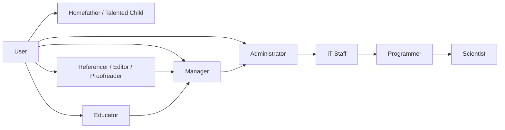
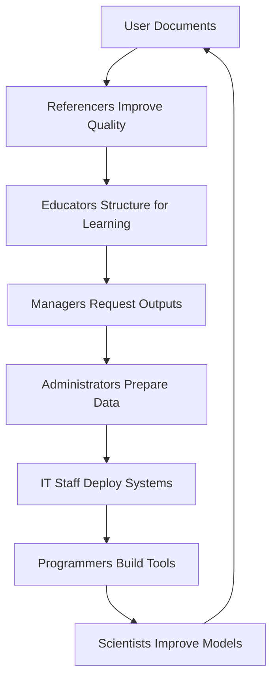
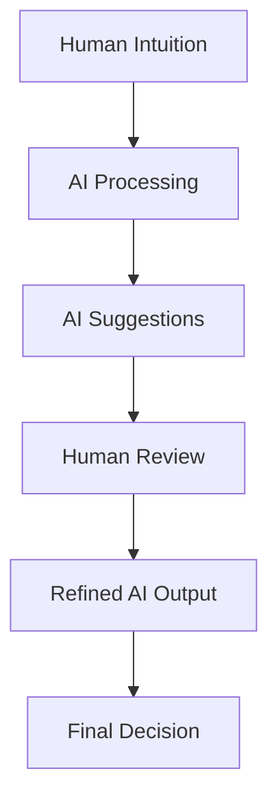
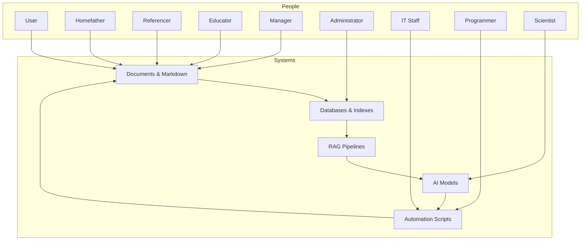
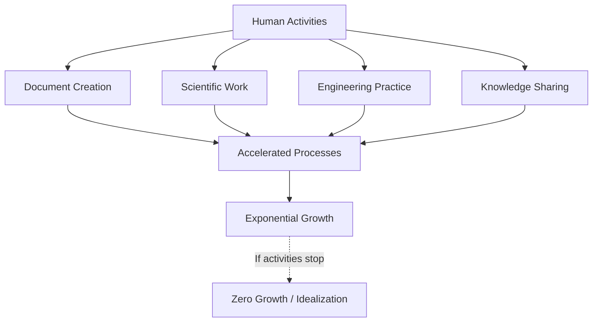
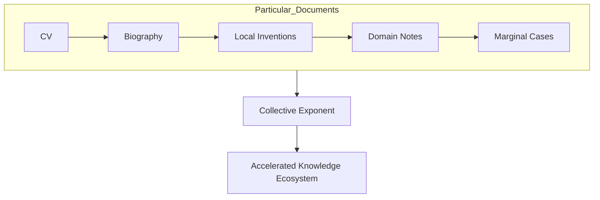
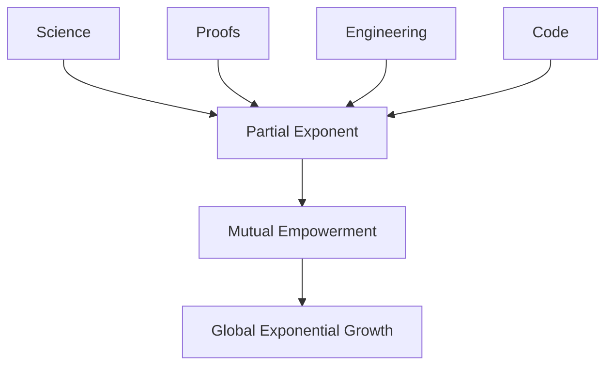
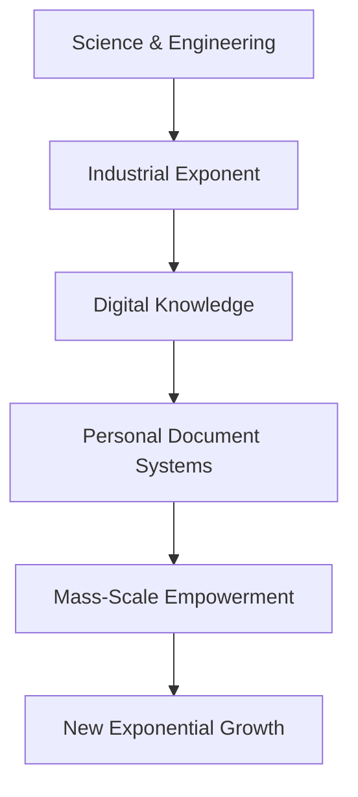
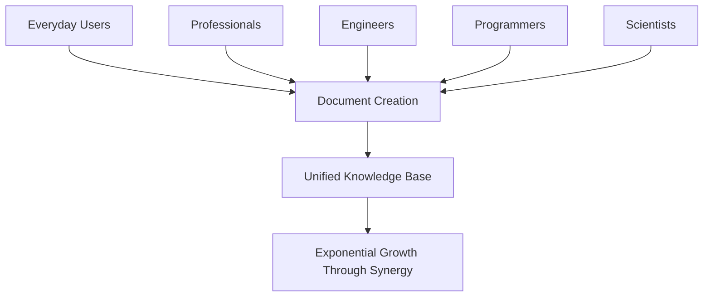

# 🌍 Ecosystem Roles in an AI‑Supported Knowledge Environment

This article describes the major human roles in a modern AI‑supported documentation and knowledge ecosystem. Each role contributes a different kind of intelligence — practical, editorial, managerial, technical, scientific, or creative. Together, they form a living system that keeps information meaningful, structured, and useful.

---

# ⭐ 1. The User — The Foundation

### Core abilities
- Creates Markdown documents.
- Learns to organize them into folders, chapters, and structures.
- Performs basic tasks in LogSeq, Obsidian, Notion, Joplin, etc.
- Converts content into different formats (PDF, DOCX, MD).
- Describes structure, associations, and document meaning.
- Follows templates, forms, and instructions.

### How a user creates Q&A cards
```md
Q: What is a perceptron?
A: A simple linear classifier used in early neural networks.
#card
```

### User intent
- Organize documents.
- Provide reports.
- Obtain automated, meaningful results from their content.

---

# ⭐ 2. The “Homefather” or Talented Technical Child

This is the intuitive, practical mind — curious, hands‑on, and naturally technical.

### Analogy: Newtonian physics
- Understands basic engineering, optics, magnets, speakers.
- Doesn’t know advanced architectures or deep theory.
- Has strong intuition and practical reasoning.

### AI equivalent
- Understands perceptrons and basic neural concepts.
- Grasps general architecture intent without deep math.
- Uses intuition to troubleshoot and improvise.
- Provides creative “hacks” and solutions.

### Typical roles
- Sets up home infrastructure.
- Makes basic technical decisions in small companies.

---

# ⭐ 3. The Referencer

Professionals who ensure correctness and clarity.

### Roles include
- Proofreader  
- Editor  
- Fact‑checker  
- Domain expert  

They refine documents, verify facts, and ensure accuracy.

---

# ⭐ 4. The Educator

Works with:
- smartcards  
- spaced repetition  
- learning structure  
- timing and advancement  

They turn documents into effective learning systems.

---

# ⭐ 5. The Manager

### Responsibilities
- Requests documentation.
- Reviews results.
- Produces plans and reports.
- Oversees creation, organization, and use of documents.

Managers ensure the knowledge ecosystem supports real‑world goals.

---

# ⭐ 6. The Administrator (Model & Data)

A technical but not deeply theoretical role.

### Capabilities
- Works with AI models and documentation.
- Understands formats, capabilities, limitations.
- Collects documents into databases.
- Queries and filters data.
- Prepares subsets for training.
- Fine‑tunes models.
- Manages resources and configuration.

Administrators are the “librarians” of the AI world.

---

# ⭐ 7. IT Staff

### Responsibilities
- Set up models and servers.
- Maintain automation pipelines.
- Deploy knowledge bases.
- Ensure uptime and reliability.

They make the system run smoothly.

---

# ⭐ 8. The Programmer

### Responsibilities
- Writes formal specifications.
- Creates automation scripts.
- Designs processing pipelines.
- Debugs toolkits.
- Understands advanced details.
- Works with architects and analysts.
- Ensures memory management and predictable automation.
- Optimizes workflows and reduces model load.

Programmers turn ideas into functioning systems.

---

# ⭐ 9. The Scientist

### Focus
- Creativity and performance of base models.
- New architectures.
- Mathematical proofs.
- Tensor fields and holistic model behavior.
- Fundamental research.

Scientists work on possibility, not just practicality.

---

# ⭐ 10. User Feedback — The Lifeblood of the Ecosystem

### Why feedback matters
AI:
- follows patterns  
- reinforces what it sees  
- lacks human intuition  
- cannot feel ethics, pleasure, pain, or lived experience  

Without human correction:
- AI drifts  
- loses grounding  
- becomes stale  
- fails to adapt to real needs  

### Why humans must keep creating
- Fresh ideas  
- New formulations  
- Clear diagrams  
- Logical structures  
- Ethical intuition  
- Mathematical rigor  
- Creative insight  

These are essential for civilization, communication, science, engineering, and law.

### The grand endeavor
Everyone participates:
- users  
- children  
- workers  
- editors  
- programmers  
- scientists  
- administrators  
- managers  

We are collectively building a new knowledge ecosystem — a shared infrastructure for intelligence.

# 🌐 Ecosystem Roles, Processes, Capabilities, and Opportunities  
### *A visual and structural representation of the knowledge–AI ecosystem*

This article illustrates the **roles**, **ecosystem structure**, **process flows**, and **opportunities** within a modern AI‑supported documentation and knowledge environment.

---

# ⭐ 1. Roles in the Ecosystem

Below is a high‑level diagram showing the major roles and how they relate.



---

# ⭐ 2. Role Descriptions

## 🧍 User
- Creates Markdown documents.  
- Organizes content into folders, chapters, templates.  
- Creates Q&A cards in LogSeq/Obsidian.  
- Converts content into multiple formats.  
- Describes structure and associations.  
- Follows templates and instructions.

## 🧰 Homefather / Talented Technical Child
- Practical intuition, like Newtonian physics for everyday engineering.  
- Understands basic AI concepts (perceptrons, layers) intuitively.  
- Sets up home infrastructure and small‑scale systems.  
- Makes practical decisions and improvises solutions.

## 📚 Referencer (Proofreader, Editor, Fact‑Checker)
- Ensures correctness, clarity, and factual accuracy.  
- Works with Q&A cards and structured documents.  
- Maintains quality of the knowledge base.

## 🎓 Educator
- Designs smartcard systems.  
- Understands spaced repetition and learning curves.  
- Structures knowledge for teaching and mastery.

## 🧭 Manager
- Requests documentation.  
- Reviews results and produces reports.  
- Oversees document creation and organization.  
- Ensures processes align with goals.

## 🗄️ Administrator (Model & Data)
- Works with AI models, formats, and capabilities.  
- Builds and queries databases.  
- Prepares datasets for fine‑tuning.  
- Manages resources and configurations.

## 🛠️ IT Staff
- Sets up models and servers.  
- Maintains automation pipelines.  
- Deploys knowledge bases.  
- Ensures reliability and uptime.

## 💻 Programmer
- Writes formal specifications and automation scripts.  
- Designs processing pipelines.  
- Debugs toolkits and manages memory.  
- Ensures predictable automation and optimized workflows.

## 🧪 Scientist
- Works on creativity, performance, and abilities of base models.  
- Develops new architectures and mathematical proofs.  
- Studies tensor fields and holistic model behavior.

---

# ⭐ 3. Ecosystem Overview

This diagram shows how all roles interact with documents, AI, and automation.



This loop represents the **continuous improvement cycle** of the knowledge ecosystem.

---

# ⭐ 4. Processes and Capabilities

## 4.1 Document Creation → Structure → Automation


---

## 4.2 Human + AI Collaboration



This illustrates the **co‑creative loop** where humans provide intuition and judgment, and AI provides speed and structure.

---

# ⭐ 5. Opportunities in the Ecosystem

## 5.1 For Users
- Better organization.  
- Automated summaries and reports.  
- Q&A card generation.  
- Multi‑format document conversion.  
- Personal knowledge systems.

## 5.2 For Technical Roles
- Build pipelines.  
- Automate document processing.  
- Create custom tools.  
- Fine‑tune models.  
- Manage large knowledge bases.

## 5.3 For Organizations
- Faster decision‑making.  
- Higher documentation quality.  
- Scalable knowledge systems.  
- Reduced manual labor.  
- Improved training and onboarding.

---

# ⭐ 6. Full Ecosystem Diagram



---

# ⭐ 7. Final Perspective

This ecosystem is a **collaborative intelligence network**:

- Users create content.  
- Referencers refine it.  
- Educators structure it.  
- Managers direct it.  
- Administrators and IT staff maintain it.  
- Programmers automate it.  
- Scientists expand what is possible.  

Together, they build a **living knowledge system** where AI amplifies human capability — but humans provide the meaning, intuition, ethics, and creativity that keep the system grounded.

# 🌌 Exponential Growth Through Information, Science, and Fine‑Tuned Knowledge  

Human civilization grows exponentially when **information**, **science**, and now **fine‑tuned personal knowledge** accelerate each other.  
This exponent only exists when **all activities continue** — writing, organizing, teaching, engineering, researching, documenting.  
If these patterns stop, the exponent collapses into *idealization* — growth without substance.

This article explains how **particular documents** (the yin aspect) and **theoretical documents** (the yang aspect) combine to create exponential progress, and how *every person*, from “dumb” users to scientists, contributes to this unified force.

---

# ⭐ 1. Exponential Growth Requires Active Processes

Information accelerates processes only when:
- documents are created  
- documents are organized  
- science is practiced  
- engineering is applied  
- knowledge is shared  
- tools are used  
- people participate  

If any of these stop, exponential growth becomes **zero** — a theoretical curve with no real-world engine.

### Mermaid: Exponential Growth Only When Activities Continue


---

# ⭐ 2. The Yin Aspect: Particular Documents Form a Collective Exponent

Particular documents include:
- personal notes  
- CVs  
- biographies  
- local inventions  
- domain summaries  
- marginal-case knowledge  
- small collections of insights  

Individually, each is small.  
Together, they form a **collective exponent** — a network of meaning.

### Why this matters
- Many small documents → many small accelerations  
- Together → exponential improvement  
- Even “simple” users contribute massively  

### Mermaid: Particular Documents Forming a Collective Exponent


---

# ⭐ 3. The Yang Aspect: Theoretical Documents Create Individual Exponents

Theoretical documents include:
- scientific papers  
- mathematical proofs  
- engineering standards  
- formal code  
- legal frameworks  

Each theoretical work is a **partial exponent** — a single spark of acceleration.

When combined, they empower each other:
- one proof enables another  
- one law enables a system  
- one engineering practice enables an industry  

### Mermaid: Theoretical Documents as Individual Exponents


---

# ⭐ 4. How Civilization First Achieved the Exponent

Historically, exponential growth came from:
- scientific method  
- engineering practices  
- legal systems  
- mathematics  
- industrialization  
- education  

These created the **first exponent** — the one that lifted humanity from stagnation.

Now, with AI and personal knowledge systems:
- *every person* can contribute  
- even a few well‑organized files matter  
- marginal cases scale into global value  

### Mermaid: From Science to Personal Knowledge Exponent


---

# ⭐ 5. How Marginal Cases Become Exponential at Scale

A single person with:
- a CV  
- a biography  
- a summary of inventions  
- a domain-specific note collection  

…may seem insignificant.

But when millions do this:
- local knowledge becomes global  
- marginal cases become patterns  
- patterns become insights  
- insights become accelerators  

This is the **democratization of the exponent**.

---

# ⭐ 6. Empowering “Dumb” Users — And Everyone Else

The term “dumb user” is misleading — it simply means:
- not a programmer  
- not a scientist  
- not a specialist  

But these users:
- create documents  
- record experiences  
- organize personal knowledge  
- ask questions  
- provide feedback  
- maintain daily life patterns  

These activities **feed the exponent**.

### Professionals experience the same empowerment
- Engineers accelerate engineering.  
- Programmers accelerate automation.  
- Scientists accelerate theory.  
- Administrators accelerate data.  
- Managers accelerate decisions.  

Each group contributes **at its own scale**, but all contributions multiply together.

### Mermaid: Unified Human–AI Exponential Force


---

# ⭐ 7. The Unified Force of Simplicity

When all roles participate:
- users  
- children  
- workers  
- editors  
- programmers  
- scientists  

…we form a **single exponential engine**.

AI amplifies:
- simple documents  
- complex theories  
- personal notes  
- professional systems  

And together, we achieve:
- more efficient simplicity  
- more accessible knowledge  
- more powerful tools  
- more meaningful progress  

This is the **new exponent** — the one built not only by scientists, but by *everyone*.

---

# 🌟 Final Perspective

Exponential growth is not magic.  
It is the result of:
- many small documents  
- many theoretical works  
- many human activities  
- many roles  
- many contributions  

When combined, they create a **self‑accelerating ecosystem**.

AI does not replace this — it multiplies it.  
And every person, no matter how “simple,” becomes part of the exponential force that shapes the future.
