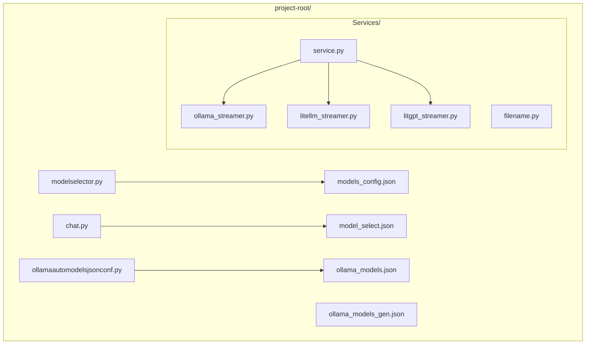
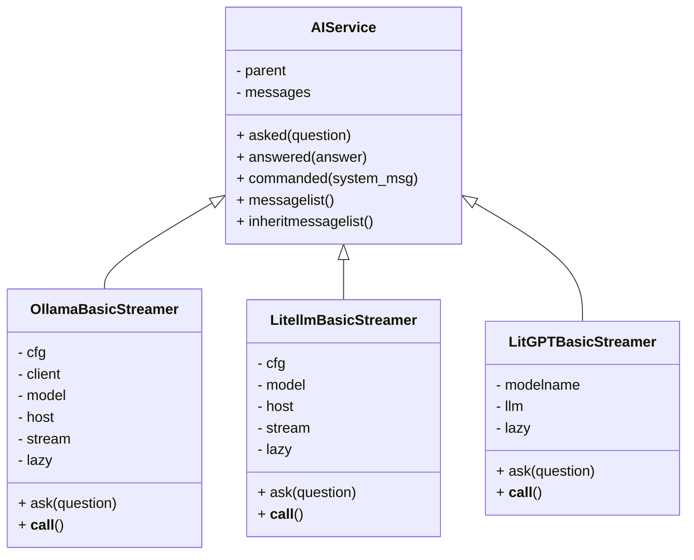
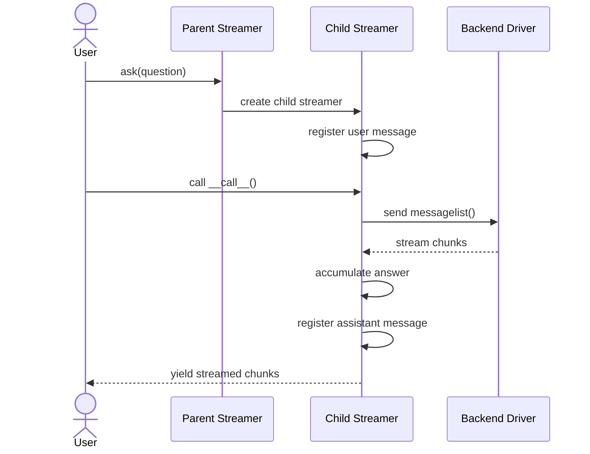
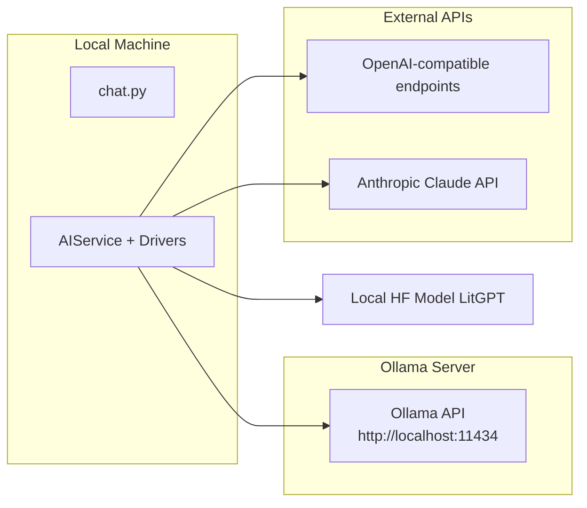

# DIAGRAMS.md  
Multi‑Backend CLI AI Chat Workbench  
Architectural & UML Documentation  
====================================================

This document provides a complete architectural overview of the Multi‑Backend CLI AI Chat Workbench.  
It is designed for architects, engineering leads, programmers, administrators, and non‑technical readers.

All diagrams use **Mermaid**, which GitHub renders natively.

---

# 1. Introduction  

## 1.1 Purpose  
This document explains the structure, behavior, and intent of the system using diagrams and narrative explanations.

## 1.2 Audience  
- **Architects** — understand module boundaries and extensibility  
- **IT managers** — understand maintainability and vendor‑agnostic design  
- **Programmers** — see class and sequence diagrams  
- **Administrators** — understand backend interactions  
- **Non‑technical readers** — plain‑language explanations included  

---

# 2. High‑Level Overview  

## 2.1 Non‑Technical Summary  
This project is a command‑line AI chat tool that can talk to different AI model providers:

- Local models (Ollama)  
- Proxy models (LiteLLM)  
- Local HF‑style models (LitGPT)  
- Optional cloud APIs  

It supports streaming answers, conversation history, and backend swapping without code changes.

---

# 3. Package Structure Diagram  

### Non‑technical explanation  
This is the “map” of the project.

---

# 4. Core Class Architecture  

### Explanation  
This diagram shows the inheritance structure:  
`AIService` is the base class, and each backend driver extends it.

### Non‑technical explanation  
Think of `AIService` as a universal translator.  
Each driver speaks a different backend language but follows the same rules.

---

# 5. Behavioral Diagram  
## 5.1 Sequence: Asking a Question & Streaming a Response

### Non‑technical explanation  
This shows what happens when you ask a question:  
a new “conversation bubble” is created, remembers history, and streams the answer.

---

# 6. Deployment Diagram  

### Non‑technical explanation  
This shows where things run and how they talk to each other.

---

# 7. Summary  

## 7.1 What This Architecture Achieves  
- Backend‑agnostic design  
- Unified interface for all model providers  
- Streaming support where available  
- Conversation history preserved  
- Easy extensibility  
- Clear separation of concerns  

## 7.2 Why It Matters  
For managers: reduces vendor lock‑in.  
For architects: clean abstraction layers.  
For programmers: easy to extend and maintain.  
For administrators: clear backend interactions.  
For non‑technical users: consistent experience.

---

# End of DIAGRAMS.md
