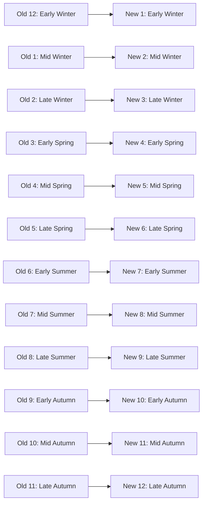

# Extraversion

*An extroverted versioning system*. You do not have your own versions, but you collaborate on global, timestamp-based versioning.

You can use also the name "DragonYear versioning": this, because I try to make sure, along other things chinese year animals are encoded visibly. It's very important that different people get *some* insight into the context of versions, and rather a few animals than personal alignment for each of 100 years in century are used - I use quite random systems where *time* is given some names, classes of days.

I will drink coffee and do my morning ritual, then continue: it's not good to write the *whole* article without those rituals. Well, the classical coffee+cigaretter ritual, this one works like magic and is scientifically verified brain-booster (brain is your sense-activity engine, so magic shift into brighter world should follow each time, so fast that it almost after..).

Extraversion is best used for:
- **Data autoincrement id**: Versioning trees, which grow from root to branches.
- **Versioning / update id**: Versioning mutations, developments and updates in the same data tag.
  - Same versioning system can be used for branched data.

# Calculation of the version "hash"

## Encoding: Letters as numbers

We have letters ordered so that four-bit binary number is used for each:
- KQCG, JPBF, IOAE, LRDH

Following functions calculate either 1 or 2 digits in this system:

```python
# Laegna bitfield encoding

# Real/natural number digit (1dim, binary precision 2)

def number_to_letter(n):
    mapping = {1: "I", 2: "O", 3: "A", 4: "E"}
    return mapping[n]

def letter_to_number(ch):
    mapping = {"I": 1, "O": 2, "A": 3, "E": 4}
    return mapping[ch]

# Complex number digit (2dim, binary precision 2, or binary 2dim precision 2*2=4)

groups = ["KQCG", "JPBF", "IOAE", "LRDH"]

def pair_to_letter(g, i):
    # g, i are 1-based
    return groups[g - 1][i - 1]

letter_to_pair_groups = {
    "K": (1, 1), "Q": (1, 2), "C": (1, 3), "G": (1, 4),
    "J": (2, 1), "P": (2, 2), "B": (2, 3), "F": (2, 4),
    "I": (3, 1), "O": (3, 2), "A": (3, 3), "E": (3, 4),
    "L": (4, 1), "R": (4, 2), "D": (4, 3), "H": (4, 4),
}

def letter_to_pair(ch):
    return letter_to_pair_groups[ch]  # returns (g, i)
```

If __name__ == "__main__" in your case, you definitely want to test it:

```python
if __name__ == "__main__":
    print("=== Testing 1D number <-> letter ===")

    # 4 typical tests
    typical_numbers = [1, 2, 3, 4]
    print("\n-- Typical number_to_letter --")
    for n in typical_numbers:
        print(f"{n} -> {number_to_letter(n)}")

    typical_letters = ["I", "O", "A", "E"]
    print("\n-- Typical letter_to_number --")
    for ch in typical_letters:
        print(f"{ch} -> {letter_to_number(ch)}")

    # 4 funny tests (scrambled, but still valid)
    funny_numbers = [4, 1, 3, 2]
    print("\n-- Funny number_to_letter --")
    for n in funny_numbers:
        print(f"{n} -> {number_to_letter(n)}")

    funny_letters = ["E", "I", "O", "A"]
    print("\n-- Funny letter_to_number --")
    for ch in funny_letters:
        print(f"{ch} -> {letter_to_number(ch)}")

    print("\n=== Testing 2D pair <-> letter ===")

    # 4 typical tests
    typical_pairs = [(1, 1), (1, 2), (2, 1), (3, 4)]
    print("\n-- Typical pair_to_letter --")
    for g, i in typical_pairs:
        print(f"({g}, {i}) -> {pair_to_letter(g, i)}")

    typical_letters_2d = ["K", "Q", "I", "H"]
    print("\n-- Typical letter_to_pair --")
    for ch in typical_letters_2d:
        g, i = letter_to_pair(ch)
        print(f"{ch} -> ({g}, {i})")

    # 4 funny tests
    funny_pairs = [(4, 4), (2, 3), (3, 1), (4, 2)]
    print("\n-- Funny pair_to_letter --")
    for g, i in funny_pairs:
        print(f"({g}, {i}) -> {pair_to_letter(g, i)}")

    funny_letters_2d = ["D", "B", "L", "F"]
    print("\n-- Funny letter_to_pair --")
    for ch in funny_letters_2d:
        g, i = letter_to_pair(ch)
        print(f"{ch} -> ({g}, {i})")
```

# Week numbering and seasonal hash

## A Season‑Aligned 4‑4‑5 Calendar for Versioning: History, Rotation, Encoding, and Implementation

The 4‑4‑5 calendar is one of the most elegant business‑time structures ever devised. It gives companies predictable reporting cycles, equal‑length quarters, and clean week boundaries. When adapted for a versioning system, it becomes a compact, season‑aware, memory‑efficient time code that can be expressed in digits or letters.

This article explains the history, the rotation, the encoding, and the Python implementation — and shows how this versioning system becomes a tiny “calendar in letters.”

---

## 1. The 4‑4‑5 Calendar: History, Logic, and Why Some 4‑Week Periods Become 5

### A brief history  
The 4‑4‑5 calendar emerged in 20th‑century retail and manufacturing. Businesses needed:

- equal‑length quarters  
- whole‑week periods  
- consistent weekday alignment  
- predictable reporting cycles  

The solution was simple:

```
4 weeks, 4 weeks, 5 weeks → one quarter
Repeat 4 times → 52 weeks
```

This yields:

- 12 periods  
- 4 quarters  
- 13 weeks per quarter  
- always starting on the same weekday  

### Why some 4‑week periods become 5  
A solar year is **52.18 weeks**, not 52.  
So every 5–6 years, the fiscal year must “catch up” by adding **one extra week**.

There are two real‑world rules:

1. **Extend the last period** (common in retail)  
2. **Extend the first period** (used in some accounting systems)

### Why this versioning system chooses Option B: extend the first period  
This versioning system uses:

- **discrete ranges**
- **fixed bit‑width**
- **hash‑friendly memory layout**

If the last period were extended, the rotated calendar would produce a **6‑week period**, which breaks:

- the 3‑bit week‑range encoding  
- the fixed‑range digit mapping  
- the compact hash‑memory model  

By extending the **first period**, the system guarantees:

- the longest period is **5 weeks**, never 6  
- all periods fit into a **small, fixed range**  
- the encoding remains stable  
- the memory footprint stays predictable  

This is why Option B is the “memory‑efficient” and “hash‑efficient” choice.

---

## 2. Rotating the Calendar to Align with Seasons

The original 4‑4‑5 calendar starts around **mid‑winter** (late January / early February).  
But the versioning system wants:

```
Period 1 = early winter
Period 2 = mid‑winter
Period 3 = late winter
Period 4 = early spring
...
Period 12 = late autumn
```

To achieve this, the original periods are rotated by **+1**:

```
new 1 = old 12
new 2 = old 1
new 3 = old 2
...
new 12 = old 11
```

### Why this matters  
When the periods are encoded as letters, this rotation becomes a **head‑calculable seasonal wheel**.

### Year boundary adjustment  
Because the fiscal year starts near February 1, some dates in January belong to the *previous* fiscal year.  
This means:

- When a week‑letter is visible in the versioning system  
- And the year is shifted by ±1  
- It becomes immediately clear whether the period belongs to the previous or next fiscal year  

This mirrors the mental model used with ISO week numbers — but now encoded in a compact alphabet.

### Mermaid diagram: rotation



---

## 3. Encoding: Seasons → Digits → Letters

Each season has 3 “months” (periods):

- Winter: 1–3  
- Spring: 4–6  
- Summer: 7–9  
- Autumn: 10–12  

Each period is encoded as:

- **Digit 1** = season (1–4)  
- **Digit 2** = month inside season (1–3)

| Period | Season | Month | Digit1 | Digit2 |
|--------|--------|--------|--------|--------|
| 1 | Winter | Early | 1 | 1 |
| 2 | Winter | Mid | 1 | 2 |
| 3 | Winter | Late | 1 | 3 |
| 4 | Spring | Early | 2 | 1 |
| 5 | Spring | Mid | 2 | 2 |
| 6 | Spring | Late | 2 | 3 |
| 7 | Summer | Early | 3 | 1 |
| 8 | Summer | Mid | 3 | 2 |
| 9 | Summer | Late | 3 | 3 |
| 10 | Autumn | Early | 4 | 1 |
| 11 | Autumn | Mid | 4 | 2 |
| 12 | Autumn | Late | 4 | 3 |

These digits can then be mapped into the IOAE or KQCG alphabets.

The result is a **compact, season‑aware, memory‑efficient versioning code**.

---

## 4. Python Implementation

```python
import datetime

def fiscal_year_start(year):
    """Return Monday of the week containing Feb 1 of given year."""
    feb1 = datetime.date(year, 2, 1)
    return feb1 - datetime.timedelta(days=feb1.weekday())

def is_53_week_year(year):
    """
    A 53-week year occurs when the fiscal year starts 7+ days earlier
    than the previous year's fiscal year start.
    """
    this_start = fiscal_year_start(year)
    prev_start = fiscal_year_start(year - 1)
    return (prev_start - this_start).days >= 7

def original_period_lengths(year):
    """
    Return the 12 period lengths (4-4-5 repeated),
    with the FIRST period extended in 53-week years.
    """
    lengths = [4, 4, 5] * 4  # 12 periods

    if is_53_week_year(year):
        lengths[0] += 1  # extend first period

    return lengths

def rotated_period_lengths(year):
    """
    Rotate so that new1 = old12, new2 = old1, ..., new12 = old11.
    """
    orig = original_period_lengths(year)
    return [orig[-1]] + orig[:-1]

def season_month_to_period(season, month):
    """season=1..4, month=1..3 → period 1..12"""
    return (season - 1) * 3 + month

def weeks_in_period(year, season, month):
    """Return number of weeks in the given season/month for the given year."""
    period = season_month_to_period(season, month)
    rotated = rotated_period_lengths(year)
    return rotated[period - 1]
```

---

## 5. Examples (`if __name__ == "__main__"`): Stories, Mnemonics, Orientation

### Example 1 — Early Winter (the “reset month”)

```python
print(weeks_in_period(2026, 1, 1))
```

**Story:**  
This is the “reset month” — the first cold breath of the fiscal year.  
If the year is a 53‑week year, this is the extended period.

**Mnemonic:**  
“1‑1 is the winter door.”

---

### Example 2 — Mid‑Winter (deep cold, stable length)

```python
print(weeks_in_period(2026, 1, 2))
```

**Story:**  
This is the heart of winter — stable, predictable, always 4 weeks.

**Mnemonic:**  
“1‑2 is the winter spine.”

---

### Example 3 — Early Spring (the thaw)

```python
print(weeks_in_period(2026, 2, 1))
```

**Story:**  
This is when the fiscal year starts to feel lighter — the first spring period.

**Mnemonic:**  
“2‑1 is the thaw.”

---

### Example 4 — Mid‑Summer (the bright center)

```python
print(weeks_in_period(2026, 3, 2))
```

**Story:**  
This is the warmest, brightest part of the year — and the calendar reflects that stability.

**Mnemonic:**  
“3‑2 is the sun at zenith.”

---

### Example 5 — Late Autumn (the fade‑out)

```python
print(weeks_in_period(2026, 4, 3))
```

**Story:**  
This is the last period before winter returns — the “fade‑out” of the year.

**Mnemonic:**  
“4‑3 is the leaf‑fall.”

---

### Orientation: How these codes help “feel” the time

When a version like:

```
1-3
```

appears, it instantly conveys:

- Season 1 → winter  
- Month 3 → late winter  
- This is the coldest, darkest part of the year  
- The next version will be **2‑1**, early spring  

The versioning system becomes a **seasonal compass**, compact enough to fit into a few bits or a single letter.

