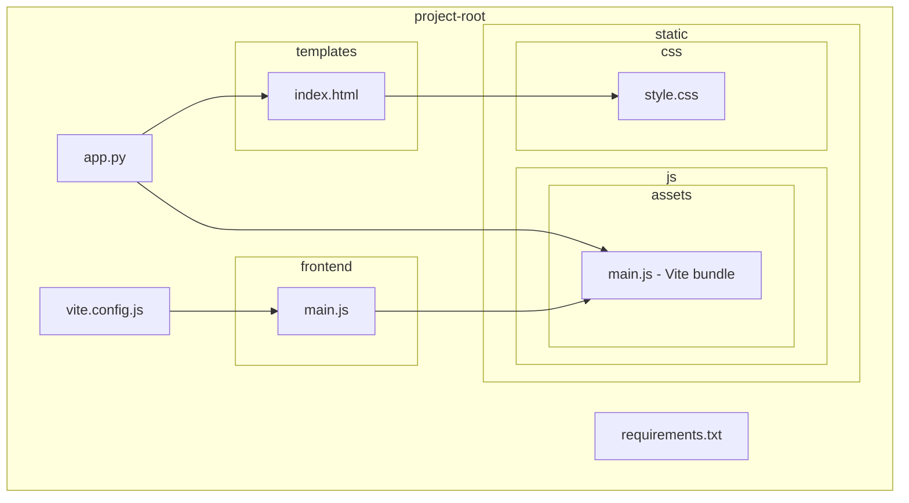
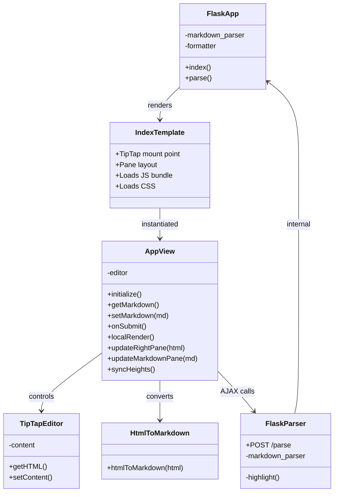
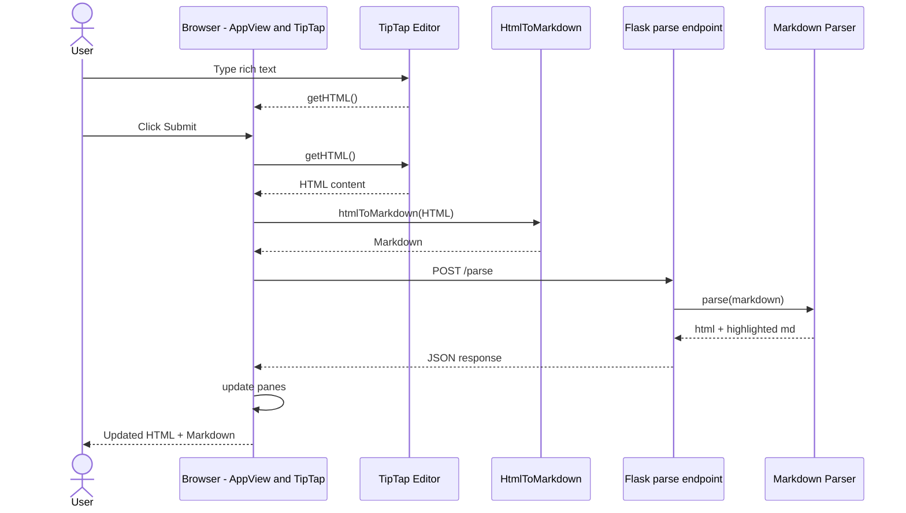
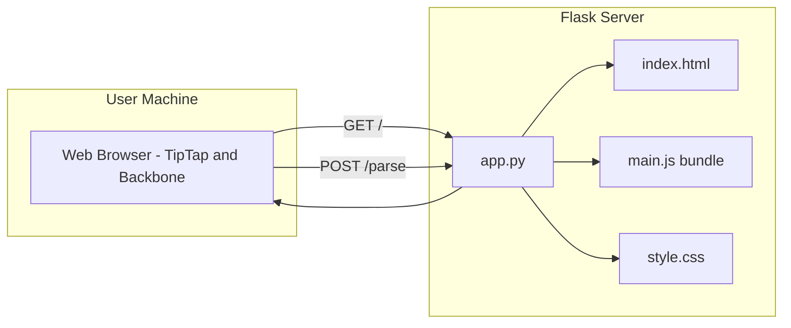
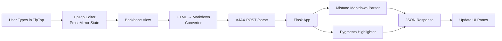
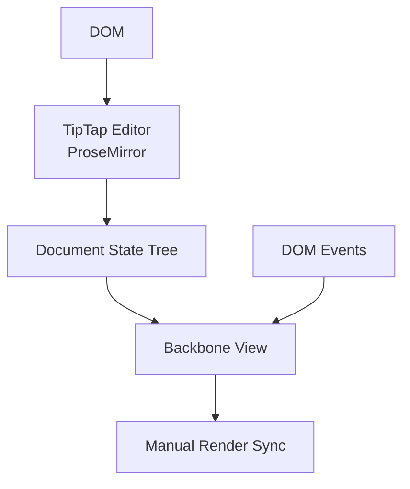
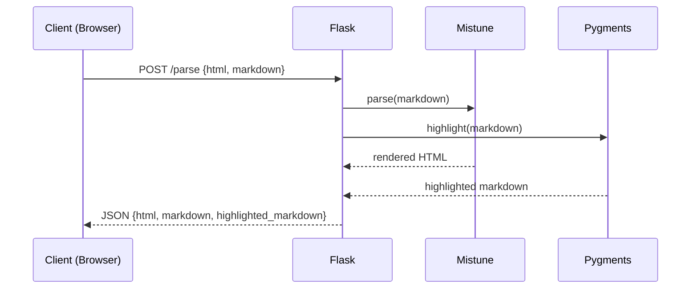
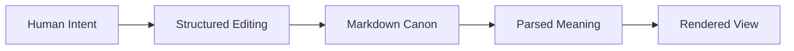

# DIAGRAMS.md — TipTap–Flask Markdown Workbench Architecture & UML

This document provides an architectural overview of the TipTap–Flask Markdown Workbench.  
All diagrams use **Mermaid**, compatible with GitHub’s renderer.

---

# 1. Introduction

## 1.1 Purpose
This document explains the structure, behavior, and intent of the system using diagrams and short narrative explanations.

## 1.2 Audience
- Architects  
- Programmers  
- Frontend engineers  
- Backend engineers  
- Non‑technical readers  

---

# 2. High‑Level Overview

The system is a **browser‑based Markdown workbench** backed by Flask:

- Left pane → TipTap rich‑text editor  
- Right pane → rendered HTML  
- Bottom pane → syntax‑highlighted Markdown  
- Backbone.js view coordinates UI and AJAX  
- Vite bundles frontend into `static/js/assets/main.js`  
- Flask serves UI and parses Markdown  

---

# 3. Project Structure Diagram

### Explanation
A map of the project’s folders and key files.



---

# 4. Core Component Architecture

### Explanation
Shows the main runtime components and how they relate.



---

# 5. Behavioral Diagram

## 5.1 Sequence: Editing → Submitting → Rendering



---

# 6. Deployment Diagram



---

# 7. Summary

## 7.1 What This Architecture Achieves
- Clear separation of frontend and backend  
- Single‑page workbench with synchronized panes  
- Simple deployment  
- Extensible Markdown + HTML pipeline  

## 7.2 Why It Matters
A clean example of integrating TipTap, Backbone, Vite, and Flask into a cohesive editing environment.

---

# End of DIAGRAMS.md

# 🧠📐 TipTap–Flask Markdown Workbench  
## System Flow, Internals & Conceptual Model (with Diagrams)

This section explains **how the entire system thinks and moves** — not just how it runs.

It combines:
- Execution flow
- Framework internals (Flask, Backbone.js)
- UI cognition (TipTap)
- A *TikTok-style analogy* for understanding data flow & attention

---

## 1️⃣ Whole Process Flow (End-to-End)



**Key insight**  
This is a **round-trip cognitive loop**:
- TipTap holds *semantic intent*
- Markdown is the *canonical intermediate*
- Flask is the *authoritative interpreter*

---

## 2️⃣ Frontend Cognitive Stack (TipTap + Backbone.js)



### Why Backbone.js still works beautifully here

Backbone acts as a **manual nervous system**:

- It does **not virtualize the DOM**
- It explicitly binds:
  ```js
  events: {
    'click #submit-button': 'onSubmit'
  }
  ```
- It coordinates *when* cognition happens

💡 This makes the system **debuggable, observable, and teachable** — ideal for AI-assisted reconstruction.

---

## 3️⃣ Flask Internal Processing Pipeline



### Critical Flask lines (authority boundary)

```python
markdown_parser = mistune.create_markdown()

rendered_html = markdown_parser(markdown_text)

highlighted_markdown = highlight(
    markdown_text,
    MarkdownLexer(),
    formatter
)
```

🧠 **Interpretation**  
Flask is not just a server — it is the **semantic judge**.  
Frontend guesses; backend *decides*.

---

## 4️⃣ TipTap → Markdown Conversion (Lossy but Intent-Preserving)

```mermaid
flowchart LR
    ProseMirror[ProseMirror JSON Tree]
    HTML[Editor.getHTML()]
    Regex[Regex Rules]
    Markdown[Intermediate Markdown]

    ProseMirror --> HTML
    HTML --> Regex
    Regex --> Markdown
```

### Critical conversion line

```js
const html = this.editor.getHTML()
const markdown = htmlToMarkdown(html)
```

⚠️ This conversion is **intentionally simple**:
- Not a full AST transform
- Designed for *clarity over completeness*
- Ideal for inspection, learning, and extension

---

## 5️⃣ TikTok Analogy (Why This Architecture Works)

```mermaid
flowchart TB
    Creator[User / Creator]
    Draft[Draft Video<br/>(TipTap State)]
    Caption[Caption Text<br/>(Markdown)]
    Algorithm[TikTok Algorithm<br/>(Flask Parser)]
    Feed[Rendered Feed<br/>(HTML Output)]

    Creator --> Draft
    Draft --> Caption
    Caption --> Algorithm
    Algorithm --> Feed
```

**Mapping**:
- TipTap = recording studio
- Markdown = captions + metadata
- Flask = recommendation algorithm
- Rendered HTML = what the world sees

🎯 TikTok works because:
- Drafts are editable
- Interpretation is centralized
- Output is consistent

So does this system.

---

## 6️⃣ System Philosophy (Why This Is AI-Friendly)

- **One canonical format** (Markdown)
- **Explicit state transitions**
- **No hidden magic**
- **Rebuildable from text alone**

This document itself can:
- Recreate the filesystem
- Explain execution order
- Train an AI on system intent

---

## 🧩 Final Mental Model



> *Markdown is not a format here — it is a **boundary of understanding***.

---

**End of system diagrams & explanation**
