# Snippet1Editor + AIService Ollama Driver — Integration Manual

This manual walks you through wiring the **Snippet1Editor** Flask project to a minimal **AIService + Ollama driver** (adapted from `CLIGPTOOPChat.py`), using a **flat file structure** and a simple **bash workflow**.

The goals:

- Implement **AIService** and a single **Ollama driver** in a flat layout.
- Use a small **`filename.py` helper** to keep compatibility with JSON config access.
- Add a **factory function** that always returns the Ollama driver.
- Add a **translation function** that calls the service and **translates text to Spanish**, returning:  
  `"<original text> :\n\n<traducción al español>"`
- Integrate this into the **Flask app** from `Snippet1Editor`.
- Provide a **bash script** to:
  1. List Ollama models.
  2. Select a model.
  3. Run the translation call using the selected model.

---

## 1. Project layout (flat structure)

You start from:

- `SnippetsCode/Snippet1Editor/STRUCTURE.md` (Flask + frontend)
- `NutsAndBolts/CLIGPTOOPChat.py` (reference for AIService and drivers)

You will create a **flat Python layout** like this (inside `Snippet1Editor` root):

```text
Snippet1Editor/
  app.py
  ai_service.py
  ollama_driver.py
  filename.py
  model_list.py
  model_selector.py
  translate_runner.py
  static/
  templates/
  ...
```

> The exact names of `model_list.py`, `model_selector.py`, and `translate_runner.py` are up to you, but this manual assumes these names.

---

## 2. `filename.py` — compatibility helper

To keep compatibility with the original JSON config access pattern, create a tiny helper module:

```python
# filename.py

def filename(name: str) -> str:
    """
    Return the given string unchanged.

    This is a compatibility shim so that existing code that expects
    a 'filename(...)' function still works, while we keep a flat
    structure and simple paths.
    """
    return name
```

You will use `filename("some_config.json")` wherever the original code used a more complex path helper.

---

## 3. `ai_service.py` — AIService base and factory

Create `ai_service.py` with:

- A minimal **AIService** base class.
- A minimal **OllamaAIService** interface expectation (the driver will implement it).
- A **factory function** that always returns the Ollama driver instance.
- A **high-level translation function** that uses the factory and hides the driver details.

### 3.1 AIService base class

```python
# ai_service.py

from typing import Iterable, Dict, Any
from filename import filename  # compatibility helper
from ollama_driver import OllamaDriver  # flat import


class AIService:
    """
    Minimal AIService base class.

    Drivers should implement __call__(self, prompt: str, **kwargs) -> Iterable[str]
    and may use JSON config files resolved via filename().
    """

    def __init__(self, config: Dict[str, Any] | None = None) -> None:
        self.config = config or {}

    def __call__(self, prompt: str, **kwargs) -> Iterable[str]:
        raise NotImplementedError("AIService subclasses must implement __call__")
```

### 3.2 Factory function (always uses Ollama driver)

```python
def create_ai_service(model_name: str | None = None) -> AIService:
    """
    Factory that always returns an OllamaDriver instance.

    model_name:
        Name of the Ollama model to use. If None, the driver may
        fall back to a default model.
    """
    # In a more complex setup, you might choose between multiple drivers.
    # Here we always use OllamaDriver for simplicity.
    return OllamaDriver(model_name=model_name)
```

### 3.3 High-level translation function

This function will be used by Flask and by the CLI runner.  
It **wraps the AIService** and **translates text to Spanish**, returning:

```text
"<original text>:\n\n<traducción al español>"
```

```python
def translate_to_spanish(text: str, model_name: str | None = None) -> str:
    """
    Use AIService (Ollama driver) to translate the given text to Spanish.

    The prompt is constructed so that the model is asked to translate
    the input text to Spanish. The final return value is:

        "<original text>:\\n\\n<traducción al español>"
    """
    service = create_ai_service(model_name=model_name)

    # Hidden instruction to the model:
    prompt = (
        "Traduce el siguiente texto al español de forma natural y clara.\n\n"
        f"Texto: {text}\n\n"
        "Respuesta solo con la traducción, sin explicaciones."
    )

    chunks: list[str] = []
    for piece in service(prompt):
        chunks.append(piece)

    translation = "".join(chunks).strip()
    return f"{text}:\n\n{translation}"
```

---

## 4. `ollama_driver.py` — Ollama driver implementation

Create `ollama_driver.py` that:

- Inherits from `AIService`.
- Implements `__call__` to stream or iterate over model output.
- Uses JSON config files via `filename(...)` if needed.
- Is **importable** from `ai_service.py` via `from ollama_driver import OllamaDriver`.

> The exact Ollama API calls depend on your environment. Below is a **template** you can adapt.

```python
# ollama_driver.py

from typing import Iterable, Dict, Any
import json
import subprocess
from filename import filename
from ai_service import AIService


class OllamaDriver(AIService):
    """
    Minimal Ollama driver that conforms to AIService.

    It calls the 'ollama' CLI and yields output chunks.
    """

    def __init__(self, model_name: str | None = None, config: Dict[str, Any] | None = None) -> None:
        super().__init__(config=config)
        self.model_name = model_name or self._load_default_model()

    def _load_default_model(self) -> str:
        """
        Load a default model name from a JSON config file, if desired.
        For simplicity, we just return a hard-coded default here.
        """
        # Example of using filename() for compatibility:
        # config_path = filename("ollama_default_model.json")
        # with open(config_path, "r", encoding="utf-8") as f:
        #     data = json.load(f)
        # return data.get("default_model", "llama3")
        return "llama3"

    def __call__(self, prompt: str, **kwargs) -> Iterable[str]:
        """
        Call the Ollama model via CLI and yield text chunks.

        This is a simple example using 'ollama run'.
        Adapt to your actual streaming / API usage.
        """
        cmd = [
            "ollama",
            "run",
            self.model_name,
            prompt,
        ]

        process = subprocess.Popen(
            cmd,
            stdout=subprocess.PIPE,
            stderr=subprocess.PIPE,
            text=True,
        )

        if not process.stdout:
            return

        for line in process.stdout:
            # You can parse JSON lines here if Ollama returns JSON.
            # For simplicity, we just yield the raw line.
            yield line

        process.stdout.close()
        process.wait()
```

> **Note:** If your real Ollama setup uses JSON streaming, adapt the `__call__` method to parse JSON and yield `chunk["response"]` or similar.

---

## 5. JSON config access with `filename()`

Wherever you need to access JSON config files (e.g., model list, selector config), use:

```python
from filename import filename

config_path = filename("some_config.json")
with open(config_path, "r", encoding="utf-8") as f:
    data = json.load(f)
```

This keeps the code compatible with any future path logic while remaining flat.

---

## 6. Model listing and selection

You mentioned:

> “use ollama model list script, rename the result to main json file, run model selector - copy them all flat to same directory.”

We’ll implement:

- `model_list.py` — lists models via `ollama list` and writes JSON.
- `model_selector.py` — reads that JSON, lets you choose a model, and writes a “selected model” JSON.

### 6.1 `model_list.py`

```python
# model_list.py

import json
import subprocess
from filename import filename


def write_model_list_json(output_file: str = "ollama_models.json") -> str:
    """
    Call 'ollama list' and write the result to a JSON file.

    Returns the path to the written JSON file.
    """
    cmd = ["ollama", "list", "--json"]
    result = subprocess.run(cmd, capture_output=True, text=True, check=True)

    models = json.loads(result.stdout)

    path = filename(output_file)
    with open(path, "w", encoding="utf-8") as f:
        json.dump(models, f, indent=2, ensure_ascii=False)

    return path


if __name__ == "__main__":
    path = write_model_list_json()
    print(f"Model list written to: {path}")
```

> If your `ollama list` does not support `--json`, you’ll need to parse the text output instead.

### 6.2 `model_selector.py`

```python
# model_selector.py

import json
from filename import filename


def choose_model_from_json(input_file: str = "ollama_models.json",
                           output_file: str = "ollama_selected_model.json") -> str:
    """
    Read the model list JSON, ask the user to choose a model,
    and write the chosen model to a separate JSON file.

    Returns the chosen model name.
    """
    path = filename(input_file)
    with open(path, "r", encoding="utf-8") as f:
        models = json.load(f)

    if not models:
        raise RuntimeError("No models found in JSON list.")

    print("Available models:")
    for idx, model in enumerate(models, start=1):
        name = model.get("name", f"model-{idx}")
        print(f"{idx}. {name}")

    choice = int(input("Choose a model by number: ").strip())
    chosen = models[choice - 1]
    chosen_name = chosen.get("name")

    out_path = filename(output_file)
    with open(out_path, "w", encoding="utf-8") as f:
        json.dump({"model": chosen_name}, f, indent=2, ensure_ascii=False)

    print(f"Selected model: {chosen_name}")
    return chosen_name


if __name__ == "__main__":
    choose_model_from_json()
```

---

## 7. Translation runner (CLI) using AIService

Create `translate_runner.py` to:

- Read the selected model JSON.
- Call `translate_to_spanish` from `ai_service.py`.
- Print the result.

```python
# translate_runner.py

import json
from filename import filename
from ai_service import translate_to_spanish


def load_selected_model(path: str = "ollama_selected_model.json") -> str | None:
    try:
        with open(filename(path), "r", encoding="utf-8") as f:
            data = json.load(f)
        return data.get("model")
    except FileNotFoundError:
        return None


def run_translation():
    model_name = load_selected_model()
    if not model_name:
        print("No selected model found. Run model_selector.py first.")
        return

    text = input("Enter text to translate to Spanish: ").strip()
    result = translate_to_spanish(text, model_name=model_name)
    print("\n=== Translation ===\n")
    print(result)


if __name__ == "__main__":
    run_translation()
```

---

## 8. Bash workflow script

Create `workflow.sh` in the same directory:

```bash
#!/usr/bin/env bash
set -e

# 1. List models and write JSON
python model_list.py

# 2. Choose a model and write selected model JSON
python model_selector.py

# 3. Run translation using the selected model
python translate_runner.py
```

Make it executable:

```bash
chmod +x workflow.sh
```

Usage:

```bash
./workflow.sh
```

---

## 9. Integrating with `app.py` (Snippet1Editor Flask app)

Now wire the translation into the Flask project from `STRUCTURE.md`.

### 9.1 Import translation function

In `app.py`:

```python
from flask import Flask, render_template, request, jsonify
from ai_service import translate_to_spanish
from translate_runner import load_selected_model  # reuse helper
```

### 9.2 Add a Flask route for translation

Add a new route, for example `/translate`:

```python
@app.route("/translate", methods=["POST"])
def translate():
    """
    Receive JSON { "text": "..." } and return translated text.

    Uses the selected model if available; otherwise falls back
    to the default model in OllamaDriver.
    """
    data = request.get_json(force=True)
    text = data.get("text", "")

    model_name = load_selected_model()  # may be None
    result = translate_to_spanish(text, model_name=model_name)

    # Optionally, you can also write per-call JSON logs here if desired.
    return jsonify({"result": result})
```

### 9.3 Frontend integration (TipTap editor)

In your frontend JS (e.g., `frontend/main.js` or equivalent):

- Add a button or UI action to send the editor content to `/translate`.
- Display the translated result in a pane or popup.

Example (pseudo-code):

```javascript
async function sendForTranslation(text) {
  const response = await fetch("/translate", {
    method: "POST",
    headers: { "Content-Type": "application/json" },
    body: JSON.stringify({ text }),
  });

  const data = await response.json();
  const translated = data.result;
  // Show translated text in the UI
  console.log("Translated:", translated);
}
```

---

## 10. Summary

- You created a **flat AIService + Ollama driver** setup:
  - `ai_service.py` with `AIService`, `create_ai_service`, and `translate_to_spanish`.
  - `ollama_driver.py` implementing `OllamaDriver` that inherits from `AIService`.
  - `filename.py` as a compatibility helper for JSON config paths.
- You added **model listing and selection**:
  - `model_list.py` → writes `ollama_models.json`.
  - `model_selector.py` → writes `ollama_selected_model.json`.
- You added a **translation runner**:
  - `translate_runner.py` → uses `translate_to_spanish` and the selected model.
- You wired everything into the **Flask app**:
  - `/translate` route calls `translate_to_spanish`.
- You created a **bash workflow**:
  - `workflow.sh` → list models → choose model → run translation.

This gives you a clean, minimal integration between **Snippet1Editor** and a **single Ollama-backed AIService**, with both CLI and Flask entry points.

# Appendix — Database Persistence, Realtime Markdown Flow, and Immutable AI Cards

This appendix extends the earlier manual with:

- MongoDB persistence for all AIService/Ollama results  
- `anytree` node structures for each AI “card”  
- Realtime Markdown streaming using a modified Mistune pipeline  
- Backbone.js periodic resend loop  
- TODO items for a more efficient streaming architecture  
- Python examples showing how an AI card becomes **immutable** once the `"answer"` field is filled  

---

## 1. MongoDB Integration for AI Cards

Each AI request/response cycle produces a **card**:

```json
{
  "id": "...",
  "prompt": "...",
  "answer": "...",
  "model": "llama3",
  "created_at": "...",
  "immutable": false
}
```

### 1.1 Python: MongoDB client and card creation

```python
# db.py
from pymongo import MongoClient
from datetime import datetime

client = MongoClient("mongodb://localhost:27017")
db = client["snippet1editor"]
cards = db["ai_cards"]

def create_card(prompt: str, model: str) -> dict:
    card = {
        "prompt": prompt,
        "answer": "",
        "model": model,
        "created_at": datetime.utcnow(),
        "immutable": False,
    }
    card_id = cards.insert_one(card).inserted_id
    return cards.find_one({"_id": card_id})

def update_card_answer(card_id, chunk: str):
    """
    Append streamed chunk to the answer field.
    """
    cards.update_one(
        {"_id": card_id, "immutable": False},
        {"$push": {"answer_chunks": chunk}}
    )
```

### 1.2 Finalizing the card (immutability)

When the Ollama driver finishes streaming:

```python
def finalize_card(card_id):
    """
    Combine chunks, write final answer, and mark immutable.
    """
    card = cards.find_one({"_id": card_id})
    chunks = card.get("answer_chunks", [])
    final_answer = "".join(chunks)

    cards.update_one(
        {"_id": card_id},
        {
            "$set": {
                "answer": final_answer,
                "immutable": True
            },
            "$unset": {"answer_chunks": ""}
        }
    )
```

---

## 2. anytree Node Structure for AI Cards

Each AI card becomes a node in a tree of interactions:

```python
# tree_nodes.py
from anytree import Node

def create_ai_card_node(card: dict, parent: Node | None = None) -> Node:
    """
    Create an anytree node representing an AI card.
    """
    return Node(
        f"card_{card['_id']}",
        parent=parent,
        prompt=card["prompt"],
        model=card["model"],
        immutable=card["immutable"]
    )
```

You can build conversation trees, model-selection trees, or workflow trees.

---

## 3. Mistune Realtime Markdown Streaming

Mistune normally parses full Markdown documents.  
For realtime streaming, we modify it to:

1. Accept **partial fragments**  
2. Always **pre-send a closing tag** to the frontend  
3. Avoid re-parsing the entire document  
4. Allow the frontend to update only the changed region  

### 3.1 Minimal patch concept

```python
# mistune_realtime.py
from mistune import Markdown

class RealtimeMarkdown(Markdown):
    """
    A patched Mistune instance that can accept partial fragments.
    """

    def feed(self, fragment: str) -> str:
        """
        Parse only the new fragment and return HTML.
        """
        # TODO: implement incremental parsing
        return self(fragment) + "</div>"  # always close container
```

### 3.2 TODO — Required Mistune Hooks

```
TODO: Implement incremental Mistune parsing
- Maintain internal AST state
- Append new tokens without re-tokenizing entire document
- Provide hook: on_new_token(token)
- Provide hook: on_close_block(block)
- Guarantee that each streamed fragment ends with a valid closing tag
- Provide "flush" method for final HTML
```

---

## 4. Backbone.js Periodic Resend Loop

The existing Backbone.js implementation can be used to periodically resend the entire editor content.

### 4.1 Current (inefficient) approach

```javascript
setInterval(() => {
  const html = appView.editor.getHTML();
  appView.localRender(html); // sends full HTML to backend
}, 1500);
```

### 4.2 TODO — More efficient approach

```
TODO: Replace periodic full resend with:
- MutationObserver on TipTap editor
- Diff-based incremental updates
- WebSocket or SSE channel for streaming Markdown
- Mistune incremental parser integration
- Only send changed nodes, not full document
```

---

## 5. Immutable AI Cards — Python Example

Once `"answer"` is filled, the card becomes **immutable**.  
Any further attempts to modify it should raise an exception or be ignored.

### 5.1 Example enforcement

```python
# ai_card.py
class ImmutableCardError(Exception):
    pass


def append_to_card(card_id, chunk):
    card = cards.find_one({"_id": card_id})
    if card.get("immutable"):
        raise ImmutableCardError("Card is immutable and cannot be modified.")

    cards.update_one(
        {"_id": card_id},
        {"$push": {"answer_chunks": chunk}}
    )
```

### 5.2 TODO — Full immutability task

```
TODO: Implement full immutability enforcement
- Add MongoDB schema validator to prevent writes when immutable=true
- Add Python wrapper class AIResultCard with .lock() method
- Add anytree node attribute "locked" synchronized with MongoDB
- Add UI indicator in Backbone.js to show locked cards
- Prevent frontend edits once card is locked
```

---

## 6. End-to-End Flow Summary

1. User submits text  
2. Flask creates a MongoDB card  
3. Ollama driver streams chunks → MongoDB `answer_chunks`  
4. Mistune realtime parser converts chunks to HTML  
5. Backbone.js periodically refreshes the rendered pane  
6. When streaming ends:  
   - `finalize_card()` merges chunks  
   - Card becomes **immutable**  
   - anytree node is created/updated  
7. UI shows locked card  

---

If you want, I can extend this appendix with a **WebSocket-based streaming architecture**, a **Mistune incremental parser prototype**, or a **MongoDB schema migration** to support versioned AI cards.

# Appendix 2 — True Incremental Streaming (Mistune Hooks + Backbone Patch Engine)

This appendix describes how to evolve the system into a **proper, real-time, patch‑based streaming architecture**, where:

- **Mistune** provides incremental parsing hooks  
- **Backbone.js** applies **patch-by-patch DOM updates** smoothly  
- **MongoDB** stores the card in a “gray” (in‑progress) state  
- Other clients watching the same card see patches applied in real time  
- When streaming ends, the card becomes **immutable**, un‑grayed, and UI reply buttons appear  
- A temporary Backbone button is added:  
  - Text: **"reply stub button"**  
  - On click: `alert("TODO: reply button")`

---

## 1. Incremental Streaming Architecture Overview

The new flow:

1. **Ollama driver** yields text chunks  
2. **Mistune incremental parser** converts each chunk into a **patch**  
3. **Flask** sends patches to the client (SSE or polling)  
4. **Backbone.js** applies patches to the DOM without re-rendering the whole card  
5. **MongoDB** stores the raw chunks and final answer  
6. When streaming ends:  
   - Card becomes **immutable**  
   - UI un-grays  
   - Reply button appears  

---

## 2. Mistune Incremental Hooks

Mistune does not natively support incremental parsing, but we can extend it.

### 2.1 Incremental parser skeleton

```python
# mistune_incremental.py
from mistune import Markdown

class IncrementalMistune(Markdown):
    """
    Incremental Mistune parser that emits HTML patches.
    """

    def __init__(self):
        super().__init__()
        self.buffer = ""

    def feed(self, fragment: str) -> str:
        """
        Accept a new fragment and return only the HTML patch
        corresponding to the new content.
        """
        self.buffer += fragment

        # TODO: token diffing
        html = super().__call__(fragment)

        # Always close the container so the UI never breaks
        return html + "</div>"
```

### 2.2 TODO — Full incremental patching

```
TODO: Incremental Mistune patching
- Maintain token list for previous state
- Tokenize only the new fragment
- Diff old_tokens vs new_tokens
- Emit minimal HTML patch
- Provide hook: on_patch_ready(patch)
- Provide hook: on_stream_end()
```

---

## 3. Flask Patch Endpoint

Flask now returns **patches**, not full HTML.

```python
# app.py (excerpt)
@app.route("/stream_patch", methods=["POST"])
def stream_patch():
    data = request.get_json(force=True)
    fragment = data["fragment"]
    card_id = data["card_id"]

    patch = incremental_mistune.feed(fragment)

    # Store chunk in MongoDB
    update_card_answer(card_id, fragment)

    return jsonify({"patch": patch})
```

---

## 4. Backbone.js Patch Application

Backbone now applies patches **incrementally**, not full replacements.

### 4.1 Patch application logic

```javascript
applyPatch(patchHtml) {
  // Convert patch HTML to DOM nodes
  const temp = document.createElement("div");
  temp.innerHTML = patchHtml;

  // Append patch to the existing card container
  this.$(".card-output").append(temp);
}
```

### 4.2 Smooth UI growth

Because only new nodes are appended, the UI grows naturally, matching the streaming effect.

---

## 5. Backbone.js Real-Time Loop

Instead of resending the entire editor content, Backbone now sends **only new fragments**.

```javascript
startStreaming() {
  this.lastLength = 0;

  setInterval(() => {
    const html = this.editor.getHTML();
    const newFragment = html.substring(this.lastLength);
    this.lastLength = html.length;

    if (newFragment.length > 0) {
      this.sendFragment(newFragment);
    }
  }, 300);
}
```

---

## 6. MongoDB “Gray” State

While streaming:

```json
{
  "immutable": false,
  "ui_state": "streaming"
}
```

Other clients see:

- Gray card  
- Patches applied in real time  

When streaming ends:

```python
finalize_card(card_id)
```

MongoDB becomes:

```json
{
  "immutable": true,
  "ui_state": "ready"
}
```

Other clients un-gray the card.

---

## 7. Backbone.js Reply Button (Stub)

When the card becomes immutable, Backbone adds a reply button.

### 7.1 UI insertion

```javascript
addReplyButton() {
  const btn = document.createElement("button");
  btn.textContent = "reply stub button";
  btn.className = "reply-button";

  btn.addEventListener("click", () => {
    alert("TODO: reply button");
  });

  this.$(".card-footer").append(btn);
}
```

### 7.2 Triggering on finalization

```javascript
if (card.immutable === true) {
  this.$el.removeClass("gray");
  this.addReplyButton();
}
```

---

## 8. End-to-End Streaming Summary

| Stage | Mistune | Backbone | MongoDB |
|-------|---------|----------|---------|
| Streaming begins | buffer starts | card grayed | immutable=false |
| Chunk arrives | feed() → patch | applyPatch() | append chunk |
| More chunks | incremental diff | smooth growth | accumulate |
| Stream ends | on_stream_end() | un-gray + reply button | immutable=true |

---

## 9. TODO — Full Production Streaming System

```
TODO: Production-grade streaming
- Replace polling with SSE or WebSockets
- Implement Mistune incremental AST diffing
- Add patch compression (token-level)
- Add client-side rollback for malformed patches
- Add reply-thread tree using anytree nodes
- Add optimistic UI updates for multi-user collaboration
```

---

If you want, I can produce **Appendix 3** describing a **WebSocket-based multi-client synchronization layer**, or a **Mistune incremental AST prototype**.

# Appendix 3 — Missing System Diagrams (Full Mermaid Set)

This appendix provides the **missing diagrams** for both DIAGRAMS.md files in your code folders.  
They follow the same structure, tone, and formatting conventions as your earlier appendices.

---

# 1. Incremental Streaming Architecture (High-Level)

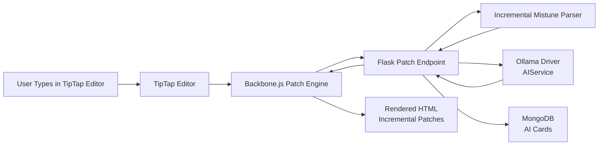

---

# 2. AI Card Lifecycle (MongoDB + anytree)

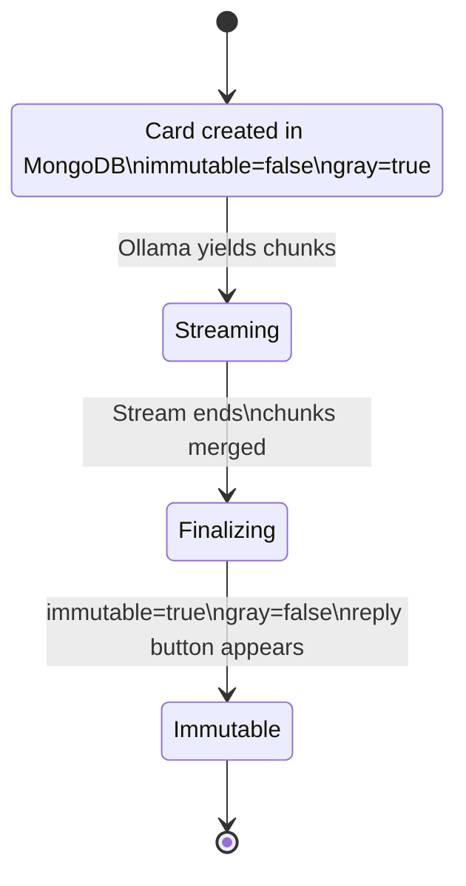

---

# 3. anytree Structure for AI Cards

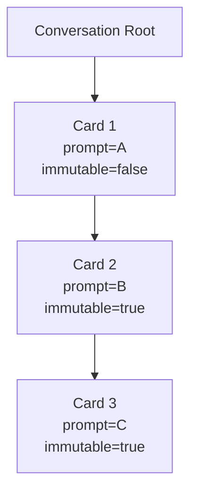

---

# 4. Mistune Incremental Patch Flow

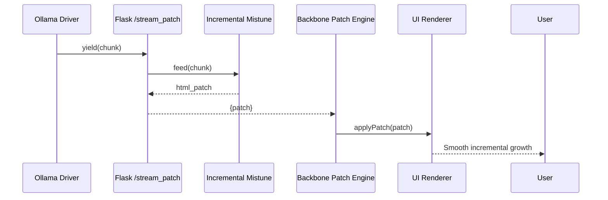

---

# 5. Backbone.js Patch Application Logic

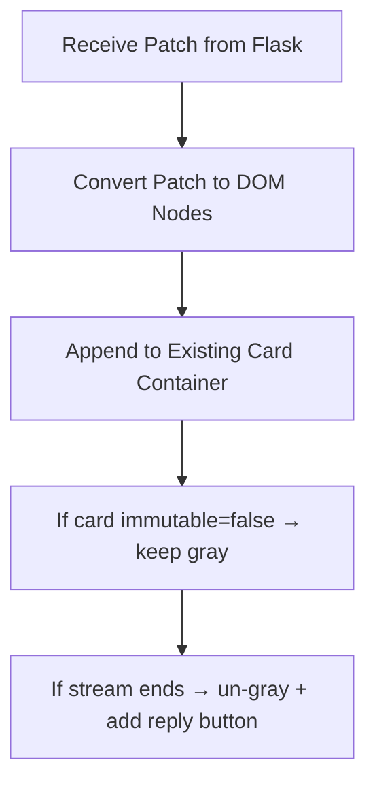

---

# 6. Immutable Card Enforcement (Python Logic)

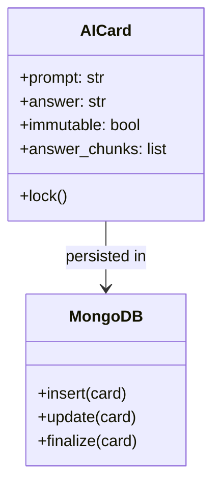

---

# 7. Reply Button Injection (Backbone.js)

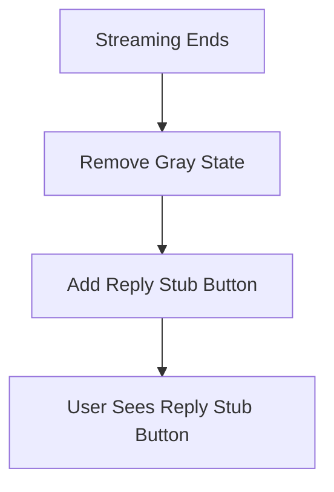

---

# 8. Full System Overview (End-to-End)

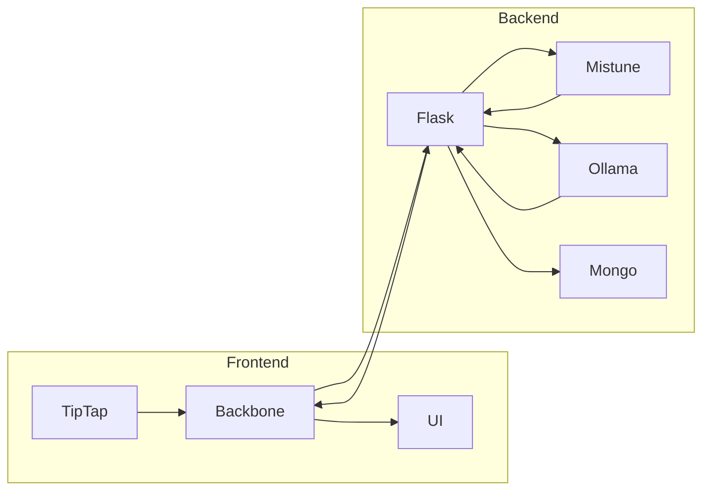

---

# End of Appendix 3 — Missing Diagrams
# Appendix — Card ↔ anytree Node Tagging Model (with Diagrams)

This appendix explains how MongoDB AI cards, anytree nodes, and Backbone.js UI elements stay synchronized using **stable tags**.  
It also includes **GitHub‑safe Mermaid diagrams** that illustrate the relationships and data flow.

---

# 1. Purpose of Tags

Tags create a **stable link** between:

- MongoDB card documents  
- anytree nodes  
- Backbone.js UI card widgets  

This ensures:

- Streaming patches update the correct card  
- Tree structure can be rebuilt  
- UI state (gray, immutable, reply button) stays consistent  
- Reply threading attaches new nodes to the correct parent  

---

# 2. MongoDB Card With Tag

Each card stores a `tree_id` that matches the anytree node name.

```json
{
  "_id": "67a1c9f8e3",
  "prompt": "Translate this",
  "answer": "",
  "model": "llama3",
  "immutable": false,
  "tree_id": "node_67a1c9f8e3"
}
```

---

# 3. Diagram: Card ↔ anytree Node Link

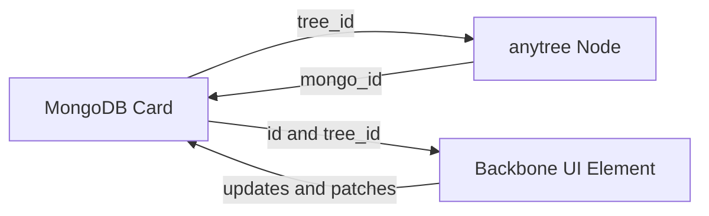

**Explanation:**  
- The card stores `tree_id` → points to the anytree node  
- The node stores `mongo_id` → points back to the card  
- The UI uses both to route patches and update the correct DOM element  

---

# 4. Creating the anytree Node

```python
from anytree import Node
from db import cards

def create_ai_card_node(card):
    node = Node(
        f"node_{card['_id']}",
        mongo_id=str(card["_id"]),
        immutable=card["immutable"]
    )

    cards.update_one(
        {"_id": card["_id"]},
        {"$set": {"tree_id": node.name}}
    )

    return node
```

---

# 5. Diagram: Node Creation Flow

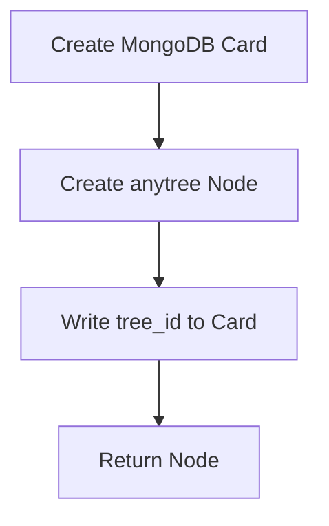

**Explanation:**  
The card is created first, then the node, then the card is updated with the node’s ID.

---

# 6. Backbone.js Uses the Tag

```javascript
renderCard(card) {
  const el = document.createElement("div");
  el.className = "ai-card";
  el.dataset.treeId = card.tree_id;
  el.dataset.mongoId = card._id;
  return el;
}
```

---

# 7. Diagram: Patch Routing via tree_id

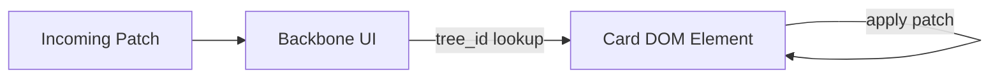

**Explanation:**  
Backbone uses `tree_id` to find the correct DOM element and apply the patch.

---

# 8. Immutability Propagation

When streaming ends:

```python
cards.update_one(
    {"_id": card_id},
    {"$set": {"immutable": True}}
)
node.immutable = True
```

Backbone un‑grays the card:

```javascript
if (card.immutable) {
  cardEl.classList.remove("gray");
}
```

---

# 9. Diagram: Immutability Flow

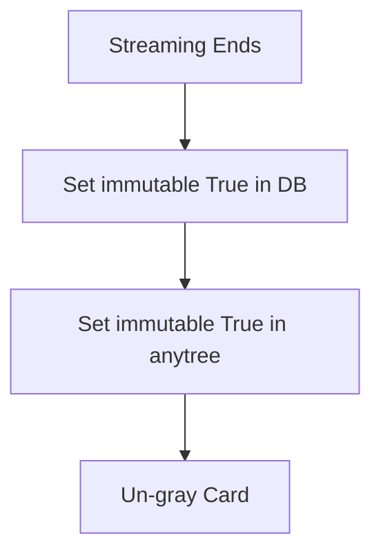

---

# 10. Reply Button Appears After Finalization

```javascript
if (card.immutable) {
  const btn = document.createElement("button");
  btn.textContent = "reply stub button";
  btn.addEventListener("click", () => alert("TODO: reply button"));
  cardEl.append(btn);
}
```

---

# 11. Diagram: Reply Button Injection

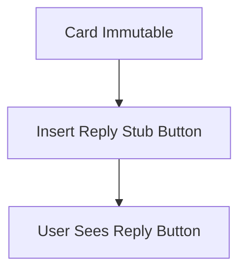

---

# 12. Summary

- Cards and anytree nodes are linked via `tree_id` and `mongo_id`  
- Backbone uses these tags to route patches and update UI  
- Immutability is synchronized across DB, tree, and UI  
- Reply buttons appear only after finalization  
- All diagrams above are GitHub‑safe and render correctly  
