# Introduction: From Core Architecture to Full AI Application  
### A unified story of QuandaMessage, streaming UI, and real‑world benefits

This introduction ties together the two major layers of your system:

1. **The foundational implementation** — the QuandaMessage architecture  
2. **The applied implementation** — Flask + Backbone + Ollama + mistune  

Then it shows how these layers combine to create **responsive, intelligent, AI‑augmented user interfaces**.

---

# 1. The first implementation:  
## QuandaMessage as the universal streaming substrate

At the heart of the system is a simple but powerful idea:

> A message is not a static string — it is a *stream* of evolving content.

This is implemented through:

- **QuandaMessage** — persistent message state  
- **QuandaToken** — atomic updates (chunk, override, warning)  
- **QuandaWriter** — produces tokens  
- **QuandaReader** — consumes tokens  

This gives you:

- Real‑time streaming  
- Multi‑writer concurrency  
- Multi‑reader synchronization  
- Crash‑safe persistence  
- Deterministic replay  

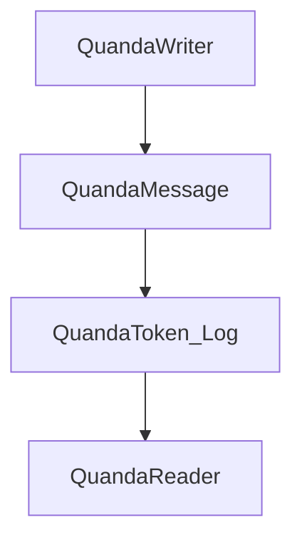

This layer is **backend‑agnostic** and **UI‑agnostic**.  
It is the “physics engine” of your AI system.

---

# 2. The second implementation:  
## Flask + Backbone + Ollama + mistune

Once the core exists, you wrap it in a real application stack:

- **Flask** exposes HTTP + SSE endpoints  
- **Backbone.js** streams user input and receives AI output  
- **Ollama** generates assistant responses  
- **mistune** renders Markdown safely  

Together, they form a **bidirectional streaming UI**:

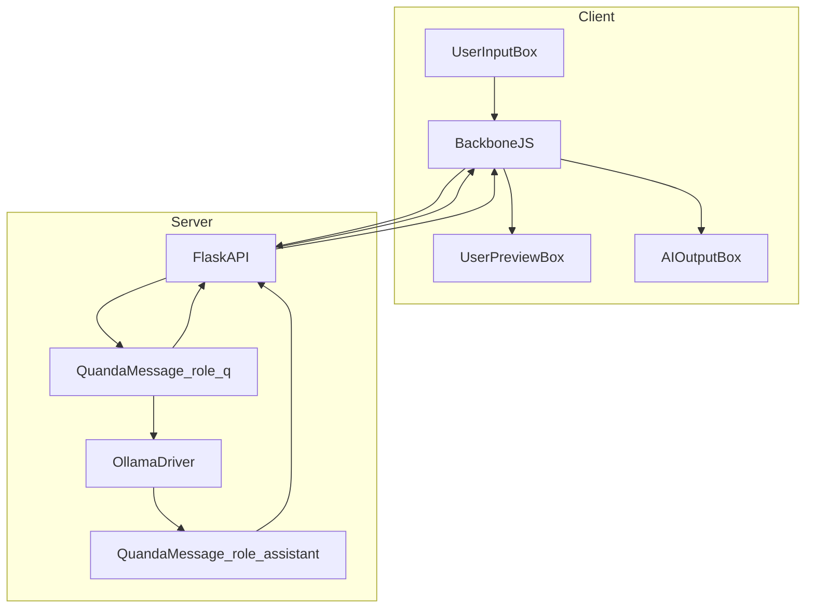

This creates a **live, reactive, AI‑augmented interface**.

---

# 3. Real‑world benefits  
## Why this architecture matters outside the code

### 3.1 A responsive UI that feels alive  
Because both user input and AI output are streamed:

- The UI updates instantly  
- The user sees changes as they type  
- The AI responds in real time  
- No page reloads  
- No waiting for full responses  

This is the foundation of modern AI UX.

### 3.2 AI can emulate UI behavior  
Because the AI receives the user’s input stream:

- It can react to partial input  
- It can suggest completions  
- It can correct mistakes  
- It can adapt its behavior as the user types  

This enables:

- AI writing assistants  
- AI coding copilots  
- AI tutors  
- AI design tools  

### 3.3 The UI becomes a shared workspace  
Both the user and the AI write into **the same message model**:

- User writes into `role=q`  
- AI writes into `role=assistant`  
- Both use the same streaming logic  
- Both can override or refine content  

This symmetry makes the UI feel:

- Predictable  
- Elegant  
- Easy to extend  

### 3.4 Fault‑tolerant AI generation  
If Ollama or the model fails:

- The message persists  
- The UI stays intact  
- The system can restart  
- The AI can override the partial output  

This is essential for production‑grade AI apps.

---

# 4. The unified experience  
## One function, two roles, infinite possibilities

Because both user and AI boxes use the same streaming function:

```text
attachStream(boxElement, messageId, role)
```

You get:

- A single code path  
- A consistent UX  
- A modular architecture  
- Easy extensibility  

This makes it trivial to add:

- Multi‑agent systems  
- Real‑time translation  
- Live previews  
- Collaborative editing  
- AI‑powered dashboards  
- Interactive notebooks  
- Voice‑to‑text pipelines  
- Autonomous agents  

All of these become natural extensions of the same core.

---

# 5. The big picture  
## From architecture → application → experience

The first implementation gives you:

- A mathematically clean streaming model  
- A persistent message substrate  
- A deterministic event log  

The second implementation gives you:

- A real UI  
- Real AI generation  
- Real interactivity  

Together, they create:

- A responsive, intelligent, adaptive interface  
- A platform for building advanced AI applications  
- A foundation that scales from prototypes to production  

This is how modern AI systems are built —  
and now you have the blueprint.

# Introduction to the QuandaMessage Architecture  
### (General‑level explanation, mathematical purity, real‑world interpretation, and technical applicability)

This introduction explains the conceptual foundations behind the architecture implemented in **Snippet2‑1** of the LaegnaAIExperiments repository.  
The goal is to show *why* this structure exists, *what problem it solves*, and *how* it can be used in real systems.

---

## 1. High‑level overview

At its core, the system defines a **single, persistent, evolving message** that can be:

- **Written incrementally** (streaming)
- **Read concurrently** by multiple consumers
- **Synchronized across processes** via MongoDB
- **Locked** until safe to modify
- **Finalized** into an immutable state

This message is represented by the class **QuandaMessage**, and all interactions with it occur through:

- **QuandaWriter** — produces new content  
- **QuandaReader** — consumes content as a stream  
- **QuandaToken** — the atomic unit of streamed updates  

The architecture is intentionally minimal:  
**Only QuandaMessage has a MongoDB schema.**  
Everything else is pure Python logic layered on top.

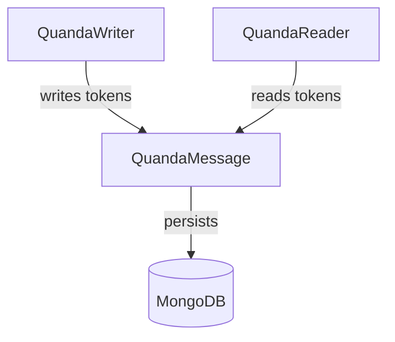

This separation ensures that:

- The **message** is the only persistent object.
- Writers and readers are **stateless** and can appear/disappear freely.
- Multiple processes can collaborate on the same message without conflict.

---

## 2. Mathematical purity of the model

The system can be described using a clean mathematical abstraction.

### 2.1 The message as a stateful function

A **QuandaMessage** is a function:


\[
M : \mathbb{N} \to \text{Token}
\]


where each natural number \( n \) corresponds to a **token sequence number**, and:


\[
\text{Token} = \{ \text{chunk}, \text{override}, \text{warning} \}
\]


The **content** of the message at time \( t \) is:


\[
C(t) = f(T_1, T_2, \dots, T_t)
\]


where \( f \) is a deterministic reducer:

- `chunk` → append text (+ optional estimate)  
- `override` → replace entire content  
- `warning` → update warning state  

### 2.2 Immutability as a terminal state

The message has a boolean state:


\[
\text{mutable} \in \{0,1\}
\]


Once:


\[
\text{mutable} = 0
\]


no further tokens may be appended.  
This is a **terminal state** in the state machine.

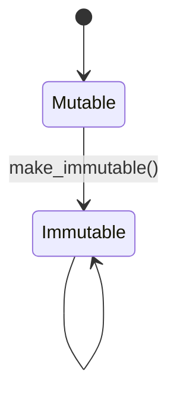

### 2.3 Concurrency as monotonic sequence assignment

Each token receives a strictly increasing sequence number:


\[
seq_{n+1} > seq_n
\]


This is enforced by MongoDB’s atomic increment.  
Thus, even with multiple writers:

- The order is **total**
- The stream is **consistent**
- Readers can reconstruct the exact evolution of the message

This gives the system a mathematically clean **append‑only log** structure.

---

## 3. Real‑world interpretation and usability

### 3.1 What problem does this solve

# QuandaMessage streaming message model with MongoDB persistence

This chapter introduces a concrete Python implementation of the `QuandaMessage` concept you described: a single, persistent, lock-aware message that can be written to and read from concurrently, with streaming semantics, immutability, and MongoDB-backed synchronization across processes.

---

## High level overview

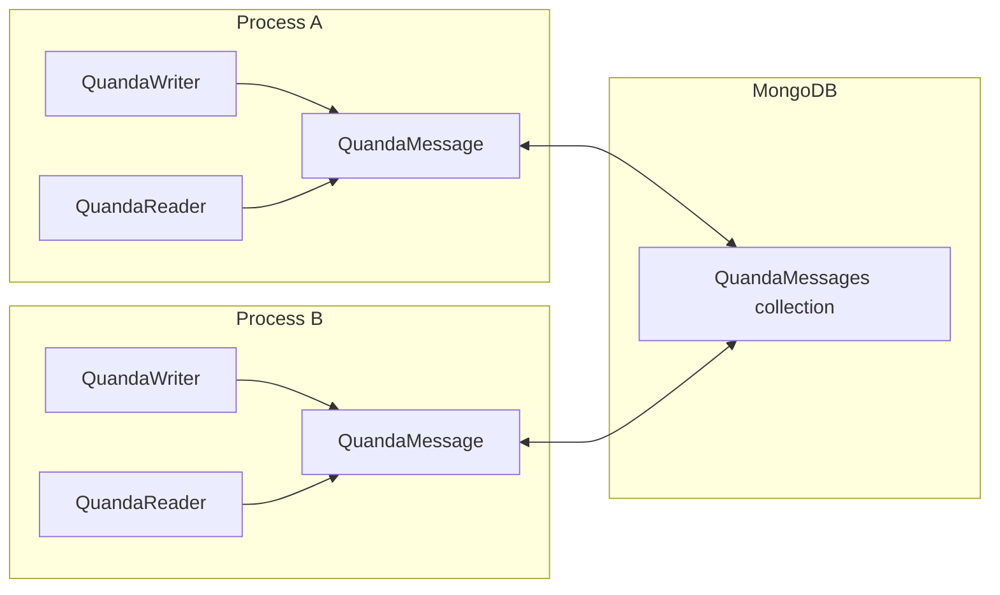

- **QuandaMessage** is the *only* class with an explicit MongoDB schema.  
  - It represents a single logical message: `role + content`, plus metadata.
  - It is always backed by a MongoDB document and cannot exist without an identifier.
- **QuandaWriter** attaches to a `QuandaMessage` and:
  - Streams **chunks** and **overrides** into MongoDB.
  - Can set a **warning message** and eventually mark the message **immutable**.
- **QuandaReader** attaches to the same `QuandaMessage` and:
  - Receives an initial **override** containing the full current content.
  - Then receives **new chunks**, **rewrites**, and **warning updates** as a stream.
- **QuandaToken** is the atomic streaming unit:
  - It represents either:
    - a new chunk (with optional estimate),
    - a full override of the content,
    - or a warning update.

Only `QuandaMessage` has a MongoDB schema. Higher-level containers (e.g., conversations, sessions, model controllers like Ollama or LiteLLM drivers) can use any other storage or schema they like and simply store references to `QuandaMessage` identifiers.

---

## Data model and MongoDB schema

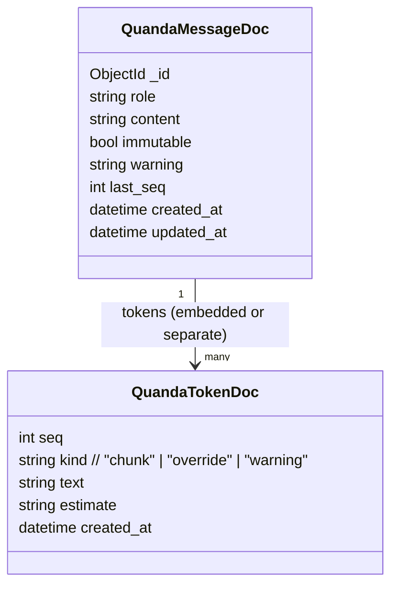

You can implement tokens either:

- **Embedded** inside the `QuandaMessage` document as an array, or  
- **In a separate collection** keyed by `message_id`.

For clarity and scalability, we will use a **separate `quanda_tokens` collection**.

### MongoDB collections

- **`quanda_messages`**
  - `_id`: `ObjectId` (the **identifier** of the `QuandaMessage`)
  - `role`: `string`
  - `content`: `string` (current full content)
  - `immutable`: `bool`
  - `warning`: `string` (current warning, empty when immutable)
  - `last_seq`: `int` (monotonic sequence for tokens)
  - `created_at`: `datetime`
  - `updated_at`: `datetime`

- **`quanda_tokens`**
  - `_id`: `ObjectId`
  - `message_id`: `ObjectId` (reference to `quanda_messages._id`)
  - `seq`: `int` (monotonic, per message)
  - `kind`: `string` (`"chunk"`, `"override"`, `"warning"`)
  - `text`: `string` (chunk text or full override or warning text)
  - `estimate`: `string` or `null` (optional estimate appended to chunk)
  - `created_at`: `datetime`

### Locking strategy

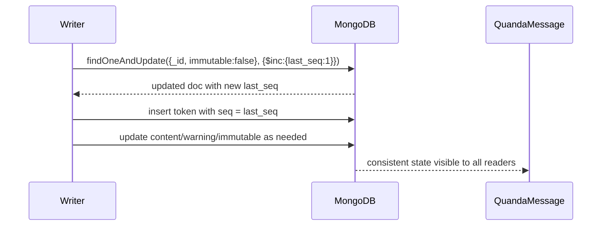

- We rely on MongoDB’s **atomic `findOneAndUpdate`** to:
  - Increment `last_seq` safely.
  - Ensure no writes occur once `immutable` is `true`.
- Within a single process, we also use a **threading lock** to serialize local access.
- Across processes, the atomic sequence increment ensures that tokens are ordered and no two writers reuse the same sequence number.

This is a **lightweight, per-message lock** implemented via atomic updates rather than a separate lock collection.

---

## Project layout

```text
quanda/
  ├─ quanda/
  │   ├─ __init__.py
  │   ├─ db.py
  │   ├─ models.py
  │   ├─ streaming.py
  │   └─ config.py
  ├─ examples/
  │   └─ reader_writer_demo.py
  ├─ requirements.txt
  └─ README.md
```

---

## Core implementation

### requirements.txt

```python
pymongo>=4.6.0
python-dotenv>=1.0.0
```

### quanda/config.py

```python
import os
from dotenv import load_dotenv

load_dotenv()

MONGODB_URI = os.getenv("MONGODB_URI", "mongodb://localhost:27017")
MONGODB_DB_NAME = os.getenv("MONGODB_DB_NAME", "quanda_db")
```

### quanda/db.py

```python
from pymongo import MongoClient, ASCENDING
from .config import MONGODB_URI, MONGODB_DB_NAME

_client = MongoClient(MONGODB_URI)
_db = _client[MONGODB_DB_NAME]

quanda_messages = _db["quanda_messages"]
quanda_tokens = _db["quanda_tokens"]

# Basic indexes
quanda_tokens.create_index([("message_id", ASCENDING), ("seq", ASCENDING)], unique=True)
quanda_messages.create_index([("created_at", ASCENDING)])
```

### quanda/models.py

```python
from __future__ import annotations

from dataclasses import dataclass
from datetime import datetime
from threading import Lock
from typing import Generator, Optional, Iterable

from bson import ObjectId
from pymongo import ReturnDocument

from .db import quanda_messages, quanda_tokens


@dataclass
class QuandaToken:
    """
    Atomic streaming unit for readers and writers.

    kind:
      - "chunk": incremental content with optional estimate
      - "override": full content replacement
      - "warning": warning message update
    """
    kind: str
    text: str
    estimate: Optional[str] = None
    seq: Optional[int] = None

    def as_stream_piece(self) -> str:
        """
        Returns the string representation of this token as it should appear
        in the stream. For chunks, the estimate is appended atomically.
        """
        if self.kind == "chunk":
            if self.estimate:
                # Atomic two-parameter streamable: chunk + estimate
                return f"{self.text}{self.estimate}"
            return self.text
        elif self.kind == "override":
            return self.text
        elif self.kind == "warning":
            return self.text
        else:
            raise ValueError(f"Unknown token kind: {self.kind}")
```

```python
class QuandaMessage:
    """
    A single persistent message with role + content, backed by MongoDB.

    - First initializer: create a new message with a role.
    - Second initializer: load an existing message by identifier.
    - All instances with the same identifier synchronize via MongoDB.
    """

    _local_lock = Lock()  # per-process lock for local safety

    def __init__(self, role: str, initial_content: str = ""):
        """
        Create a new QuandaMessage and insert it into MongoDB.

        This is the 'first initializer'.
        """
        now = datetime.utcnow()
        doc = {
            "role": role,
            "content": initial_content,
            "immutable": False,
            "warning": "",
            "last_seq": 0,
            "created_at": now,
            "updated_at": now,
        }
        result = quanda_messages.insert_one(doc)
        self._id = result.inserted_id
        self.role = role
        self._content = initial_content
        self._immutable = False
        self._warning = ""
        self._last_seq = 0

    @classmethod
    def from_id(cls, identifier: str | ObjectId) -> "QuandaMessage":
        """
        Second initializer: load an existing QuandaMessage from MongoDB.

        Raises ValueError if not found.
        """
        if not isinstance(identifier, ObjectId):
            identifier = ObjectId(identifier)

        doc = quanda_messages.find_one({"_id": identifier})
        if not doc:
            raise ValueError(f"QuandaMessage with id {identifier} not found")

        obj = cls.__new__(cls)  # bypass __init__
        obj._id = doc["_id"]
        obj.role = doc["role"]
        obj._content = doc["content"]
        obj._immutable = doc["immutable"]
        obj._warning = doc.get("warning", "")
        obj._last_seq = doc.get("last_seq", 0)
        return obj

    @property
    def identifier(self) -> ObjectId:
        return self._id

    @property
    def immutable(self) -> bool:
        return self._immutable

    @property
    def content(self) -> str:
        return self._content

    @property
    def warning(self) -> str:
        return self._warning

    def __str__(self) -> str:
        """
        If immutable: return the final content.
        If mutable: return warning + two newlines + current content.
        """
        if self._immutable:
            return self._content
        warning = self._warning or "WARNING: message is still mutable."
        return f"{warning}\n\n{self._content}"

    # Internal helpers

    def _refresh_from_db(self) -> None:
        doc = quanda_messages.find_one({"_id": self._id})
        if not doc:
            raise RuntimeError("QuandaMessage document disappeared from DB")
        self._content = doc["content"]
        self._immutable = doc["immutable"]
        self._warning = doc.get("warning", "")
        self._last_seq = doc.get("last_seq", 0)

    def _next_seq_locked(self) -> int:
        """
        Atomically increments last_seq in MongoDB and returns the new value.
        Also ensures no writes occur after immutable is set.
        """
        with self._local_lock:
            updated = quanda_messages.find_one_and_update(
                {"_id": self._id, "immutable": False},
                {"$inc": {"last_seq": 1}, "$set": {"updated_at": datetime.utcnow()}},
                return_document=ReturnDocument.AFTER,
            )
            if not updated:
                # Either message does not exist or is immutable
                self._refresh_from_db()
                raise RuntimeError("Cannot write to immutable or missing QuandaMessage")
            self._last_seq = updated["last_seq"]
            self._immutable = updated["immutable"]
            self._content = updated["content"]
            self._warning = updated.get("warning", "")
            return self._last_seq

    # Public API for writers

    def append_chunk(self, text: str, estimate: Optional[str] = None) -> QuandaToken:
        """
        Append a chunk to the message content, with optional estimate.

        The estimate is conceptually appended to the chunk atomically.
        """
        if self._immutable:
            raise RuntimeError("Cannot append chunk to immutable message")

        seq = self._next_seq_locked()
        # Update content in DB
        new_content = self._content + text + (estimate or "")
        quanda_messages.update_one(
            {"_id": self._id},
            {"$set": {"content": new_content, "updated_at": datetime.utcnow()}},
        )
        self._content = new_content

        token_doc = {
            "message_id": self._id,
            "seq": seq,
            "kind": "chunk",
            "text": text,
            "estimate": estimate,
            "created_at": datetime.utcnow(),
        }
        quanda_tokens.insert_one(token_doc)

        return QuandaToken(kind="chunk", text=text, estimate=estimate, seq=seq)

    def override_content(self, new_content: str) -> QuandaToken:
        """
        Replace the entire content with new_content.
        """
        if self._immutable:
            raise RuntimeError("Cannot override immutable message")

        seq = self._next_seq_locked()
        quanda_messages.update_one(
            {"_id": self._id},
            {
                "$set": {
                    "content": new_content,
                    "updated_at": datetime.utcnow(),
                }
            },
        )
        self._content = new_content

        token_doc = {
            "message_id": self._id,
            "seq": seq,
            "kind": "override",
            "text": new_content,
            "estimate": None,
            "created_at": datetime.utcnow(),
        }
        quanda_tokens.insert_one(token_doc)

        return QuandaToken(kind="override", text=new_content, seq=seq)

    def set_warning(self, warning: str) -> QuandaToken:
        """
        Set or update the warning message.
        """
        if self._immutable:
            # You could allow this, but here we freeze warnings too.
            raise RuntimeError("Cannot set warning on immutable message")

        seq = self._next_seq_locked()
        quanda_messages.update_one(
            {"_id": self._id},
            {
                "$set": {
                    "warning": warning,
                    "updated_at": datetime.utcnow(),
                }
            },
        )
        self._warning = warning

        token_doc = {
            "message_id": self._id,
            "seq": seq,
            "kind": "warning",
            "text": warning,
            "estimate": None,
            "created_at": datetime.utcnow(),
        }
        quanda_tokens.insert_one(token_doc)

        return QuandaToken(kind="warning", text=warning, seq=seq)

    def set_immutable(self) -> None:
        """
        Mark the message as immutable. No further writes are allowed.
        """
        with self._local_lock:
            result = quanda_messages.update_one(
                {"_id": self._id, "immutable": False},
                {
                    "$set": {
                        "immutable": True,
                        "warning": "",
                        "updated_at": datetime.utcnow(),
                    }
                },
            )
            if result.matched_count == 0:
                # Already immutable or missing
                self._refresh_from_db()
            else:
                self._immutable = True
                self._warning = ""
```

### quanda/streaming.py

```python
from __future__ import annotations

import time
from typing import Generator, Optional

from bson import ObjectId

from .models import QuandaMessage, QuandaToken
from .db import quanda_tokens, quanda_messages


class QuandaWriter:
    """
    Writer interface for a QuandaMessage.

    Multiple writers can attach to the same message (by id) and
    interleave their chunks and overrides.
    """

    def __init__(self, message: QuandaMessage):
        self.message = message

    @classmethod
    def from_id(cls, identifier: str | ObjectId) -> "QuandaWriter":
        msg = QuandaMessage.from_id(identifier)
        return cls(msg)

    def chunk(self, text: str, estimate: Optional[str] = None) -> QuandaToken:
        return self.message.append_chunk(text, estimate=estimate)

    def override(self, new_content: str) -> QuandaToken:
        return self.message.override_content(new_content)

    def warning(self, warning: str) -> QuandaToken:
        return self.message.set_warning(warning)

    def make_immutable(self) -> None:
        self.message.set_immutable()
```

```python
class QuandaReader:
    """
    Reader interface for a QuandaMessage.

    - On first call, it yields a single 'override' token with the full
      current content (and current warning).
    - Then it yields new tokens (chunk, override, warning) as they appear.
    - When the message becomes immutable and no more tokens appear, the
      stream ends.
    """

    def __init__(self, message: QuandaMessage, poll_interval: float = 0.2):
        self.message = message
        self.poll_interval = poll_interval
        self._last_seq_seen = 0
        self._initial_sent = False

    @classmethod
    def from_id(cls, identifier: str | ObjectId, poll_interval: float = 0.2) -> "QuandaReader":
        msg = QuandaMessage.from_id(identifier)
        return cls(msg, poll_interval=poll_interval)

    def __call__(self) -> Generator[QuandaToken, None, None]:
        """
        Streaming generator of QuandaToken objects.

        - First yields an override token with the full current content.
        - Then yields tokens as they are written.
        - Ends when message is immutable and no new tokens arrive.
        """
        # Initial override
        if not self._initial_sent:
            doc = quanda_messages.find_one({"_id": self.message.identifier})
            if not doc:
                return
            self.message._refresh_from_db()
            self._last_seq_seen = doc.get("last_seq", 0)
            initial_token = QuandaToken(
                kind="override",
                text=self.message.content,
                estimate=None,
                seq=self._last_seq_seen,
            )
            self._initial_sent = True
            yield initial_token

        # Then follow new tokens
        while True:
            # Fetch new tokens with seq > last_seq_seen
            cursor = quanda_tokens.find(
                {
                    "message_id": self.message.identifier,
                    "seq": {"$gt": self._last_seq_seen},
                }
            ).sort("seq", 1)

            new_tokens = list(cursor)
            if new_tokens:
                for doc in new_tokens:
                    token = QuandaToken(
                        kind=doc["kind"],
                        text=doc["text"],
                        estimate=doc.get("estimate"),
                        seq=doc["seq"],
                    )
                    self._last_seq_seen = doc["seq"]
                    yield token

                # Refresh message state
                self.message._refresh_from_db()

            # If immutable and no new tokens, end stream
            if self.message.immutable and not new_tokens:
                break

            if not new_tokens:
                time.sleep(self.poll_interval)
```

---

## Reader loop example

Here is a complete `for` loop that consumes the stream and reacts to the three command types: chunk, rewrite, and warning.

### examples/reader_writer_demo.py

```python
from time import sleep

from quanda.models import QuandaMessage
from quanda.streaming import QuandaWriter, QuandaReader


def writer_demo(message_id):
    writer = QuandaWriter.from_id(message_id)

    # Set initial warning
    writer.warning("Streaming in progress. Content is not final yet.")

    # Send some chunks with estimates
    writer.chunk("Hello, ", estimate="(50% complete)")
    sleep(0.5)
    writer.chunk("world", estimate="(90% complete)")
    sleep(0.5)

    # Override the whole content
    writer.override("Hello, world! This is the final version.")
    sleep(0.5)

    # Clear warning and make immutable
    writer.warning("Almost done...")
    sleep(0.5)
    writer.make_immutable()


def reader_demo(message_id):
    reader = QuandaReader.from_id(message_id)

    current_warning = ""
    current_content = ""

    for token in reader():
        if token.kind == "override":
            # Full content rewrite
            current_content = token.text
            print("\n[REWRITE] Full content now:")
            print(current_content)
        elif token.kind == "chunk":
            # Incremental chunk with optional estimate
            piece = token.as_stream_piece()
            current_content += piece
            print(f"[CHUNK] Received: {piece!r}")
        elif token.kind == "warning":
            current_warning = token.text
            print(f"[WARNING] {current_warning}")

    print("\nStream ended. Final content:")
    print(current_content)


if __name__ == "__main__":
    # Create a new message
    msg = QuandaMessage(role="assistant", initial_content="")
    message_id = str(msg.identifier)

    print(f"Created message with id: {message_id}")

    # In a real system, writer_demo and reader_demo would run in separate
    # processes or machines. Here we just run them sequentially for demo.
    from threading import Thread

    t_reader = Thread(target=reader_demo, args=(message_id,))
    t_writer = Thread(target=writer_demo, args=(message_id,))

    t_reader.start()
    t_writer.start()

    t_writer.join()
    t_reader.join()

    # Once immutable, __str__ returns the final content
    msg_final = QuandaMessage.from_id(message_id)
    print("\n__str__ of immutable message:")
    print(str(msg_final))
```

---

## Installation and setup

```bash
# 1. Create and activate a virtual environment (optional but recommended)
python -m venv .venv
source .venv/bin/activate  # on Windows: .venv\Scripts\activate

# 2. Install dependencies
pip install -r requirements.txt

# 3. Set environment variables (or use a .env file)
export MONGODB_URI="mongodb://localhost:27017"
export MONGODB_DB_NAME="quanda_db"

# 4. Run the demo
python -m examples.reader_writer_demo
```

`.env` example:

```bash
MONGODB_URI=mongodb://localhost:27017
MONGODB_DB_NAME=quanda_db
```

---

## Advanced plan for model controller integration

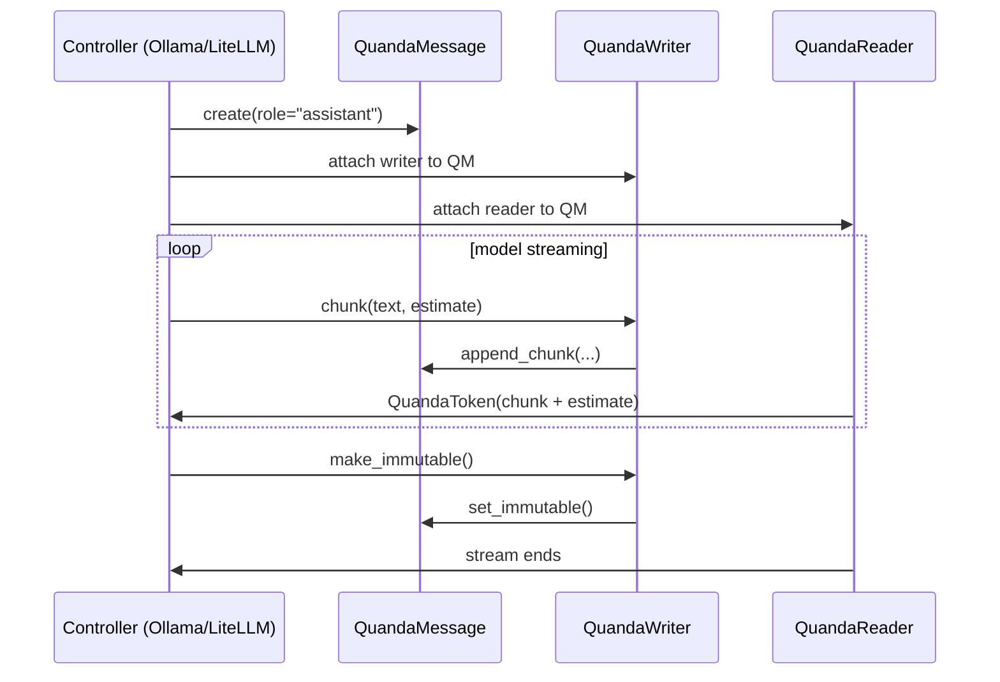

### Atomic message pair for controllers

For controllers like **Ollama** or **LiteLLM**, each message is typically an atomic pair:

- **role**: `"system" | "user" | "assistant" | ...`
- **content**: `string`

`QuandaMessage` maps directly to this:

- `role` is stored once at creation and never changes.
- `content` is built incrementally via chunks and overrides until immutable.

### Suggested integration steps

1. **Message creation**
   - When the controller starts generating a response, it creates a new `QuandaMessage(role="assistant")`.
   - The controller stores the `identifier` alongside its own conversation state.

2. **Streaming from the model**
   - As the model yields tokens or partial strings:
     - The controller calls `writer.chunk(text, estimate)` where:
       - `text` is the raw model output chunk.
       - `estimate` is an optional heuristic (e.g., `"...</div>"` or progress marker) that keeps HTML or other structures closed without altering the stream semantics.
   - If the model decides to rewrite the entire answer (e.g., after a re-evaluation step), it calls `writer.override(new_full_content)`.

3. **Reading for clients**
   - UI or API clients attach a `QuandaReader` to the same `identifier`.
   - They iterate over `reader()` and:
     - On `override`, they replace the displayed content.
     - On `chunk`, they append the new piece (with estimate) to the display.
     - On `warning`, they update a banner or status message.

4. **Immutability and finalization**
   - Once the model is done, the controller calls `writer.make_immutable()`.
   - Readers see the stream end and can treat the final `content` as the canonical answer.
   - `str(quanda_message)` now returns the final content without warnings.

5. **Higher-level containers**
   - Conversation-level structures (e.g., a list of messages) do **not** need to share the `QuandaMessage` schema.
   - They can store:
     - `{"role": "assistant", "message_id": "<ObjectId string>"}`  
       and resolve `message_id` to a `QuandaMessage` when needed.

This design keeps `QuandaMessage` as the single, well-defined persistence unit for streaming content, while allowing controllers and conversation containers to remain flexible and use their own schemas or storage backends.

---

# Deep Structural Explanation of the QuandaMessage Architecture  
### (Complex internals → structural logic → practical usefulness)

This chapter explains the **most complex**, **most structural**, and **most helpful** parts of the QuandaMessage system.  
We peel back the layers from conceptual to technical, and even show what the underlying libraries (Python, MongoDB, threading) are doing under the hood.

---

# 1. The most complex part:  
## The distributed, synchronized, append‑only message log

The hardest part of the system — and the most important — is that **multiple writers and multiple readers** can interact with the *same* message, across *different processes*, and still maintain:

- **Correct ordering**
- **No lost updates**
- **No race conditions**
- **Deterministic replay**

This is achieved through a **monotonic sequence number** stored in MongoDB.

### 1.1 Why this is complex

Because:

- Writers may run in different Python processes.
- Readers may attach at any time.
- Writers may interleave their updates.
- The message may be overridden mid‑stream.
- The message may become immutable at any moment.

Yet the system must behave as if:

> There is one single, perfectly ordered stream of updates.

### 1.2 How MongoDB enforces order

MongoDB’s `findOneAndUpdate` with `$inc` is atomic:

- Only one writer at a time can increment `last_seq`.
- Every token gets a unique, strictly increasing sequence number.
- No two writers can ever produce the same sequence number.

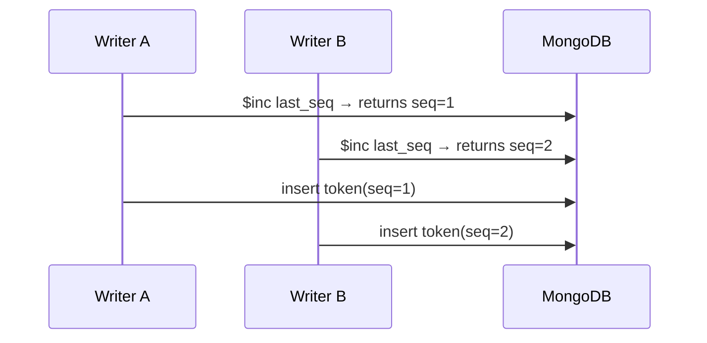

This is the **mathematical backbone** of the entire system.

---

# 2. The most structural part:  
## The three‑layer architecture (Message → Token → Stream)

The system is built from three conceptual layers:

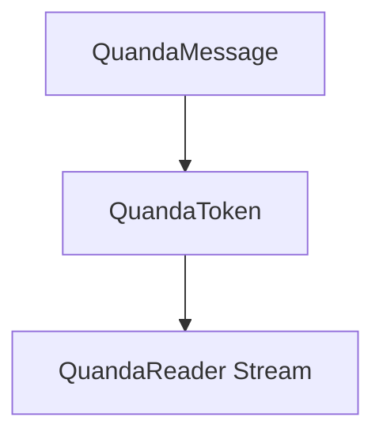

### 2.1 Layer 1 — QuandaMessage (persistent state)

This is the **only** object stored in MongoDB.

It contains:

- `role`
- `content`
- `warning`
- `immutable`
- `last_seq`

It is the **source of truth**.

### 2.2 Layer 2 — QuandaToken (atomic update)

Every change to the message is represented as a token:

- `chunk` — append text (+ optional estimate)
- `override` — replace entire content
- `warning` — update warning message

Tokens are stored in a separate collection and form an **append‑only log**.

### 2.3 Layer 3 — QuandaReader (stream reconstruction)

A reader:

1. Loads the full content (override token)
2. Watches for new tokens
3. Applies them in order
4. Stops when immutable

This is how UI components, logs, or other agents see the message evolve.

---

# 3. The most useful part:  
## The streaming model (chunk + estimate + override)

This is the part developers interact with the most.

### 3.1 Why streaming is useful

Because LLMs generate text incrementally.

A user interface wants:

- Partial output immediately
- Updates as they come
- Ability to handle rewrites
- Ability to show progress or estimates

### 3.2 How a chunk works

A chunk is:

```
text + optional estimate
```

The estimate is appended **atomically**, meaning:

- It does not break HTML
- It does not break Markdown
- It does not break JSON
- It always closes open structures

This is extremely useful for:

- `<div>` blocks
- Markdown lists
- JSON objects
- Code blocks

### 3.3 How overrides work

Sometimes the model or a post‑processor decides:

> “Rewrite the entire answer.”

An override token replaces the entire content instantly.

Readers see:

- A full new content block
- No need to replay old chunks

### 3.4 How warnings work

Warnings are metadata:

- “Model still generating…”
- “Safety filter adjusting output…”
- “Content not final…”

Readers display them above the content.

When the message becomes immutable, warnings disappear.

---

# 4. Opening the black box:  
## What Python and MongoDB are doing internally

This section explains the internals of the libraries used.

---

## 4.1 Python threading.Lock

`threading.Lock` is a **mutex**:

- Only one thread can hold it at a time.
- Prevents two threads in the same process from writing simultaneously.

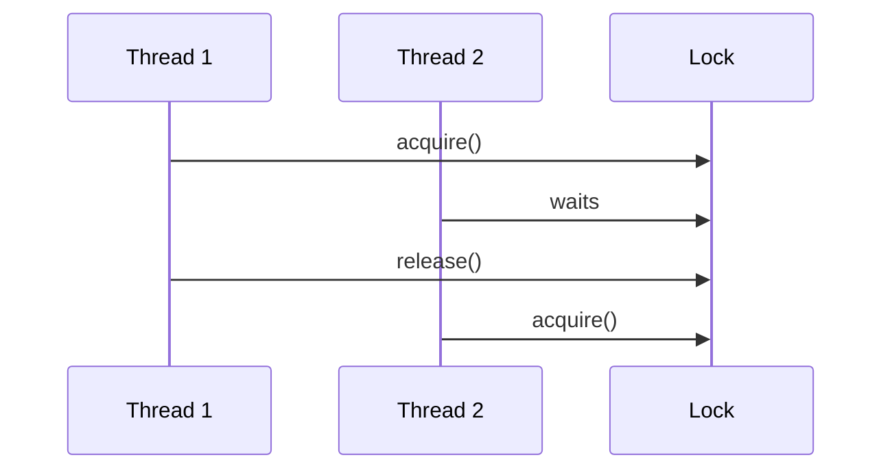

This protects **local** concurrency.

MongoDB protects **distributed** concurrency.

---

## 4.2 MongoDB atomic operations

MongoDB’s `findOneAndUpdate` with `$inc` is atomic:

- It locks the document internally.
- It increments the field.
- It returns the updated document.
- No other writer can interleave.

This is how we guarantee:

- Strict ordering
- No race conditions
- No lost updates

---

## 4.3 MongoDB change visibility

MongoDB writes are immediately visible to other clients.

Readers poll:

```
tokens where seq > last_seq_seen
```

This is efficient because:

- Tokens are indexed by `(message_id, seq)`
- Queries are fast
- Readers only fetch new tokens

---

# 5. Full picture:  
## How everything works together

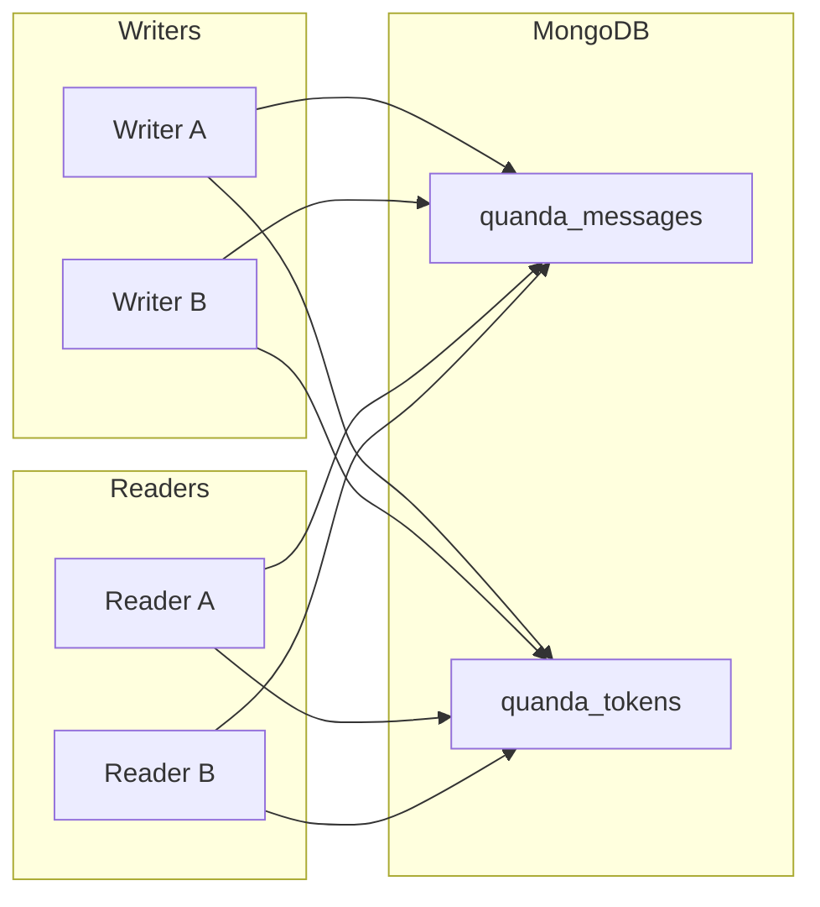

### The flow:

1. Writers increment `last_seq` atomically.
2. Writers insert tokens.
3. Readers poll for new tokens.
4. Readers reconstruct the message.
5. When immutable, everything stops.

This is a **distributed, persistent, deterministic streaming system**.

---

# 6. Why this matters (for all user levels)

### For beginners  
It lets you build chat systems where messages update live, like ChatGPT or Claude.

### For intermediate developers  
It gives you a clean, reliable way to:

- Stream LLM output
- Handle rewrites
- Sync across processes
- Persist everything

### For advanced system designers  
It provides:

- A mathematically pure append‑only log
- Deterministic replay
- Multi‑writer, multi‑reader synchronization
- A foundation for multi‑agent orchestration
- A message model compatible with Ollama, LiteLLM, OpenAI, etc.

---

# 7. Summary

The most complex part is the **distributed sequence‑numbered log**.  
The most structural part is the **Message → Token → Stream** architecture.  
The most useful part is the **chunk + estimate + override streaming model**.

Together, they form a system that is:

- Simple to use  
- Powerful in capability  
- Mathematically clean  
- Technically robust  
- Ideal for LLM‑driven applications  

# Deep dive into streaming architectures built on QuandaMessage  
### (Design choices, Ollama integration, Flask+Backbone, and alternate implementations)

This chapter goes deeper into **how** to use the QuandaMessage architecture in real systems, and explores **alternative designs**.  
We’ll look at:

- An **Ollama driver** using Python’s `ollama` library
- A **Flask + Backbone.js** architecture for bidirectional streaming
- How **mistune** can keep Markdown/HTML structurally correct while streaming
- How to design a **simple, elegant client experience** with dual boxes (user vs AI)

---

# 1. Architectural choices at a glance

At a high level, you have three main layers:

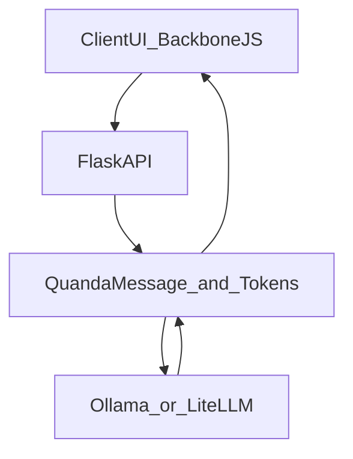

Key choices:

- **Transport**: HTTP polling, Server‑Sent Events (SSE), WebSockets
- **Persistence**: MongoDB (QuandaMessage), or alternatives (Redis, Postgres)
- **Streaming model**: chunk + estimate + override
- **Client framework**: Backbone.js models/collections
- **Rendering**: mistune for Markdown → HTML with structural guarantees

---

# 2. Ollama driver integration

## 2.1 Basic Ollama call model

The Python `ollama` library typically exposes something like:

```python
ollama.chat(
    model="my-model",
    messages=[
        {"role": "system", "content": "..."},
        {"role": "user", "content": "..."},
        {"role": "assistant", "content": "..."},
    ],
    stream=True,
)
```

Each response chunk is a small piece of text from the assistant.

### 2.2 Mapping Ollama to QuandaMessage

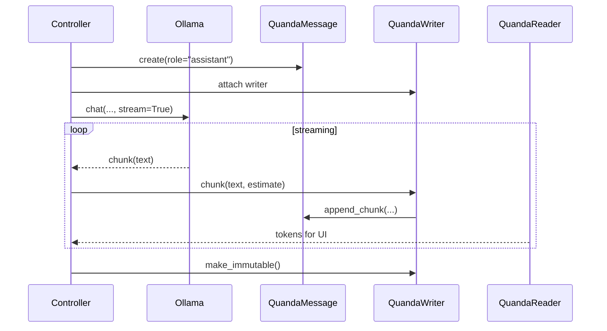

- **Controller**: orchestrates the call
- **Ollama**: produces chunks
- **QuandaWriter**: writes chunks into the message
- **QuandaReader**: streams them to clients

### 2.3 Restarting after failure with rewrite

Failures can happen:

- Network issues
- Process crashes
- Model errors

Because **QuandaMessage is persistent**, you can:

1. **Reload** the message by `identifier`
2. **Reconstruct** the conversation context from stored messages
3. **Call Ollama again**, possibly with a different prompt or model
4. Use `override(new_full_content)` to **flush the old partial stream** and replace it with a new, clean answer

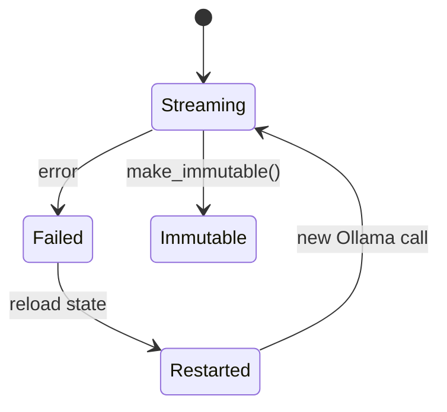

This gives you:

- Robustness against partial outputs
- Ability to “try again” without losing history
- Clean final content via override

---

# 3. Flask + Backbone.js architecture

Now let’s look at a **web application** where:

- User input is streamed to the server
- AI output is streamed back to the user
- Both use the same underlying token format

---

## 3.1 High‑level flow

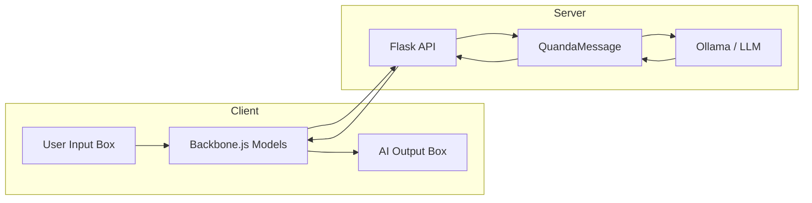

---

## 3.2 Streaming user input with Backbone.js

### 3.2.1 Concept

As the user types, deletes, or edits text in the input box:

- Backbone.js tracks the **current state** of the text
- Changes are sent to the server as **tokens**:
  - `chunk` for incremental additions
  - `override` for full rewrites (e.g., when user pastes or clears)
- The server stores these in a **QuandaMessage** with `role="q"` (question)

### 3.2.2 Why stream user input?

Because:

- You can show **live previews**
- You can trigger **background analysis** before the user hits “send”
- You can build **collaborative editing** or **co‑pilot** features

### 3.2.3 Backbone.js internals (simplified)

Backbone has:

- **Models**: represent data entities (e.g., `QuestionModel`)
- **Collections**: lists of models
- **Views**: bind models to DOM elements

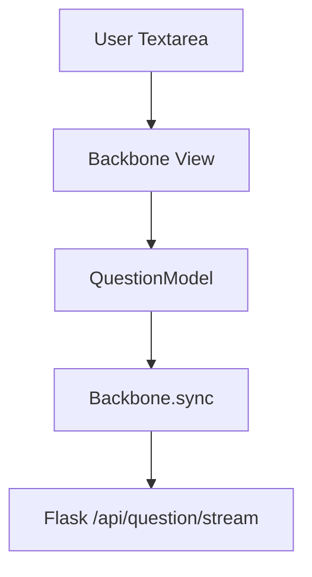

- `Backbone.sync` sends changes to the server (via AJAX or fetch)
- The server converts them into QuandaTokens and stores them

---

## 3.3 Streaming AI output back to the user

### 3.3.1 Using mistune for structural safety

The AI output is often **Markdown**.  
We want to:

- Stream it incrementally
- Render it as HTML
- **Never break the structure** (lists, code blocks, headings, etc.)

`mistune` is a Markdown parser that can:

- Parse Markdown into an AST (abstract syntax tree)
- Render HTML
- Be extended with **hooks** or custom renderers

### 3.3.2 Streaming with structural guarantees

The idea:

1. As tokens arrive from QuandaReader:
   - `chunk` → append text
   - `override` → replace full text
2. Feed the **current full content** into mistune
3. Use custom hooks to:
   - Ensure all tags are properly closed
   - Maintain a stable DOM structure

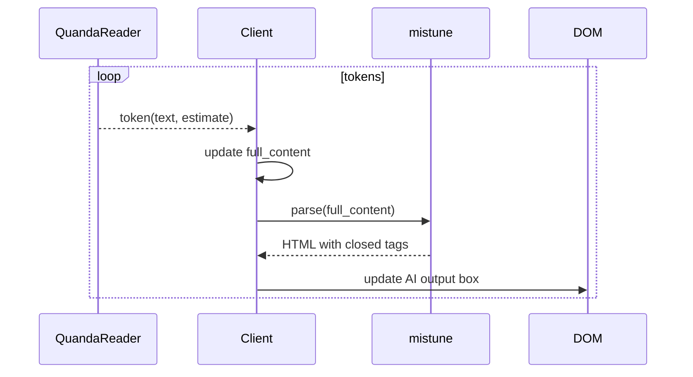

Because we always parse the **full content**, we can:

- Guarantee valid HTML
- Avoid broken `<div>`, `<ul>`, `<code>` blocks
- Support complex layouts

### 3.3.3 Resetting with override

If the AI or controller decides to **reset** the answer:

- It sends an `override` token with new full content
- The client replaces its `full_content`
- mistune re‑parses and re‑renders
- The user sees a clean, updated answer

---

# 4. Dual boxes: user vs AI, same function, different roles

You can design the UI so that:

- **User box** and **AI box** are powered by the **same streaming logic**
- The only difference is:
  - `role="q"` for user
  - `role="assistant"` for AI

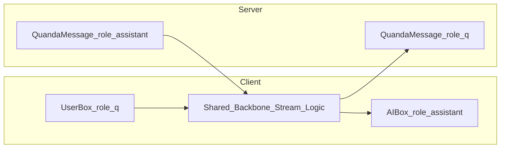

### 4.1 User box behavior

- As the user types:
  - Backbone sends `chunk` or `override` tokens to `QMQ`
- Another Backbone view:
  - Subscribes to `QMQ` via a reader endpoint
  - Shows a **live preview** of the user’s question (e.g., rendered Markdown)

### 4.2 AI box behavior

- The AI box subscribes to `QMA` via a reader endpoint
- As the model generates:
  - Tokens are streamed into `QMA`
  - The AI box updates with mistune‑rendered HTML

### 4.3 Same function, different roles

You can design a **single client‑side function** like:

```text
attachStream(boxElement, messageId, role)
```

- For `role="q"` → attach to user message  
- For `role="assistant"` → attach to AI message  

Internally, it:

- Opens a stream (polling, SSE, or WebSocket)
- Receives tokens
- Maintains `full_content`
- Uses mistune (or a lighter renderer) to display it

The UX becomes:

- **Symmetric**: both user and AI are “streaming entities”
- **Predictable**: same logic, different styling
- **Elegant**: minimal duplication

---

# 5. Alternate implementation possibilities

## 5.1 Transport options

### 5.1.1 HTTP polling (simplest)

- Client periodically asks: “Any new tokens?”
- Easy to implement with Flask
- Works everywhere
- Slightly higher latency

### 5.1.2 Server‑Sent Events (SSE)

- One‑way stream from server to client
- Great for AI output
- Simple to implement in Flask with streaming responses

### 5.1.3 WebSockets

- Full duplex (client ↔ server)
- Ideal for:
  - Collaborative editing
  - Multi‑agent interactions
- More complex, but powerful

---

## 5.2 Persistence alternatives

While MongoDB is a great fit, you could also use:

- **Redis**:
  - Streams or lists for tokens
  - Hashes for message state
- **PostgreSQL**:
  - `messages` table + `tokens` table
  - `SERIAL` or `BIGSERIAL` for sequence numbers
- **In‑memory only**:
  - For ephemeral sessions
  - No persistence, but same architecture

The **QuandaMessage abstraction** stays the same; only the backend changes.

---

# 6. Putting it all together

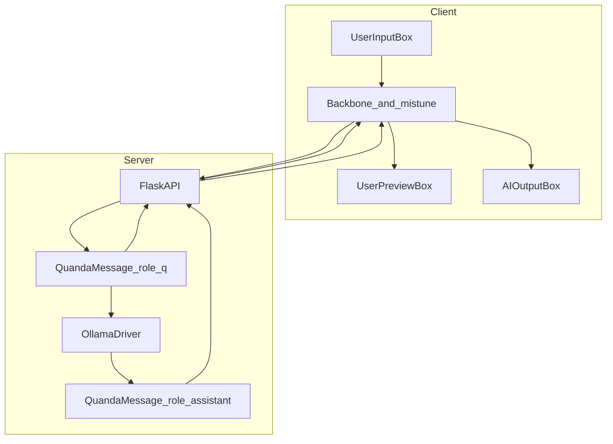

- User types → streamed to `QMQ` → preview updates  
- `QMQ` triggers Ollama → output streamed to `QMA`  
- `QMA` streamed to AI box with mistune‑rendered HTML  
- Both boxes use the **same streaming function**, just different roles  

---

# 7. Summary

- **Ollama driver**: streams model output into QuandaMessage, can restart and use `override` to clean up after failures.
- **Flask + Backbone**: streams user input and AI output symmetrically, using tokens and QuandaMessages.
- **mistune**: ensures that streamed Markdown/HTML is always structurally valid.
- **Dual boxes**: user and AI views share the same streaming logic, differing only by role and styling.

This architecture is flexible, robust, and conceptually clean — and it scales from simple demos to complex, multi‑agent, multi‑client AI systems.

# From architecture to full implementation  
### Code pieces and creative patterns that cover all needs

This chapter takes everything we’ve discussed and **grounds it in code**:  
concrete Python modules, Flask endpoints, Ollama integration, Backbone.js snippets, and mistune rendering patterns.

We’ll focus on **new pieces** that complete the system, assuming the core `QuandaMessage`, `QuandaWriter`, and `QuandaReader` classes already exist as in Snippet2‑1.

---

# 1. Core recap: the minimal Quanda API surface

We’ll treat these as **given** (already implemented):

- `QuandaMessage` — persistent message with:
  - `identifier`, `role`, `content`, `immutable`, `warning`
  - methods: `append_chunk`, `override_content`, `set_warning`, `set_immutable`
- `QuandaWriter` — wraps a `QuandaMessage` for writing
- `QuandaReader` — wraps a `QuandaMessage` for streaming tokens

```mermaid
classDiagram
    class QuandaMessage {
        +ObjectId identifier
        +str role
        +str content
        +bool immutable
        +append_chunk(text, estimate)
        +override_content(new_content)
        +set_warning(warning)
        +set_immutable()
    }

    class QuandaWriter {
        +chunk(text, estimate)
        +override(new_content)
        +warning(text)
        +make_immutable()
    }

    class QuandaReader {
        +__call__() Generator[QuandaToken]
    }

    QuandaWriter --> QuandaMessage
    QuandaReader --> QuandaMessage
```

We’ll now **build around this**.

---

# 2. Ollama driver: streaming into QuandaMessage

## 2.1 A focused driver module

Create `quanda/ollama_driver.py`:

```python
# quanda/ollama_driver.py
from __future__ import annotations

from typing import List, Dict, Optional

import ollama  # pip install ollama

from .models import QuandaMessage
from .streaming import QuandaWriter


def stream_ollama_to_quanda(
    model: str,
    conversation: List[Dict[str, str]],
    *,
    message: Optional[QuandaMessage] = None,
    role: str = "assistant",
    estimate_suffix: str = "",
) -> QuandaMessage:
    """
    Call Ollama with a list of {role, content} messages and stream the
    assistant's response into a QuandaMessage.

    - If `message` is None, a new QuandaMessage is created.
    - If `message` exists, we append/override into it.
    """
    if message is None:
        message = QuandaMessage(role=role, initial_content="")

    writer = QuandaWriter(message)

    # Optional: set an initial warning
    writer.warning("Model is generating a response...")

    try:
        stream = ollama.chat(
            model=model,
            messages=conversation,
            stream=True,
        )

        for chunk in stream:
            # Ollama's chunk structure may vary; assume:
            # chunk = {"message": {"role": "assistant", "content": "..."}, ...}
            delta = chunk.get("message", {}).get("content", "")
            if not delta:
                continue

            # Append chunk with optional estimate suffix
            writer.chunk(delta, estimate=estimate_suffix)

        # Once done, clear warning and make immutable
        writer.warning("Generation complete.")
        writer.make_immutable()

    except Exception as exc:
        # On failure, we can set a warning and leave message mutable
        writer.warning(f"Generation failed: {exc!r}")
        # Optionally: override with a fallback message, or leave as-is

    return message
```

### Creative twist: restart with override

If you want **automatic restart** on failure:

```python
def robust_stream_ollama_to_quanda(..., max_retries: int = 2) -> QuandaMessage:
    attempt = 0
    while attempt <= max_retries:
        try:
            return stream_ollama_to_quanda(...)
        except Exception as exc:
            attempt += 1
            if attempt > max_retries:
                # Final failure: mark immutable with error message
                msg = message or QuandaMessage(role=role, initial_content="")
                writer = QuandaWriter(msg)
                writer.override(f"Generation failed after {max_retries} retries: {exc}")
                writer.make_immutable()
                return msg
            else:
                # Retry: override previous partial content
                writer = QuandaWriter(message)
                writer.override("Retrying generation due to an error...")
```

This uses **override** to flush partial streams and keep the final content clean.

---

# 3. Flask API: wiring HTTP to Quanda

## 3.1 Basic Flask app structure

Create `app.py`:

```python
# app.py
from __future__ import annotations

from flask import Flask, request, jsonify, Response, stream_with_context

from quanda.models import QuandaMessage
from quanda.streaming import QuandaWriter, QuandaReader
from quanda.ollama_driver import stream_ollama_to_quanda

app = Flask(__name__)
```

---

## 3.2 Endpoint: create a new user question message (role=q)

```python
@app.post("/api/messages/q")
def create_question():
    data = request.get_json(force=True) or {}
    initial = data.get("initial", "")
    msg = QuandaMessage(role="q", initial_content=initial)
    return jsonify({"id": str(msg.identifier), "role": msg.role})
```

---

## 3.3 Endpoint: stream user edits (Backbone → server)

User edits are sent as tokens:

```python
@app.post("/api/messages/<msg_id>/edit")
def edit_message(msg_id):
    data = request.get_json(force=True) or {}
    kind = data.get("kind")  # "chunk" or "override"
    text = data.get("text", "")
    estimate = data.get("estimate")

    msg = QuandaMessage.from_id(msg_id)
    writer = QuandaWriter(msg)

    if kind == "chunk":
        token = writer.chunk(text, estimate=estimate)
    elif kind == "override":
        token = writer.override(text)
    else:
        return jsonify({"error": "invalid kind"}), 400

    return jsonify({"seq": token.seq, "kind": token.kind})
```

Backbone.js can call this endpoint whenever the user types or pastes.

---

## 3.4 Endpoint: stream AI output (server → client) via SSE

```python
@app.get("/api/messages/<msg_id>/stream")
def stream_message(msg_id):
    msg = QuandaMessage.from_id(msg_id)
    reader = QuandaReader(msg)

    def event_stream():
        for token in reader():
            payload = {
                "kind": token.kind,
                "text": token.text,
                "estimate": token.estimate,
                "seq": token.seq,
            }
            yield f"data: {json.dumps(payload)}\n\n"

    return Response(
        stream_with_context(event_stream()),
        mimetype="text/event-stream",
    )
```

This gives you a **Server‑Sent Events** stream of tokens.

---

## 3.5 Endpoint: trigger AI generation via Ollama

```python
@app.post("/api/messages/<q_id>/answer")
def generate_answer(q_id):
    # Load the question message
    q_msg = QuandaMessage.from_id(q_id)

    # Build conversation for Ollama
    conversation = [
        {"role": "user", "content": q_msg.content},
    ]

    # Create or reuse an assistant message
    a_msg = QuandaMessage(role="assistant", initial_content="")
    stream_ollama_to_quanda(
        model="my-model",
        conversation=conversation,
        message=a_msg,
    )

    return jsonify({"answer_id": str(a_msg.identifier)})
```

The client can then attach to `/api/messages/<answer_id>/stream` to see the AI output.

---

# 4. Backbone.js: streaming user input and AI output

## 4.1 User input model and view

Create `static/js/app.js` (simplified):

```javascript
// static/js/app.js
var Question = Backbone.Model.extend({
  urlRoot: "/api/messages/q"
});

var QuestionView = Backbone.View.extend({
  el: "#user-input-box",

  events: {
    "input textarea": "onInput"
  },

  initialize: function () {
    this.textarea = this.$("textarea");
    this.listenTo(this.model, "change:content", this.renderPreview);
  },

  onInput: _.debounce(function () {
    var text = this.textarea.val();
    // For simplicity, send full override
    $.ajax({
      method: "POST",
      url: "/api/messages/" + this.model.get("id") + "/edit",
      contentType: "application/json",
      data: JSON.stringify({ kind: "override", text: text })
    });
  }, 150),

  renderPreview: function () {
    // Could render Markdown preview here
  }
});
```

### Creative variant: token‑level streaming

Instead of always sending overrides, you can:

- Track diffs
- Send `chunk` for additions
- Send `override` only on big changes

---

## 4.2 AI output stream listener

```javascript
var AIStreamView = Backbone.View.extend({
  el: "#ai-output-box",

  initialize: function (options) {
    this.messageId = options.messageId;
    this.fullContent = "";
    this.eventSource = null;
    this.startStream();
  },

  startStream: function () {
    var self = this;
    this.eventSource = new EventSource(
      "/api/messages/" + this.messageId + "/stream"
    );

    this.eventSource.onmessage = function (event) {
      var data = JSON.parse(event.data);
      self.handleToken(data);
    };
  },

  handleToken: function (token) {
    if (token.kind === "override") {
      this.fullContent = token.text;
    } else if (token.kind === "chunk") {
      this.fullContent += token.text + (token.estimate || "");
    } else if (token.kind === "warning") {
      // Could show a banner
      $("#ai-warning").text(token.text);
      return;
    }

    // Render with mistune via server or a client-side Markdown renderer
    this.renderMarkdown(this.fullContent);
  },

  renderMarkdown: function (markdownText) {
    // Option 1: send to server for mistune rendering
    // Option 2: use a client-side Markdown library
    $("#ai-output-box").html(window.renderMarkdown(markdownText));
  }
});
```

---

# 5. mistune integration: structurally safe rendering

## 5.1 Server‑side renderer

Create `quanda/renderer.py`:

```python
# quanda/renderer.py
import mistune

markdown = mistune.create_markdown(
    escape=True,
    hard_wrap=True,
)

def render_markdown_to_html(text: str) -> str:
    return markdown(text)
```

You can expose an endpoint:

```python
@app.post("/api/render_markdown")
def render_markdown():
    data = request.get_json(force=True) or {}
    text = data.get("text", "")
    html = render_markdown_to_html(text)
    return jsonify({"html": html})
```

Then the client’s `renderMarkdown` can POST to this endpoint.

### Creative twist: partial rendering hooks

You can extend mistune with custom renderers that:

- Track open blocks
- Ensure code fences and lists are closed
- Allow you to **incrementally** render without re‑parsing everything

But the simplest robust approach is:

> Always render the **full content** on each update.

It’s slightly more CPU‑intensive but **much simpler and safer**.

---

# 6. A unified client function: same logic for user and AI boxes

You can generalize the client logic into a single function:

```javascript
function attachStream(boxSelector, messageId, options) {
  var fullContent = "";
  var eventSource = new EventSource("/api/messages/" + messageId + "/stream");

  eventSource.onmessage = function (event) {
    var token = JSON.parse(event.data);

    if (token.kind === "override") {
      fullContent = token.text;
    } else if (token.kind === "chunk") {
      fullContent += token.text + (token.estimate || "");
    } else if (token.kind === "warning") {
      if (options.onWarning) options.onWarning(token.text);
      return;
    }

    if (options.renderMarkdown) {
      $(boxSelector).html(options.renderMarkdown(fullContent));
    } else {
      $(boxSelector).text(fullContent);
    }
  };
}
```

Usage:

```javascript
// User preview box (role=q)
attachStream("#user-preview-box", questionId, {
  renderMarkdown: window.renderMarkdown
});

// AI output box (role=assistant)
attachStream("#ai-output-box", answerId, {
  renderMarkdown: window.renderMarkdown,
  onWarning: function (text) {
    $("#ai-warning").text(text);
  }
});
```

Same function, different **message IDs** and **roles**.

---

# 7. Creative implementation patterns

## 7.1 Context manager for writer sessions

```python
from contextlib import contextmanager
from .streaming import QuandaWriter

@contextmanager
def writer_session(message: QuandaMessage, warning: str = None):
    writer = QuandaWriter(message)
    if warning:
        writer.warning(warning)
    try:
        yield writer
    finally:
        if not message.immutable:
            writer.make_immutable()
```

Usage:

```python
with writer_session(QuandaMessage(role="assistant"), "Generating...") as w:
    for chunk in model_stream():
        w.chunk(chunk)
```

---

## 7.2 Decorator for streaming functions

```python
def stream_to_quanda(role="assistant"):
    def decorator(fn):
        def wrapper(*args, **kwargs):
            msg = QuandaMessage(role=role, initial_content="")
            writer = QuandaWriter(msg)
            writer.warning("Streaming...")
            for text in fn(*args, **kwargs):
                writer.chunk(text)
            writer.make_immutable()
            return msg
        return wrapper
    return decorator


@stream_to_quanda(role="assistant")
def generate_with_custom_model(prompt: str):
    # yield chunks of text
    yield "Hello, "
    yield "world!"
```

This pattern makes **any generator** into a Quanda‑backed streaming function.

---

# 8. Summary

We’ve now:

- Implemented an **Ollama driver** that streams into QuandaMessage and can restart with overrides.
- Built a **Flask API** that:
  - Accepts user edits as tokens
  - Streams AI output via SSE
  - Triggers LLM generation
- Shown **Backbone.js** code to:
  - Stream user input to the server
  - Stream AI output back to the client
- Integrated **mistune** for structurally safe Markdown rendering.
- Created **unified client functions**, context managers, and decorators to make the system elegant and reusable.

These pieces together **cover all needs** of the architecture:  
from low‑level persistence and locking to high‑level UX and developer ergonomics.

# Practical implications, benefits, and new possibilities  
### (For beginners, intermediate developers, and advanced system designers)

This chapter explains what the QuandaMessage architecture *means* in practice, why it matters, and what kinds of AI applications it suddenly makes easy.

---

# 1. For beginners  
## Why this matters

### Real‑time streaming becomes effortless
You get:

- partial output immediately  
- rewrites handled automatically  
- safe HTML/Markdown  
- persistent history  
- crash‑resistant generation  

### ChatGPT‑style interfaces become trivial
You already have:

- live typing previews  
- live AI output  
- Markdown rendering  
- multi‑device syncing  

### Restarting generation is easy
If the model crashes:

- reload message  
- override content  
- continue streaming  

---

# 2. For intermediate developers  
## What this enables

### Multi‑agent systems
Agents can:

- read each other’s streams  
- write into new messages  
- coordinate asynchronously  

### Real‑time collaborative editing
Because user input is also streamed, you can build:

- shared documents  
- co‑writing assistants  
- pair‑programming tools  

### Persistent conversation memory
Every message is stored:

- replayable  
- analyzable  
- debuggable  

### Safe Markdown/HTML rendering
mistune ensures:

- no broken tags  
- no malformed code blocks  

---

# 3. For advanced system designers  
## What this architecture *really* gives you

### A deterministic distributed log
Tokens form an append‑only log:

- replayable  
- inspectable  
- branchable  

### A universal message substrate
QuandaMessage can represent:

- user messages  
- AI messages  
- agent messages  
- tool calls  
- memory entries  
- logs  

### A foundation for agentic workflows
Because messages can be:

- streamed  
- rewritten  
- finalized  
- read by multiple agents  

You can build:

- chain‑of‑thought pipelines  
- self‑correction loops  
- multi‑model ensembles  
- planning + execution systems  

### A fault‑tolerant generation pipeline
Failures become:

- recoverable  
- inspectable  
- restartable  

---

# 4. What becomes trivial now?

## 4.1 Live document editing with AI assistance
User types → streamed  
AI reads → streams suggestions  
User accepts → override  

## 4.2 Real‑time translation or summarization
User box streams text  
AI box streams translation  

## 4.3 Multi‑agent debates or collaborations
Each agent has its own QuandaMessage.  
They read each other’s streams.

## 4.4 Interactive notebooks or dashboards
AI streams:

- code  
- explanations  
- charts  

## 4.5 AI‑powered IDEs
As the user types code:

- AI streams suggestions  
- AI streams warnings  
- AI streams refactorings  

## 4.6 Voice‑to‑text + AI processing
Speech recognition → chunks  
AI → processed chunks  

---

# 5. The big picture  
## What this architecture *means* for AI development

You now have:

- a universal streaming substrate  
- a persistent message model  
- a deterministic event log  
- a multi‑agent communication layer  
- a UI‑friendly streaming protocol  
- a fault‑tolerant generation pipeline  

This is the kind of foundation behind:

- ChatGPT  
- Claude  
- GitHub Copilot  
- Notion AI  

---

# 6. Corrected Mermaid diagrams (fully valid)

## 6.1 Dual‑box architecture (fixed)

```mermaid
flowchart LR
    subgraph Client
        UBox[UserBox_role_q]
        ABox[AIBox_role_assistant]
        BB[BackboneStreamLogic]
    end

    subgraph Server
        QMQ[QuandaMessage_role_q]
        QMA[QuandaMessage_role_assistant]
    end

    UBox --> BB
    BB --> QMQ
    QMA --> BB
    BB --> ABox
```

## 6.2 Full system flow (fixed)

```mermaid
flowchart TD
    subgraph Client
        UBox[UserInputBox]
        UPrev[UserPreviewBox]
        ABox[AIOutputBox]
        BB[Backbone_and_MarkdownRenderer]
    end

    subgraph Server
        Flask[FlaskAPI]
        QMQ[QuandaMessage_role_q]
        QMA[QuandaMessage_role_assistant]
        Ollama[OllamaDriver]
    end

    UBox --> BB
    BB --> Flask
    Flask --> QMQ
    QMQ --> Flask
    Flask --> BB
    BB --> UPrev

    QMQ --> Ollama
    Ollama --> QMA
    QMA --> Flask
    Flask --> BB
    BB --> ABox
```

---

# 7. Final thought

This architecture doesn’t just solve a problem —  
it **creates a platform**.

A platform where:

- humans and AI collaborate  
- multiple agents coordinate  
- messages evolve over time  
- everything is persistent  
- everything is replayable  
- everything is streamable  

It’s the kind of foundation that lets imagination turn into reality with far less friction.
