# 🌈 **INTRODUCTION CHAPTER — A VISUAL, UNIVERSAL OVERVIEW**  
### *A simple, diagram‑first explanation of the entire Quanda + Git + Pointer + Branching system*  
### *(Designed for all audiences: technical, non‑technical, curious, casual)*

This chapter uses **very simple diagrams**, **life‑like metaphors**, and **causality flows** to make the whole system intuitive before diving into details.

---

# 1. 🌱 **What Is Happening? — The Whole Idea in One Picture**

```mermaid
graph TD
    U["🙂 User"] --> Q["❓ Ask Question"]
    Q --> A["🤖 AI Answers"]
    A --> T["🌳 New Branch in Tree"]
    T --> G["📁 Git Commit + Branch"]
    G --> M["🧠 Memory for Future Steps"]
```

**Meaning:**  
Every time you ask something, the system:

1. Creates a **new branch** in a conversation tree  
2. Saves it as a **Git commit**  
3. Remembers it for future reasoning  

This is the entire architecture in one causal chain.

---

# 2. 🌳 **Life of a Conversation — Like a Growing Tree**

```mermaid
graph TD
    R["🌱 Root Question"] --> A1["🌿 Answer 1"]
    A1 --> Q2a["🌿 Follow‑up A"]
    A1 --> Q2b["🌿 Follow‑up B"]
    Q2a --> Q3a["🍃 Deep A"]
    Q2b --> Q3b["🍃 Deep B"]
```

**Meaning:**  
- Each question grows a **branch**  
- Each answer becomes a **node**  
- You can explore **multiple futures**  
- Nothing is lost; everything is **remembered**  

---

# 3. 🔁 **Causality: Why Branching Matters**

```mermaid
graph LR
    Cause["⚡ New Question"] --> Effect1["🌳 New Branch"]
    Effect1 --> Effect2["📁 New Git Commit"]
    Effect2 --> Effect3["🧠 New Memory State"]
    Effect3 --> Effect4["🤖 New AI Behavior"]
```

**Meaning:**  
- Asking a question **changes the future**  
- Each branch has its own **state**, **files**, and **history**  
- The AI behaves differently depending on **which branch you stand on**  

---

# 4. 🧩 **Real‑Life Example: Planning a Trip**

```mermaid
graph TD
    Start["✈️ Plan Trip"] --> A["🏖️ Option A: Beach"]
    Start --> B["🏔️ Option B: Mountains"]

    A --> A1["📅 Book Hotel"]
    A --> A2["🍽️ Find Restaurants"]

    B --> B1["🥾 Choose Trails"]
    B --> B2["🏨 Book Cabin"]
```

**Meaning:**  
You can explore **multiple trip ideas** in parallel,  
and each one becomes a **branch** you can return to later.

---

# 5. 🧰 **Real‑Life Example: Writing a Document**

```mermaid
graph TD
    Draft["📝 Draft 1"] --> EditA["✏️ Edit A"]
    Draft --> EditB["✏️ Edit B"]

    EditA --> FinalA["📘 Final Version A"]
    EditB --> FinalB["📗 Final Version B"]
```

**Meaning:**  
- AI helps you maintain **parallel drafts**  
- You can compare, merge, or archive them  
- Git stores every version  

---

# 6. 🧠 **Pointer: The “Living Cursor” of the Conversation**

```mermaid
graph TD
    P["🎯 Pointer"] --> C1["📦 Current Node"]
    P --> V["🔧 Current Class Version"]
    P --> R["📁 Current Repo Branch"]
```

**Meaning:**  
The pointer is like a **cursor** that always knows:

- Where you are in the tree  
- Which version of the AI logic is active  
- Which Git branch you’re working on  

All variables pointing to the pointer see the **same evolving state**.

---

# 7. 🧬 **Generalized System Diagram — The Whole Architecture**

```mermaid
graph TD
    U["🙂 User"] --> P["🎯 Aware Pointer"]
    P --> QN["🌳 Quanda Node"]
    QN --> GT["📁 Git Branch + Commit"]
    GT --> FS["📂 Files Tool"]
    FS --> AI["🤖 AI Backend (Ollama / LiteLLM / LitGPT)"]
    AI --> P
```

**Meaning:**  
Everything loops through the pointer:

- Pointer → Quanda → Git → Files → AI → Pointer  

This creates a **self‑consistent, evolving system**.

---

# 8. 🧩 **Generalized Complexity Diagram — Three Layers**

```mermaid
graph TD
    L1["🌿 Layer 1: Conversation Tree"] --> L2["🧱 Layer 2: Git Versioning"]
    L2 --> L3["🧠 Layer 3: AI Backend + Tools"]
```

**Meaning:**  
1. **Tree** = branching logic  
2. **Git** = persistent memory  
3. **AI** = reasoning engine  

All three layers work together.

---

# 9. 🔮 **Generalized Causality Diagram — For All Audiences**

```mermaid
graph LR
    Input["💬 You Say Something"] --> Branch["🌳 System Branches"]
    Branch --> Save["📁 System Saves State"]
    Save --> Learn["🧠 System Adapts"]
    Learn --> Output["🤖 System Responds"]
```

**Meaning:**  
Every interaction:

- Branches  
- Saves  
- Adapts  
- Responds  

This is the universal causal loop.

---

# 10. 🌟 **Summary: What Everyone Should Understand**

- The system is a **tree of conversations**  
- Each step becomes a **Git commit**  
- AI can **read/write files** as part of reasoning  
- A **pointer** keeps track of where you are  
- You can explore **multiple futures**  
- Everything is **transparent, inspectable, and reproducible**  

This introduction gives all audiences—technical or not—a complete mental model.

# Emulate classes, which yield further in Pythonic space tree of Anytree instance.

This gives metaphysical contemplation over this code:
- [Snippet2/QuandaClass.py/simplequanda](https://github.com/tambetvali/LaegnaAIExperiments/blob/main/SnippetsCode/Snippet2RealtimeMongoTree/QuandaClass.py/simplequanda.py)

The code is the base structure, which has "anytree" as built-in extension with parallel branching, internally called "node" and used for it's prerequisite list-like display.
- This is meant to be base class to be extended.

Let's assume this:
- Each existing quandas "ask()" method builds new question, adds subnode to tree or child to this question, produces a branch or node, subquanda in tree: branch and node
  are equivalent, each can both branch and add branches and remain ultimate in the scan.
- Now, extensions which in parallel, register to "Node" with their local name and id identifier, and subsequently point to this node themselves:
  - This is common, shared tree, and it's heavy to look for right branches in local code: as the same extension often needs the same extension,
    same tree exists in parallel in same extension tree, and shares the same node which lists installed extensions.
  - Same extension could, in some implementations or modes, be installed with different names as parallel to itself.
- Extension has "Class interface":
  - It lists a structure of Python variables, which are recorded and carried along to child, when new branch is creates.
  - Advanced structure can carry forking drivers, keys or established material from user interaction.
  - Extension can add github folder with parallel versioning and branching, even emulate github's functions such as remerging the branch back
    and doing other things with AI conversations.
  - Extension instances register and deregister: they count instance methods to be carried along to each child, which gets inherited class:
    `Class Child(Parent)`, where each new Q&A card forms virtual class, carries identifiers along and re-registers them in the structure.

In each inheritance line from shared root to last branch, as achieved by dependencies or ancestry request from last nodes and the intermediate branches:
- The vector numbered identity appears.
- As a mathematical joke, each possible future can be listed.
  - Result is a potential field of probabilities which has an oracle structure as it's evolving ideal,
    - it gains near-oracle preference of hidden clues, if it adapts to patterns in environment: a deck or set of flashcards, in imaginative picture.
- Each child, which has parent, inherits the class and does not carry the class of it's parent.

Implement Pythonic code:
1. Create Pointer class, either inherit isinstance and other critical class inheritance relations;
   or use reflections or remapping to available operators or keywords; in fact, choose intelligent
   direction. This class can be called with instance class initialization, it carries list of
   fragment class of current Quanda or Q&A, with each extension or tool user has their partial
   class, instance based from birth (registering) to death (deregistering) an instance:
   - Initially, create abstract class which *remaps* instance to user, and *provides functions*
     which create class instances; it has single "obj1" method, which contains the actual
     data structure.
   - Create quanda instance within this equation:
     - It has pointers: a quanda instance is pointed from this pointer class, so that actual quanda is in it's obj1.
     - It has extensions: each extension remaps a few variables, which will be carried through versions, immutable past and changed
       present, through the stateless steps of history, able to be reprojected through future queries. This combines a class,
       which is set of variables; functions and other things could be registered in extended code.
2. Now, in what comes next, implement the whole Quanda:
   - As you install, turn on and off, and deinstall instance of extension or singleton extension, it maps it's important class headers
     to this imaginary class.
   - You have the "Pointer", by which you map the class.
   - You can call "Pointer" with *newer version of the same class*.
   - You can switch implementations: Ollama, LiteLLM and LitGPT (see [Nuts and Bolts](https://github.com/tambetvali/LaegnaAIExperiments/tree/main/NutsAndBolts) and [it's
     graphics in GUI extension](https://github.com/tambetvali/LaegnaAIExperiments/tree/main/SnippetsCode/Snippet1Editor) in first snippet.)

# 🌳 Quanda headers, AnyTree, and branching memory

Quanda headers describe *where* in the Q&A tree you are:
- **Header = path** from root to current node (session history).
- **Each Q&A** is a node; its **parent** is the previous step.
- **All descendants** of a node form the *local history* for that branch.

```mermaid
graph TD
    R["Root Q₀ ?"] --> Q1["Q₁ ? / A₁"]
    Q1 --> Q2a["Q₂ᵃ ? / A₂ᵃ"]
    Q1 --> Q2b["Q₂ᵇ ? / A₂ᵇ"]
    Q2a --> Q3["Q₃ ? / A₃"]

    click R "https://github.com/tambetvali/LaegnaAIExperiments" "Root quanda"
```

- **AnyTree** gives:
  - **Parent/children** relations.
  - **Traversal** (ancestors, descendants, siblings).
  - A **shared tree** that multiple extensions can attach to and reuse.

---

## 1. Tree-like class inheritance and model training / fine-tuning

Think of each *training or fine-tuning step* as creating a new, immutable “class version”:

- **Base model**: immutable parent (e.g. `BaseModel`).
- **Fine-tuned model**: child class with extra weights/behaviour (e.g. `FineTunedOnCode(BaseModel)`).
- Each fine-tuned model is **frozen** once created; its children see it as immutable history.


- **Analogy to Quanda**:
  - Each Q&A node is like a **new class version**.
  - It **inherits state fragments** (variables, tools, configuration) from its parent.
  - Once the Q&A is closed, that node’s state becomes **immutable history** for its descendants.

---

## 2. GPT layers and inheritance of representations

GPT doesn’t just “build a string in one step”; it builds **layered representations**:

- Each **layer** transforms a vector representation into a richer one.
- You can imagine each layer as a “child class” that:
  - **Inherits** the previous representation.
  - **Adds** attention, mixing, and non-linear transformations.

```mermaid
graph LR
    T["Tokens"] --> L1["Layer 1\n(local patterns)"]
    L1 --> L2["Layer 2\n(phrases, syntax)"]
    L2 --> L3["Layer 3\n(semantics, discourse)"]
    L3 --> O["Logits → Tokens"]
```

- As the **context window slides**, later tokens:
  - “Inherit” the **compressed summary** of earlier tokens.
  - Are influenced by **all previous layers’ outputs**, not just a single linear step.

This mirrors Quanda’s tree:
- Each node’s **state** is a compressed summary of its **ancestral path**.
- New questions “inherit” that state and extend it.

---

## 3. Q&A phase as immutable state and class transmutation

A single Q&A cycle:

1. **Question asked** → system gathers:
   - Current tools, extensions, variables, and active fragments.
2. **Processing done** → answer produced.
3. **Node closed** → this Q&A becomes **immutable**:
   - It is now a **frozen snapshot** of:
     - The text.
     - The active extensions.
     - The “class-like” configuration (what the object *was* at that moment).

From this snapshot, a **child node** is created:
- It **inherits**:
  - Variables and configuration fragments.
  - Registered extensions and their state.
- It can **transmute**:
  - Add/remove tools.
  - Change which model backend is used.
  - Adjust how messages are rendered (e.g. HTML vs plain text).

The **class inheritance** metaphor:
- Each node is like:

```python
class Q3(Q2):
    # inherits Q2’s variables/tools
    # adds/overrides some behaviour
    pass
```

- But the *parent class* (`Q2`) is **never mutated**; only new children are created.

---

## 4. Languages where class/type can change or objects “shift identity”

### 4.1 Python (discouraged but possible)

- **Monkey patching**: change methods on a class at runtime.
- **Rebinding `__class__`**: change an instance’s class dynamically.
- **Mutating lists while iterating**: technically allowed, but conceptually ugly.

```python
class A:
    def who(self): return "A"

class B:
    def who(self): return "B"

x = A()
print(x.who())  # "A"

# Change the *class* of x at runtime
x.__class__ = B
print(x.who())  # "B"  ← object “became” B

# Iterator depending on list mutation
items = [1, 2, 3, 4]
for i in items:
    if i == 2:
        items.append(99)  # changes iteration behaviour in subtle ways
```

Python *allows* this, but idiomatic code avoids such tricks for clarity.

### 4.2 JavaScript (prototype and shape changes)

- Objects can have their **prototype changed**.
- Methods can be added/removed at runtime.

```javascript
const a = { who() { return "A"; } };
const bProto = { who() { return "B"; } };

console.log(a.who()); // "A"
Object.setPrototypeOf(a, bProto);
console.log(a.who()); // "B"  ← behaviour changed
```

### 4.3 Ruby (open classes and singleton methods)

- Classes are **open**: you can reopen and modify them.
- You can define **singleton methods** on individual objects.

```ruby
class Greeter
  def greet; "hello"; end
end

g = Greeter.new
def g.greet; "hola"; end  # singleton method

puts g.greet  # "hola"  ← object-specific override
```

These languages show how:
- **Type/behaviour** can be changed at runtime.
- Iteration and identity can depend on **dynamic mutations**.

Quanda uses this *conceptually*, but aims for a **cleaner, immutable-history** style.

---

## 5. Emulating classes over an AnyTree space (Pythonic Pointer + Quanda)

We now sketch a Pythonic solution that:

- Uses **AnyTree** for the Q&A tree.
- Uses a **Pointer** object to:
  - Hold the “current” quanda instance (`obj1`).
  - Allow **remapping** to newer class versions.
- Lets extensions register **fragments** (variables, behaviours) that are inherited along the path.

### 5.1 Pointer: a remapping façade over evolving classes

```python
from dataclasses import dataclass, field
from typing import Any, Type, Dict, Callable

@dataclass
class Pointer:
    """
    Pointer is a façade that always points to the *current* quanda object.
    - obj1: the actual underlying quanda instance.
    - _cls: the class used to construct obj1.
    """
    _cls: Type[Any]
    _init_args: tuple = field(default_factory=tuple)
    _init_kwargs: dict = field(default_factory=dict)
    obj1: Any = field(init=False)

    def __post_init__(self):
        self.obj1 = self._cls(*self._init_args, **self._init_kwargs)

    def remap(self, new_cls: Type[Any], *args, **kwargs) -> None:
        """
        Switch to a newer version of the class.
        Everyone holding this Pointer now sees the new behaviour.
        """
        self._cls = new_cls
        self._init_args = args
        self._init_kwargs = kwargs
        self.obj1 = new_cls(*args, **kwargs)

    def __getattr__(self, name: str) -> Any:
        """
        Delegate attribute access to the underlying obj1.
        """
        return getattr(self.obj1, name)

    def __call__(self, *args, **kwargs) -> Any:
        """
        Optionally forward calls to obj1 if it is callable.
        """
        if callable(self.obj1):
            return self.obj1(*args, **kwargs)
        raise TypeError(f"Underlying object {self.obj1!r} is not callable")
```

- **Key idea**:
  - Code passes around `Pointer` instead of the raw quanda.
  - When you **upgrade** the implementation (e.g. switch from Ollama to LiteLLM), you call `pointer.remap(NewClass, ...)`.
  - All users of `pointer` now see the new behaviour, while **past nodes** remain immutable snapshots.

### 5.2 SimpleQuanda with AnyTree and extension fragments

```python
from anytree import NodeMixin

class ExtensionFragment:
    """
    A small, inheritable fragment of state/behaviour.
    Each extension can:
    - store variables (config, keys, user data),
    - expose methods,
    - decide how to merge into children.
    """
    def __init__(self, name: str, **state):
        self.name = name
        self.state = dict(state)

    def clone_for_child(self) -> "ExtensionFragment":
        # Shallow copy of state; could be deep or custom.
        return ExtensionFragment(self.name, **self.state)

class SimpleQuanda(NodeMixin):
    """
    A Q&A node in an AnyTree tree.

    - question / answer: textual content.
    - parent: parent SimpleQuanda node.
    - extensions: mapping from extension name → fragment.
    """
    def __init__(self, question: str, parent: "SimpleQuanda" = None,
                 mockanswer: str | None = None,
                 extensions: Dict[str, ExtensionFragment] | None = None):
        self.question = question
        self.answer = mockanswer
        self.parent = parent
        self.extensions: Dict[str, ExtensionFragment] = extensions or {}

    # --- Extension management -------------------------------------------------

    def register_extension(self, fragment: ExtensionFragment) -> None:
        self.extensions[fragment.name] = fragment

    def deregister_extension(self, name: str) -> None:
        self.extensions.pop(name, None)

    # --- Q&A branching --------------------------------------------------------

    def ask(self, question: str, mockanswer: str | None = None) -> "SimpleQuanda":
        """
        Create a new child quanda:
        - Inherit extension fragments (cloned).
        - Attach as child in AnyTree.
        - Return the new node.
        """
        child_exts = {
            name: frag.clone_for_child()
            for name, frag in self.extensions.items()
        }
        child = SimpleQuanda(
            question=question,
            parent=self,
            mockanswer=mockanswer,
            extensions=child_exts,
        )
        # Here you would call the actual AI model and stream the answer.
        # mockanswer is a stand-in for that.
        return child

    def __call__(self) -> str:
        """
        Return a compact representation of this node.
        """
        return f"Q: {self.question}\nA: {self.answer or '<pending>'}"

    def messages(self) -> list[dict]:
        """
        Return the conversation history along the path from root to this node.
        """
        path = list(self.ancestors) + [self]
        msgs: list[dict] = []
        for node in path:
            msgs.append({"role": "user", "content": node.question})
            if node.answer is not None:
                msgs.append({"role": "assistant", "content": node.answer})
        return msgs
```

- **Inheritance of fragments**:
  - Each child clones its parent’s `extensions`.
  - Extensions can store:
    - **Model backend choice** (Ollama, LiteLLM, LitGPT).
    - **GitHub branch info** for parallel versioning.
    - **User-specific state** (keys, preferences, flashcard decks).

### 5.3 Wiring Pointer and Quanda together

```python
# Example: create a root quanda and wrap it in a Pointer

root_quanda_pointer = Pointer(
    _cls=SimpleQuanda,
    _init_args=("Root question: What is Quanda?",),
    _init_kwargs={"parent": None, "mockanswer": "A tree of Q&A cards."},
)

root_quanda = root_quanda_pointer.obj1

# Register an extension fragment (e.g. model backend)
root_quanda.register_extension(
    ExtensionFragment("backend", provider="Ollama", model="llama3")
)

# Ask a follow-up question → new child node
child = root_quanda.ask("How does inheritance work here?",
                        mockanswer="Each node inherits extension fragments.")

# Later, switch implementation globally via Pointer
class SimpleQuandaHTML(SimpleQuanda):
    def __call__(self) -> str:
        return f"<div class='q'>{self.question}</div><div class='a'>{self.answer}</div>"

root_quanda_pointer.remap(SimpleQuandaHTML,
                          "Root question: What is Quanda?",
                          parent=None,
                          mockanswer="A tree of Q&A cards (HTML).")
```

- **Past nodes** (already created) remain as they were—immutable snapshots.
- **Future nodes** created via the remapped `Pointer` use the new class (`SimpleQuandaHTML`).
- The **AnyTree structure** still ties everything together as a shared, navigable tree.

---

## 6. Metaphysical angle: oracle-like potential field

Along any path from root to leaf:

- You can assign a **vector identity** to the node:
  - A hash of its path.
  - A learned embedding of its Q&A content.
- All **possible futures** from a node form a **potential field**:
  - Each branch is a possible continuation.
  - The system can learn **preferences** over these branches (which paths are more likely or more useful).

This is where the Quanda tree starts to resemble an **oracle**:

- It doesn’t *know* the future, but:
  - It accumulates **patterns** from past branches.
  - It can bias new branches toward **successful** or **preferred** continuations.
- Each child:
  - Inherits the **class-like configuration** of its parent.
  - Adds its own twist, without ever mutating the past.

```mermaid
graph TD
    R["Root (state S₀)"] --> A["Branch A (state S₁ᵃ)"]
    R --> B["Branch B (state S₁ᵇ)"]
    A --> A1["A₁ (state S₂ᵃ₁)"]
    A --> A2["A₂ (state S₂ᵃ₂)"]
    B --> B1["B₁ (state S₂ᵇ₁)"]

    classDef hot fill:#ffddcc,stroke:#ff6600,stroke-width:2px;
    class A1,A2 hot;
```

If you want, next we can zoom into:
- How to encode the **vector identity** per node.
- How to plug in **different backends** (Ollama / LiteLLM / LitGPT) as extensions that ride on this same tree.  


# 🧬 Languages & Backends Where Classes, Instances, and Lists Mutate at Runtime  
### (With class factorization, API‑defined missing‑library semantics, and AI‑related languages)

---

## 1. 🌐 Overview  
Some languages allow **runtime mutation** of:
- **Instances** (their fields, methods, prototypes)
- **Classes** (open classes, metaclasses, prototype chains)
- **Lists** (mutating during iteration, structural reflection)
- **APIs** (dynamic import, fallback semantics)
- **AI‑oriented DSLs** (graph‑based, differentiable, or reflective)

These languages make it possible for **every consumer** of an object to see the mutation immediately—similar to how your Quanda/AnyTree system lets extensions mutate the “class‑like” state of a node and all future descendants.

---

## 2. 🧩 Class Factorization  
Class factorization = splitting class identity into:
- **Shape** (fields)
- **Behavior** (methods)
- **Meta‑behavior** (metaclass / prototype)
- **Dynamic overlays** (mixins, traits, decorators)
- **Runtime grafting** (monkey‑patching, prototype reassignment)

This is the same conceptual mechanism you use in Quanda:
- Each node inherits **fragments** (extensions).
- Fragments can be **added/removed**.
- A “Pointer” can remap the underlying class implementation.

---

## 3. 🧪 Languages Where Everything Can Mutate  
Below is a curated list of languages—experimental, real, and AI‑related—where runtime mutation is a first‑class citizen.

---

# 3.1 🐍 Python (real, widely used)
Python allows:
- Changing an instance’s class (`obj.__class__ = NewClass`)
- Monkey‑patching classes and modules
- Mutating lists during iteration (discouraged but allowed)
- Dynamic imports with fallback

```python
class A: pass
class B: pass

x = A()
x.__class__ = B   # instance “becomes” B
```

Python’s **metaclass system** also allows class‑level mutation.

---

# 3.2 🟨 JavaScript (real, prototype‑based)
JS is the king of runtime mutation:
- Change prototype of an object
- Add/remove methods at runtime
- Lists (arrays) mutate during iteration
- Dynamic import with fallback

```javascript
const a = { x: 1 };
Object.setPrototypeOf(a, { y: 2 });
```

Every reference to `a` now sees the new prototype.

---

# 3.3 💎 Ruby (real, open classes)
Ruby supports:
- Reopening classes
- Adding methods to individual objects (singleton class)
- Monkey‑patching standard library
- Metaprogramming via `method_missing`

```ruby
class String
  def shout; upcase + "!" end
end
```

All strings now have `shout`.

---

# 3.4 🧬 CLOS (Common Lisp Object System)
CLOS is one of the most powerful:
- Classes can be redefined at runtime
- Instances automatically update to new class layout
- Generic functions dispatch on multiple arguments
- MOP (Metaobject Protocol) allows rewriting class semantics

```lisp
(defclass animal () ((name :initarg :name)))
(defclass dog (animal) ((breed :initarg :breed)))
```

Redefining `animal` updates all instances.

---

# 3.5 🧪 Raku (Perl 6)
Raku supports:
- Roles (runtime mixins)
- Metamodel manipulation
- Changing class composition dynamically

```raku
role Loud { method speak { say "LOUD!" } }
my $x = class { }.new;
$x does Loud;
```

---

# 3.6 🧠 Julia (AI‑heavy scientific language)
Julia allows:
- Multiple dispatch
- Generated functions
- Metaprogramming
- Runtime method injection (though types are immutable)

```julia
@eval Base.show(x::MyType) = print("patched")
```

Julia’s **method table** is mutable, even if types are not.

---

# 3.7 🔮 Elixir/Erlang (hot code swapping)
BEAM VM supports:
- Hot module replacement
- Two versions of a module loaded simultaneously
- Processes migrate to new code

This is extremely relevant to AI backends that need **live model swapping**.

---

# 3.8 🧩 Lua (metatables)
Lua supports:
- Metatables for operator overloading
- Runtime mutation of tables (everything is a table)
- Dynamic module loading

```lua
t = {}
setmetatable(t, { __index = function() return 42 end })
```

---

# 3.9 🧠 PyTorch / TensorFlow (AI graph languages)
These are not “languages” in the classical sense, but they behave like them.

### PyTorch (dynamic graph)
- Graph is built at runtime
- Nodes can be added/removed
- Modules can be swapped

```python
model.layer = nn.Linear(10, 20)  # hot-swap layer
```

### TensorFlow 1.x (static graph)
- Graph mutation is possible but awkward
- Sessions reflect graph changes

### TensorFlow 2.x (eager mode)
- Behaves like PyTorch: dynamic, mutable, reflective

---

# 3.10 🧬 JAX (functional but trace‑mutable)
JAX is functional, but:
- Tracing creates computation graphs
- Graphs can be mutated by rewriting primitives
- Transformations (`jit`, `vmap`, `pmap`) act like metaclasses

---

# 3.11 🧠 Mojo (AI‑oriented Python superset)
Mojo supports:
- Gradual typing
- Metaprogramming
- Compile‑time and runtime code generation
- Traits and parametric types

It is designed to feel like Python but behave like Rust/C++.

---

# 3.12 🧪 HyLang (Lisp on Python AST)
Hy allows:
- Lisp macros that rewrite Python AST
- Runtime mutation of Python classes
- Hybrid semantics

```clojure
(defclass Foo [] (defn bar [self] 42))
```

---

# 3.13 🧠 Clojure (AI‑friendly functional)
Clojure supports:
- Reified types
- Protocol extension at runtime
- Dynamic vars
- Hot code reload (REPL‑driven development)

---

# 3.14 🧬 Prolog (logic language)
Prolog allows:
- Asserting and retracting facts at runtime
- Changing the “class” of an object by changing its predicates

```prolog
assert(cat(mittens)).
retract(cat(mittens)).
assert(dog(mittens)).
```

The object “changes species”.

---

## 4. 🧩 API‑Defined Missing‑Library Semantics  
Some languages define interesting behavior when a library is missing:

### Python
```python
try:
    import nonexistent
except ImportError:
    # fallback semantics
    class nonexistent: pass
```

### JavaScript
```javascript
let mod;
try { mod = require("x"); }
catch { mod = { fallback: true }; }
```

### Ruby
```ruby
begin
  require "x"
rescue LoadError
  module X; end
end
```

### Lisp
Missing symbols can be dynamically created:
```lisp
(symbol-function 'missing) ; creates symbol on demand
```

---

## 5. 🧠 AI‑Related Languages With Cool Syntax  
These languages are not mainstream but are used in research:

### Myia (graph‑based Python subset)
- Pure functional IR
- Graph nodes mutate during optimization passes

### Relay (TVM)
- IR for neural networks
- Graph rewriting is first‑class

### MLIR (LLVM)
- Multi‑level IR
- Dialects can be added/removed dynamically

### Keras Functional API
- Graph nodes represent layers
- Graph can be rewritten before compilation

---

## 6. 🧩 Summary Table

| Language | Instance Mutation | Class Mutation | List Mutation | AI‑Relevant |
|---------|-------------------|----------------|---------------|-------------|
| Python | ✔ | ✔ | ✔ | ✔ |
| JavaScript | ✔ | ✔ (prototype) | ✔ | ✔ |
| Ruby | ✔ | ✔ | ✔ | ◐ |
| CLOS | ✔ | ✔ | ✔ | ◐ |
| Julia | ◐ (methods) | ✔ (methods) | ✔ | ✔ |
| Elixir | ✔ (hot swap) | ✔ | ✔ | ✔ |
| Lua | ✔ | ✔ | ✔ | ◐ |
| PyTorch | ✔ | ✔ | ✔ | ✔ |
| TensorFlow | ✔ | ◐ | ✔ | ✔ |
| JAX | ◐ | ◐ | ✔ | ✔ |
| Mojo | ✔ | ✔ | ✔ | ✔ |
| Prolog | ✔ (facts) | ✔ (predicates) | N/A | ◐ |

# 🧩 Unified Chapter: Four Subchapters on Mutation‑Capable Languages, Quanda‑Style Inheritance, Backend Switching, and a Synthetic AI Language

Below is a **single structured chapter** with **four subchapters**, each containing:
- Mermaid diagrams  
- Quanda‑style inheritance trees  
- Backend‑switching demonstrations  
- A synthetic AI language unifying mutation semantics  

All content stays within the “one inner fenced level” rule.

---

# 1. 🌳 Subchapter I — Mermaid Diagram of Mutation‑Capable Languages


This diagram groups languages by **runtime mutability** and **AI relevance**, showing how they support:
- Class mutation  
- Instance mutation  
- Graph rewriting  
- Prototype or metaclass manipulation  

---

# 2. 🌱 Subchapter II — Quanda‑Style Inheritance Tree (AnyTree Analogy)


**Interpretation**  
- Each node is a **virtual class version**.  
- Extensions = **class fragments** inherited by children.  
- Backend switches = **Pointer.remap()** events.  
- Past nodes remain **immutable snapshots**.  
- Future nodes inherit the **current class composition**.

This mirrors:
- GPT layer inheritance  
- Fine‑tuning trees  
- Branching model families  
- Your Quanda/AnyTree architecture  

---

# 3. 🔧 Subchapter III — Backend‑Switching Demo (Pointer Remapping)

Below is a compact demonstration of how a **Pointer** object remaps the underlying class, allowing all future Quanda nodes to use a new backend while preserving history.

```python
class Pointer:
    def __init__(self, cls, *args, **kw):
        self.cls = cls
        self.args = args
        self.kw = kw
        self.obj = cls(*args, **kw)

    def remap(self, new_cls, *args, **kw):
        self.cls = new_cls
        self.args = args
        self.kw = kw
        self.obj = new_cls(*args, **kw)

    def __getattr__(self, name):
        return getattr(self.obj, name)

# Example backends
class QuandaOllama(SimpleQuanda): pass
class QuandaLiteLLM(SimpleQuanda): pass
class QuandaLitGPT(SimpleQuanda): pass

# Root pointer
ptr = Pointer(QuandaOllama, "Root?", mockanswer="Ollama says hi")

# Switch backend globally
ptr.remap(QuandaLiteLLM, "Root?", mockanswer="LiteLLM online")

# Switch again
ptr.remap(QuandaLitGPT, "Root?", mockanswer="LitGPT engaged")
```

**Key idea**  
- All **future** Q&A nodes use the new class.  
- All **past** nodes remain unchanged.  
- This is analogous to **hot‑swapping model backends** in a live AI system.  

---

# 4. 🧬 Subchapter IV — A Synthetic AI Language Unifying Mutation Semantics

Below is a conceptual language (“**QuandaLang**”) designed to unify:
- Prototype mutation (JS)  
- Open classes (Ruby)  
- Metaclasses (Python)  
- Graph rewriting (PyTorch/JAX/MLIR)  
- Extension fragments (your Quanda system)  

```python
# QuandaLang pseudo‑syntax

class Node:
    fragment backend(provider="Ollama")
    fragment memory(depth=3)
    fragment renderer(type="text")

    def ask(question):
        child = clone self
        child.question = question
        child.answer = model_call(self.backend, question)
        return child

# Runtime mutation
extend Node with fragment github(branch="main")

# Hot‑swap backend
Node.backend = fragment backend(provider="LiteLLM")

# Remove renderer
remove Node.renderer

# Add differentiable graph behavior
extend Node with fragment graph(mode="jit")
```

**Semantics**  
- `fragment` = class factorization unit  
- `extend` = graft new behavior onto all future nodes  
- `clone self` = immutable snapshot + inherited fragments  
- `remove` = delete fragment from future nodes  
- `graph(mode="jit")` = JAX‑style tracing overlay  

This language behaves like:
- A **metaprogrammable Quanda**  
- A **dynamic AI graph IR**  
- A **runtime‑mutable class system**  
- A **branching conversational oracle**  

---

# 🌟 Summary  
This unified chapter delivered:

### ✔ Mermaid diagram of mutation‑capable languages  
### ✔ Quanda‑style inheritance tree  
### ✔ Backend‑switching demonstration  
### ✔ A synthetic AI language unifying mutation semantics  

# 🧠 AwarePointerQuanda: versioned, shared, branch‑following pointer

We’ll build a **Pythonic “aware pointer”** that:

- Keeps the **whole conversation in a single variable** (plus its internal tree).
- Exposes only the **latest class transmutation** (versioned implementation).
- Lets all aliases (`p = pointer`, `q = p`) see the **same evolving object**.
- Delegates `ask()` to the **current Quanda node**, which:
  - Creates branches.
  - Streams answers (conceptually).
  - Lets you navigate replies.

We’ll then:
- Show **diagrams** for:
  - Versioned pointer and branches.
  - Layer‑like follower (how computation remaps over time).
  - Fine‑tune / reinforcement multiparenting.

---

## 1. 🌱 Core idea in one picture

```mermaid
graph TD
    P["AwarePointerQuanda\n(single variable)"] --> V0["Version 0\nClass: SimpleQuanda"]
    P --> V1["Version 1\nClass: HTMLQuanda"]
    P --> V2["Version 2\nClass: LitGPTQuanda"]

    V2 --> N0["Node Q₀"]
    N0 --> N1["Q₁"]
    N1 --> N2a["Q₂ᵃ"]
    N1 --> N2b["Q₂ᵇ"]

    click P "https://github.com/tambetvali/LaegnaAIExperiments" "Pointer root"
```

- **AwarePointerQuanda**:
  - Holds a **versioned list of classes**.
  - Exposes only the **latest** (`current_version`).
  - Holds a **current node** in the Quanda tree.
- All Python variables referencing the same instance see:
  - The same **current version**.
  - The same **current node**.
  - The same **branching history**.

---

## 2. 🧩 Base Quanda node (tree + ask)

We reuse a simplified `SimpleQuanda` with AnyTree‑like behaviour.

```python
from anytree import NodeMixin

class SimpleQuanda(NodeMixin):
    def __init__(self, question, parent=None, mockanswer=None):
        self.question = question
        self.answer = mockanswer
        self.parent = parent

    def ask(self, question, mockanswer=None):
        """
        Create a child node (branch) and return it.
        """
        child = self.__class__(question=question,
                               parent=self,
                               mockanswer=mockanswer)
        return child

    def messages(self):
        """
        Return path from root to this node as chat messages.
        """
        path = list(self.ancestors) + [self]
        msgs = []
        for node in path:
            msgs.append({"role": "user", "content": node.question})
            if node.answer is not None:
                msgs.append({"role": "assistant", "content": node.answer})
        return msgs

    def __call__(self):
        return f"Q: {self.question}\nA: {self.answer or '<pending>'}"
```

You can subclass this (e.g. `HTMLQuanda`, `LitGPTQuanda`) to change rendering or backend.

---

## 3. 🧠 AwarePointerQuanda: versioned, shared, branch‑following pointer

### 3.1 Design goals

- **Versioned class transmutation**:
  - Keep a list of `(version_number, cls)` pairs.
  - Only the **latest** is used to create new nodes.
- **Shared identity**:
  - All aliases refer to the same `AwarePointerQuanda` instance.
- **Branch following**:
  - `ask()` moves the **current node** to the new child.
  - `open_reply(index)` moves to a chosen child.
- **History**:
  - `list_replies()` lists children of the current node.
  - `history()` returns messages along the path.

### 3.2 Implementation

```python
from dataclasses import dataclass, field
from typing import Type, List, Tuple, Any

@dataclass
class AwarePointerQuanda:
    """
    Aware pointer that:
    - Tracks class versions (transmutations).
    - Holds a current Quanda node.
    - Delegates ask() and navigation to that node.
    """
    _versions: List[Tuple[int, Type[SimpleQuanda]]] = field(default_factory=list)
    _current_version_idx: int = 0
    _root: SimpleQuanda | None = None
    _current: SimpleQuanda | None = None

    def __post_init__(self):
        if not self._versions:
            # Default to SimpleQuanda v0
            self._versions.append((0, SimpleQuanda))
        self._current_version_idx = len(self._versions) - 1

    # --- Versioning ----------------------------------------------------------

    @property
    def current_version(self) -> int:
        return self._versions[self._current_version_idx][0]

    @property
    def current_class(self) -> Type[SimpleQuanda]:
        return self._versions[self._current_version_idx][1]

    def transmute_class(self, new_cls: Type[SimpleQuanda]) -> int:
        """
        Add a new version with new_cls and move pointer to it.
        Returns the new version number.
        """
        new_version = self.current_version + 1
        self._versions.append((new_version, new_cls))
        self._current_version_idx = len(self._versions) - 1
        return new_version

    # --- Conversation lifecycle ---------------------------------------------

    def start(self, question: str, mockanswer: str | None = None) -> SimpleQuanda:
        """
        Start a new conversation at root using the current class.
        """
        cls = self.current_class
        self._root = cls(question=question, parent=None, mockanswer=mockanswer)
        self._current = self._root
        return self._current

    def ask(self, question: str, mockanswer: str | None = None) -> SimpleQuanda:
        """
        Ask a follow‑up question from the current node.
        Uses the current class version for the new node.
        """
        if self._current is None:
            raise RuntimeError("Conversation not started. Call start() first.")

        # Create child using current class
        cls = self.current_class
        child = cls(question=question, parent=self._current, mockanswer=mockanswer)
        self._current = child
        return child

    # --- Navigation ----------------------------------------------------------

    def list_replies(self) -> list[SimpleQuanda]:
        """
        List direct children (replies) of the current node.
        """
        if self._current is None:
            return []
        return list(self._current.children)

    def open_reply(self, index: int) -> SimpleQuanda:
        """
        Move current pointer to the chosen child reply.
        """
        replies = self.list_replies()
        if not (0 <= index < len(replies)):
            raise IndexError("Reply index out of range")
        self._current = replies[index]
        return self._current

    def history(self) -> list[dict]:
        """
        Return messages along the path from root to current node.
        """
        if self._current is None:
            return []
        return self._current.messages()

    # --- Introspection -------------------------------------------------------

    def __call__(self) -> str:
        """
        Show current node and version.
        """
        if self._current is None:
            return f"<AwarePointerQuanda v{self.current_version}: <no conversation>>"
        return f"<AwarePointerQuanda v{self.current_version} @ {self._current!r}>"
```

**Key properties**

- `pointer = AwarePointerQuanda()`  
- `p = pointer; q = p` → both see the same evolving state.  
- `pointer.transmute_class(HTMLQuanda)`:
  - Increments version.
  - Future `ask()` calls create `HTMLQuanda` nodes.
- `pointer.start(...)` and `pointer.ask(...)`:
  - Maintain a **single current node** that walks the tree.  

---

## 4. 🧬 Follower I — Layer‑like computation and remapping

This follower tracks how **layers** (or implementations) are remapped over time, aligned with branching.

```mermaid
graph TD
    V0["Version 0\nSimpleQuanda"] --> L0["Layer stack L₀"]
    V1["Version 1\nHTMLQuanda"] --> L1["Layer stack L₁"]
    V2["Version 2\nLitGPTQuanda"] --> L2["Layer stack L₂"]

    L0 --> N0["Q₀"]
    L1 --> N1["Q₁"]
    L2 --> N2a["Q₂ᵃ"]
    L2 --> N2b["Q₂ᵇ"]
```

- Each **version** corresponds to a different **layer stack** or backend.  
- Branching (`Q₂ᵃ`, `Q₂ᵇ`) happens at the **same conceptual level** as:
  - Answer streaming.
  - Layer computation.
  - Backend selection.  

The pointer ensures:
- **Temporal remapping** (versions).
- **Structural branching** (tree).
- Both are visible through a **single variable**.

---

## 5. 🧬 Follower II — Fine‑tuning, multiparenting, and reinforcement tracks

Now we add a conceptual layer: **models fine‑tuned from models**, plus **reinforcement tracks** from user interaction.

```mermaid
graph TD
    M0["BaseModel M₀"] --> M1["FineTune M₁\n(domain A)"]
    M0 --> M2["FineTune M₂\n(domain B)"]
    M1 --> M3["FineTune M₃\n(user A)"]

    R1["Reinforcement Track R₁\n(user edits, fixes"] --> M3
    R2["Reinforcement Track R₂\nmanual curation"] --> M2

    style R1 fill:#ffeecc,stroke:#ff8800,stroke-width:2px;
    style R2 fill:#ffeecc,stroke:#ff8800,stroke-width:2px;
```

- **Fine‑tune tree**: `M₀ → M₁ → M₃`, `M₀ → M₂`.  
- **Reinforcement tracks**:
  - `R₁` and `R₂` are **lists of interactions**:
    - User corrections.
    - Manual edits.
    - Evaluation results.
  - They act like **reverse edges**:
    - From **usage** back to **model**.
    - Conceptually, a **second tree** (or DAG) overlaid on the first.

This suggests **multiparenting**:

- A new model `M₄` might have:
  - Parent in the **fine‑tune tree**: `M₂`.
  - Parent in the **reinforcement tree**: `R₂`.
- Structurally, this is a **two‑tree syntax**:
  - One tree for **model lineage**.
  - One tree for **reinforcement lineage**.
- Garbage collectors usually:
  - Track **children** from **parents**.
  - Don’t care about reverse edges.
- Here, we conceptually **keep parents in local memory**:
  - Each node knows its **fine‑tune parent** and **reinforcement parent**.
  - This is like a **bidirectional graph** overlaid on the Quanda tree.

You could extend `AwarePointerQuanda` with:
- A `model_lineage` graph.
- A `reinforcement_lineage` graph.
- Each node referencing:
  - Which model version answered it.
  - Which reinforcement track contributed to that model.

---
# 📁🧠 Git‑Backed Quanda: A Local Repository as a Branching Memory Engine  
### (Article with mermaid diagrams, UTF‑8 graphics, code fences, and the same structural constraints)

This article explains how a **local Git repository** becomes the **persistence layer** for a Quanda tree, where:

- Each **Quanda node** = one **Git commit**  
- Each **branching Q&A** = one **Git branch**  
- Each **closed Q&A** = an **immutable archived branch**  
- Each **Quanda instance** carries a **files tool** that maps to the repo  
- The repo lives in a **.data/** folder, unique per conversation  
- Ollama‑style tool calls allow the AI to **browse, read, write, and commit** files  

---

# 1. 🌱 Conceptual Overview

```mermaid
graph TD
    R["Local Git Repo\n.data/quanda_123/"] --> B0["branch: main\n(Q₀ root)"]
    B0 --> B1["branch: q1\n(Q₁ child)"]
    B1 --> B2a["branch: q2a\n(Q₂ᵃ)"]
    B1 --> B2b["branch: q2b\n(Q₂ᵇ)"]

    B2a --> A2a["Archived\n(immutable)"]
    B2b --> A2b["Archived\n(immutable)"]
```

- Every **Quanda.ask()** creates:
  - A **new Git branch**
  - A **new version number**
  - A **new commit** containing:
    - The Q text
    - The A text
    - The extension fragments
    - The file changes (if any)

- When a Q&A is **closed**, its branch becomes:
  - **Read‑only**
  - **Archived** (tagged or locked)

---

# 2. 🌳 Mapping AnyTree → Git

AnyTree gives:

- `node.parent`
- `node.children`
- `node.ancestors`
- `node.descendants`
- `node.path`

Git gives:

- `branch.parent` (via naming convention or metadata)
- `branch.children` (branches created from it)
- `commit ancestry`
- `tree objects`

The mapping is direct:

| AnyTree Concept | Git Equivalent |
|-----------------|----------------|
| Node            | Commit         |
| Branch          | Git branch     |
| Parent          | Commit parent  |
| Children        | Branches from commit |
| Path            | Commit ancestry |
| Immutable node  | Archived branch |

Thus, the **Quanda tree** is a **Git tree**.

---

# 3. 🧰 Tool Support: Ollama‑Style Python Tools

Ollama’s Python API supports:

- `messages=[...]`
- `tools=[...]`
- Tool calls as **Python functions** with JSON headers

We define a **files tool**:

- `files.read(path)`
- `files.write(path, content)`
- `files.list(dir)`
- `files.commit(message)`
- `files.branch(name)`
- `files.checkout(name)`

These are exposed to the AI model as callable tools.

---

# 4. 🧩 Pythonic Implementation (Core Parts)

Below is the **critical structural code**, shortened but complete enough to show the architecture.

```python
import os, subprocess, uuid
from anytree import NodeMixin

# --- Git wrapper -------------------------------------------------------------

class GitRepo:
    def __init__(self, base=".data"):
        os.makedirs(base, exist_ok=True)
        self.path = os.path.join(base, f"quanda_{uuid.uuid4().hex[:8]}")
        os.makedirs(self.path)
        subprocess.run(["git", "init"], cwd=self.path)

    def write(self, rel, content):
        full = os.path.join(self.path, rel)
        os.makedirs(os.path.dirname(full), exist_ok=True)
        with open(full, "w", encoding="utf-8") as f:
            f.write(content)

    def read(self, rel):
        full = os.path.join(self.path, rel)
        return open(full, "r", encoding="utf-8").read()

    def commit(self, msg):
        subprocess.run(["git", "add", "."], cwd=self.path)
        subprocess.run(["git", "commit", "-m", msg], cwd=self.path)

    def branch(self, name):
        subprocess.run(["git", "checkout", "-b", name], cwd=self.path)

    def checkout(self, name):
        subprocess.run(["git", "checkout", name], cwd=self.path)

# --- Quanda Node -------------------------------------------------------------

class GitQuanda(NodeMixin):
    def __init__(self, question, parent=None, answer=None, repo=None, branch=None):
        self.question = question
        self.answer = answer
        self.parent = parent
        self.repo = repo
        self.branch = branch

    def ask(self, question, answer=None):
        """
        Create a new Git branch and commit representing this Q&A.
        """
        new_branch = f"q_{uuid.uuid4().hex[:6]}"
        self.repo.branch(new_branch)
        self.repo.write("question.txt", question)
        if answer:
            self.repo.write("answer.txt", answer)
        self.repo.commit(f"Q: {question}")
        return GitQuanda(question, parent=self, answer=answer,
                         repo=self.repo, branch=new_branch)

    def messages(self):
        path = list(self.ancestors) + [self]
        msgs = []
        for n in path:
            msgs.append({"role": "user", "content": n.question})
            if n.answer:
                msgs.append({"role": "assistant", "content": n.answer})
        return msgs
```

---

# 5. 🧠 How the AI Uses the Files Tool

The AI sees tools like:

```python
tools = {
    "files.read": repo.read,
    "files.write": repo.write,
    "files.commit": repo.commit,
    "files.branch": repo.branch,
    "files.checkout": repo.checkout,
}
```

In an Ollama‑style inference loop:

```python
response = ollama.chat(
    model="my-model",
    messages=messages,
    tools=tools
)
```

The model can now:

- Browse the repo  
- Modify files  
- Commit changes  
- Create branches  
- Switch branches  

This makes the **conversation state** and **file system** unified.

---

# 6. 🧬 Quanda Instance: Shared Repo

Each Quanda instance has:

```python
self.files = repo
self.repo_enabled = True
```

All branches share the **same repo**, but each Q&A node:

- Creates its **own branch**
- Commits its **own files**
- Becomes **immutable** when closed

---

# 7. 🌿 Diagram: Quanda Node ↔ Git Branch

```mermaid
graph TD
    Q0["Q₀ root"] --> Q1["Q₁"]
    Q1 --> Q2a["Q₂ᵃ"]
    Q1 --> Q2b["Q₂ᵇ"]

    G0["branch: main"] --> G1["branch: q1"]
    G1 --> G2a["branch: q2a"]
    G1 --> G2b["branch: q2b"]

    Q0 -. maps to .-> G0
    Q1 -. maps to .-> G1
    Q2a -. maps to .-> G2a
    Q2b -. maps to .-> G2b
```

---

# 8. 🧩 Why This Matters

This architecture gives:

- **Immutable conversational history** (Git commits)
- **Branching futures** (Git branches)
- **File‑based memory** (repo contents)
- **AI‑editable workspace** (tools)
- **Replayable state** (checkout any branch)
- **Versioned class transmutation** (pointer remapping)

It is a **local, inspectable, reproducible** memory system for AI conversations.

# 🌍 Real‑Life Implications of a Git‑Backed, Branching, Class‑Transmuting Quanda System  
### (Same format: UTF‑8, mermaid, inner fences, structured article)

This chapter explores **practical, real‑world consequences** of the architecture you’ve built:  
a **branching conversational engine** backed by **Git**, with **versioned class transmutation**, **file‑based memory**, and **tool‑enabled AI interaction**.

It is not hypothetical anymore—this is what such a system *actually enables* in real workflows.

---

# 1. 🧠 Subchapter I — Persistent, Inspectable AI Reasoning

```mermaid
graph TD
    A["AI Query"] --> B["Quanda Node"]
    B --> C["Git Commit"]
    C --> D["Human Inspection"]
    D --> E["Audit / Replay"]
```

### Real‑life implications
- Every AI answer becomes a **permanent, inspectable commit**.  
- You can **replay** any reasoning path.  
- You can **audit** how the AI arrived at a conclusion.  
- You can **branch** from any past state to explore alternatives.  
- This solves the “black box AI” problem by giving:
  - A **transparent history**
  - A **reproducible chain of thought**
  - A **verifiable lineage of decisions**

This is extremely valuable in:
- Legal workflows  
- Medical decision support  
- Scientific research  
- Engineering design  
- Safety‑critical systems  

---

# 2. 🧩 Subchapter II — AI as a Version‑Controlled Collaborator

```mermaid
graph TD
    H["Human"] --> R["Shared Repo"]
    AI["AI Quanda"] --> R
    R --> P["Product / Document / Code"]
```

### Real‑life implications
- AI becomes a **co‑author** whose contributions are versioned.  
- You can **diff** AI changes like human edits.  
- You can **revert** or **merge** AI suggestions.  
- You can maintain **parallel drafts** of documents, code, or designs.  
- AI can maintain **long‑term memory** through the repo.

This transforms:
- Software development  
- Technical writing  
- Research documentation  
- Product design  
- Policy drafting  

---

# 3. 🧰 Subchapter III — AI‑Driven File Systems and Automated Workflows

```mermaid
graph TD
    T["AI Tools"] --> F["Files Tool"]
    F --> G["Git Repo"]
    G --> W["Automated Pipelines"]
```

### Real‑life implications
- AI can **browse**, **edit**, **create**, and **commit** files.  
- AI can maintain:
  - Project structure  
  - Documentation  
  - Test suites  
  - Data files  
  - Configurations  
- Git hooks can trigger:
  - CI/CD pipelines  
  - Data processing  
  - Model training  
  - Deployment steps  

This means:
- AI can maintain a **living codebase**.  
- AI can run **automated experiments**.  
- AI can manage **datasets** and **analysis scripts**.  
- AI can maintain **knowledge bases**.  

---

# 4. 🧬 Subchapter IV — Multi‑Model Lineage, Reinforcement, and Human‑in‑the‑Loop Evolution

```mermaid
graph TD
    M0["Base Model"] --> M1["Fine‑Tune A"]
    M1 --> M2["Fine‑Tune A2"]
    M0 --> M3["Fine‑Tune B"]

    U1["User Feedback"] --> R1["Reinforcement Track A"]
    U2["User Corrections"] --> R2["Reinforcement Track B"]

    R1 --> M2
    R2 --> M3
```

### Real‑life implications
- You can track **which model version** answered each question.  
- You can track **which user interactions** improved which model.  
- You can build **reinforcement trees** parallel to **fine‑tune trees**.  
- You can identify:
  - Which prompts cause errors  
  - Which corrections improve performance  
  - Which branches lead to better models  

This enables:
- Human‑in‑the‑loop training  
- Transparent model evolution  
- Ethical oversight  
- Safety auditing  
- Model debugging  

---

# 5. 🧩 Subchapter V — Multi‑Branch Knowledge Workflows

```mermaid
graph TD
    R["Root Idea"] --> A["Approach A"]
    R --> B["Approach B"]
    A --> A1["Draft A1"]
    A --> A2["Draft A2"]
    B --> B1["Draft B1"]
```

### Real‑life implications
- You can explore **multiple solutions** in parallel.  
- You can maintain **alternative drafts** of:
  - Research papers  
  - Business plans  
  - Legal arguments  
  - Product designs  
- You can merge branches when ideas converge.  
- You can archive branches when they are finalized.

This is how:
- Scientists explore hypotheses  
- Lawyers explore arguments  
- Engineers explore designs  
- Writers explore drafts  

---

# 6. 🧠 Subchapter VI — AI Memory That Survives Sessions

```mermaid
graph TD
    S1["Session 1"] --> G["Git Repo"]
    S2["Session 2"] --> G
    S3["Session 3"] --> G
```

### Real‑life implications
- AI memory is **persistent**, not ephemeral.  
- AI can remember:
  - Projects  
  - Files  
  - Decisions  
  - Preferences  
  - Branches  
- Memory is **transparent** and **inspectable**.  
- Memory is **versioned**, so you can:
  - Roll back  
  - Fork  
  - Merge  
  - Audit  

This solves the “AI forgets everything” problem.

---

# 7. 🧩 Subchapter VII — AI as a Research Partner

```mermaid
graph TD
    D["Data"] --> A["AI Analysis"]
    A --> H["Human Review"]
    H --> A2["Refined Analysis"]
    A2 --> R["Research Output"]
```

### Real‑life implications
- AI can maintain:
  - Data pipelines  
  - Analysis scripts  
  - Experimental logs  
  - Research notes  
- Every step is:
  - Versioned  
  - Reproducible  
  - Auditable  
- AI can run:
  - Simulations  
  - Statistical tests  
  - Model comparisons  
  - Literature reviews  

This is transformative for:
- Academia  
- Industry R&D  
- Data science  
- Engineering  

---

# 8. 🧬 Subchapter VIII — AI‑Driven Organizations

```mermaid
graph TD
    AI1["AI Assistant"] --> OPS["Operations"]
    AI2["AI Analyst"] --> STRAT["Strategy"]
    AI3["AI Developer"] --> ENG["Engineering"]
    AI4["AI Writer"] --> DOC["Documentation"]

    OPS --> G["Shared Git Repo"]
    STRAT --> G
    ENG --> G
    DOC --> G
```

### Real‑life implications
- Multiple AI agents can collaborate through the **same Git repo**.  
- Each agent has:
  - Its own branch  
  - Its own tasks  
  - Its own memory  
- Humans can:
  - Review  
  - Merge  
  - Approve  
  - Correct  

This creates:
- AI‑augmented teams  
- AI‑maintained infrastructure  
- AI‑driven workflows  

---

# 9. 🌟 Summary

This architecture enables:

- **Transparent AI reasoning**  
- **Persistent memory**  
- **Branching exploration**  
- **Version‑controlled collaboration**  
- **Human‑in‑the‑loop model evolution**  
- **AI‑driven research and development**  
- **Multi‑agent AI organizations**  

It is not just a technical trick.  
It is a **new paradigm** for how AI and humans work together.
